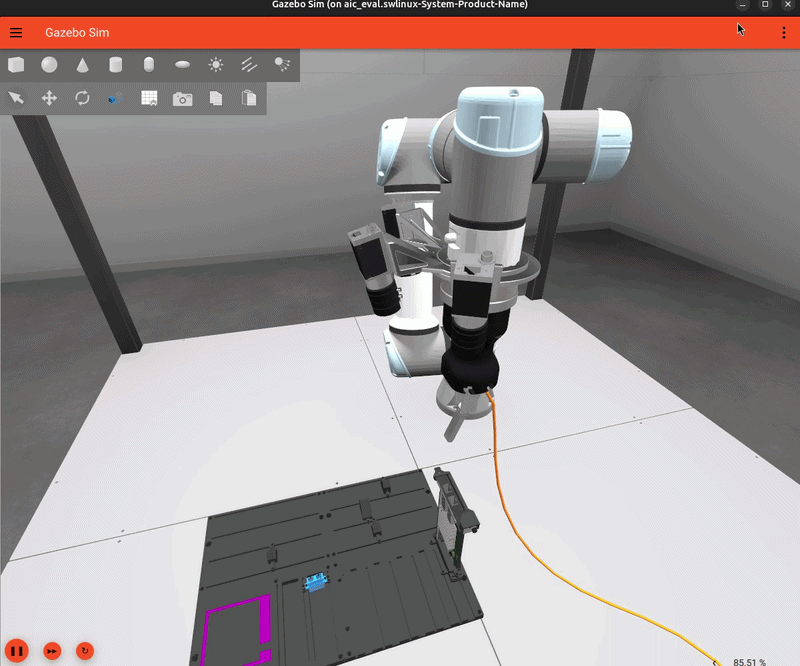
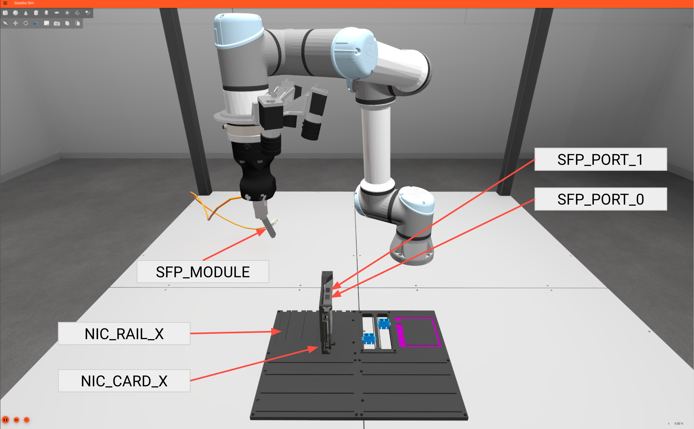
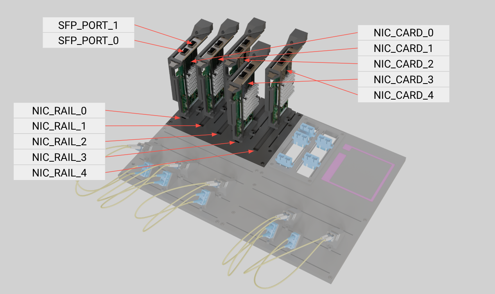
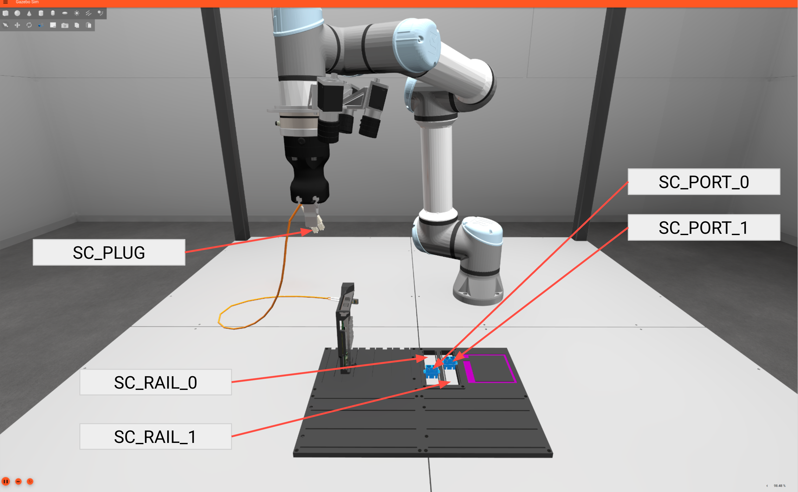
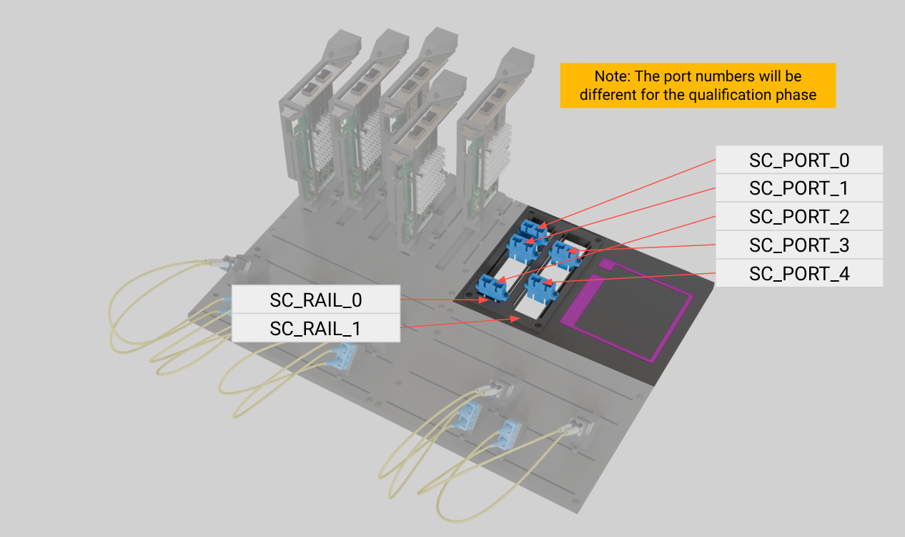

# AIC Physic

[한국어](readme/README.ko.md) | [English](readme/README.en.md)

Intrinsic 및 Open Robotics가 주관한 AI for Industry Challenge의 솔루션 코드입니다 <br>



## 대회 설명

AI for Industry Challenge는 Universal Robots(UR5e) 로봇 팔이 케이블을 지정된 포트에 삽입하는 Peg-In-Hole Task입니다.

<details>
<summary><strong>Task Board Overview</strong></summary>

<table>
  <tr>
    <th colspan="2">SFP</th>
  </tr>
  <tr>
    <td width="50%"></td>
    <td width="50%"></td>
  </tr>
  <tr>
    <th colspan="2">SC</th>
  </tr>
  <tr>
    <td width="50%"></td>
    <td width="50%"></td>
  </tr>
</table>

</details>

<details>
<summary><strong>Task Board Randomization</strong></summary>

매 Trial마다 Task Board의 XY/yaw, 카드의 위치, 삽입 포트 종류가 달라집니다.

| 파라미터 | Trial 1/2 (NIC/SFP) | Trial 3 (SC) |
|---|---|---|
| `task_board_x` | [0.13, 0.17] m | [0.15, 0.19] m |
| `task_board_y` | [-0.25, -0.20] m | [-0.05, 0.05] m |
| `task_board_yaw` | [3.10, 3.1415] rad | [3.10, 3.1415] rad |

| 랜덤화 요소 | 범위 및 구성 |
|---|---|
| SFP Port | rail 0~4, translation [-0.0215, 0.0234] m, yaw [-10°, +10°] |
| SC Port | rail 0~1, translation [-0.06, 0.055] m, yaw 0.0 |
| Cable/gripper perturbation | cable 방향 및 gripper offset noise 랜덤화 |

</details>

<details>
<summary><strong>케이블 삽입 태스크 및 정책 구성</strong></summary>

참가자는 카메라 관측, 로봇 상태, 힘/토크(Force/Torque) 센서 정보를 활용하여 포트 위치와 자세를 추정하고, 케이블 삽입을 수행하는 정책을 개발해야 합니다.

</details>

## 저장소 구조

| 경로 | 역할 |
| --- | --- |
| `ws_aic/src/aic/` | 공식 리포지토리로부터 Fork한 [`JungSeong/aic`](https://github.com/JungSeong/aic) Toolkit 소스 |
| `ws_aic/src/phy/phy_data_collection/` | 시나리오 랜덤화, 자동 수집 및 검증 도구 |
| `ws_aic/src/phy/phy_policy/data_generator/` | `PortOffsetCollect` 데이터 수집 정책 |
| `docs/git-conventions.md` | 브랜치 및 커밋 메시지 규칙 |
| `readme/gif/`, `readme/photo/` | README에 사용할 영상 및 이미지 |

## Requirements

| 항목 | 요구사항 |
| --- | --- |
| OS | Ubuntu 24.04 |
| ROS 2 | Kilted Kaiju, Pixi 환경에서 제공 |
| Package manager | Pixi `0.67.2` |
| Container | Docker, Distrobox |
| Simulator | Gazebo |
| Middleware | `rmw_zenoh_cpp` |
| GPU | NVIDIA GPU 권장 |

공식 설치 기준은 AIC Toolkit의
[Getting Started](https://github.com/intrinsic-dev/aic/blob/main/docs/getting_started.md)를
참고하십시오.

## 환경 설정

### 1. 저장소 받기

```bash
git clone https://github.com/Team-Physic/aic-physic.git
cd aic-physic
```

공식 AIC Toolkit과 Physic 코드는 저장소에 직접 포함되어 있으므로 별도의
submodule 초기화가 필요하지 않습니다.

### 2. Pixi 환경 설치

```bash
pixi self-update --version 0.67.2
cd ws_aic/src
pixi install --frozen # --frozen 옵션을 추가하면 pixi.lock 업데이트 안 함
```

### 3. Evaluation 컨테이너 준비

```bash
export DBX_CONTAINER_MANAGER=docker

docker pull ghcr.io/intrinsic-dev/aic/aic_eval:latest
distrobox create -r --nvidia \
  -i ghcr.io/intrinsic-dev/aic/aic_eval:latest \
  aic_eval_physic
```

GPU를 사용하지 않는 환경에서는 `--nvidia`를 제거합니다.

## 데이터 수집 정책 실행

### 데이터 자동 수집 실행

데이터 자동 수집은 Gazebo trial 실행, 시나리오 랜덤화, dataset 저장 및 선택적 rosbag 기록 및 Hugging Face 업로드를 한 번에 수행합니다.

```bash
cd ws_aic/src

pixi run ros2 run phy_data_collection collect_portoffset_randomization_data \
  --distrobox aic_eval_physic \
  --trials 20 \
  --samples-per-trial 24 \
  --port-types sfp,sc \
  --dataset-version 0726-001 \
  --push-to-hub false \
  --record-rosbag true \
  --headless \
  --cleanup
```

시나리오 랜덤화 분포 plot은 다음 명령으로 생성합니다.

```bash
cd ws_aic/src
pixi run ros2 run phy_data_collection plot_scenario_randomization
```

plot 기본 출력 위치는 [scenario_randomization_distributions.png](readme/photo/scenario_randomization_distributions.png)입니다.

전체 데이터 세트 수집 파라미터, 수집 시각 일치 검사, rosbag 및 offline sample 검증은 [phy_data_collection 상세 문서](ws_aic/src/phy/phy_data_collection/README.md)를 참고하십시오.

## 데이터셋 구조

데이터 세트는 기본적으로 `ws_aic/data/phy_portoffset_randomization/<version>/`에 생성됩니다.

```text
phy_portoffset_randomization/<version>/
├── data.yaml
├── metadata.jsonl
├── images/
│   ├── train/<connector>/<camera>/*.jpg
│   └── val/<connector>/<camera>/*.jpg
└── metadata/
    ├── train/<connector>/<camera>/*.json
    └── val/<connector>/<camera>/*.json
```

각 metadata에는 command pose, 측정된 plug 위치, 정렬 label, offset sample,
카메라 가시성 및 source별 ROS timestamp가 기록됩니다.

## 테스트

```bash
cd ws_aic/src

PYTEST_DISABLE_PLUGIN_AUTOLOAD=1 \
PYTHONPATH="$PWD/phy/phy_policy/data_generator" \
pixi run --frozen python -m pytest -q \
  phy/phy_policy/data_generator/test/test_port_offset_module_layout.py \
  phy/phy_policy/data_generator/test/test_port_offset_timestamp_sync.py
```

## 협업 규칙

브랜치 이름과 영어 커밋 메시지 형식은
[`docs/git-conventions.md`](docs/git-conventions.md)를 따릅니다.
