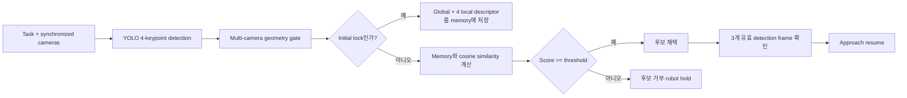

# ReID integration

- 작성일: 2026-08-30
- 브랜치: `feature/remind`
- 코드 기준: `c5f25ce` + working tree
- 대상: FinalPolicy appearance ReID, reacquisition dataset, model downloader, 성능 비교기
- 결론: **Global·4-keypoint local ReID와 네 비교 조건은 runtime에 통합되었다. 실제 threshold와 채택 결과는 local weight, calibration/test 영상, ROS GT 변환 결과로 측정해야 한다.**

### Why?

기존 FinalPolicy는 YOLO exact class와 3D geometry로 target을 선택했다. 같은 외형의
SFP port가 여러 개 보일 때 geometry 후보 중 어느 instance가 최초 target과 같은지
appearance로 재검증하는 경로는 없었다. 일시 가림 뒤 다른 port가 검출되어도 class와
거리만 통과하면 recovery 후보가 될 수 있었다.

이번 변경은 geometry gate를 대체하지 않는다. geometry를 통과한 후보만 frozen
appearance encoder로 비교한다. 최초 lock의 global descriptor와 네 keypoint local
descriptor를 memory에 저장하고, recovery 후보가 같은 appearance인지 cosine similarity로
판정한다.

또한 동일 class의 SFP를 `instance_id=00`, `01`, …로 구분하는 simulation GT와
`visible_before → occluded → visible_after` reacquisition event를 기록한다. 이 데이터는
encoder와 attention 조건을 같은 영상에서 비교하기 위한 입력이다.

### What I Made

#### 1. 현재 runtime 흐름



`ws_aic/src/phy/phy_policy/phy_policy/ros/final_policy_vision.py` |
[`PortVision.estimate()`](../../ws_aic/src/phy/phy_policy/phy_policy/ros/final_policy_vision.py#L503)은
YOLO 결과에서 multi-camera geometry 후보를 만든 뒤
`ws_aic/src/phy/phy_policy/phy_policy/ros/final_policy_reid.py` |
[`AppearanceReID.select()`](../../ws_aic/src/phy/phy_policy/phy_policy/ros/final_policy_reid.py#L413)에
전달한다. ReID가 꺼졌거나 아직 memory가 없으면 geometry 정렬의 첫 후보를 반환한다.
memory가 있으면 threshold를 통과한 최고 score 후보만 반환한다.

#### 2. Encoder와 비교 조건

| 조건 | `AIC_REID_ENCODER` | `AIC_REID_ATTENTION_MODE` | descriptor 생성 방식 |
|---|---|---|---|
| EfficientNet baseline | `efficientnet_b0` | `none` | CNN spatial feature map의 bbox global 평균 + keypoint bilinear local |
| DINOv3 no-attn | `dinov3_vits16` | `none` | patch token의 bbox global 평균 + keypoint bilinear local |
| DINOv3 keypoint-attn | `dinov3_vits16` | `keypoint` | bbox global + keypoint가 attention한 상위 patch 영역 local |
| DINOv3 hull-attn | `dinov3_vits16` | `convex_hull` | convex hull 내부 global + hull 안의 attention 상위 patch 영역 local |

EfficientNet-B0는 `torchvision`의 `IMAGENET1K_V1` state dict를 사용한다. DINOv3는
Meta의 [`facebook/dinov3-vits16-pretrain-lvd1689m`](https://huggingface.co/facebook/dinov3-vits16-pretrain-lvd1689m)을
사용한다. 두 모델 모두 `eval()`과 `requires_grad_(False)`로 고정한다. 선택된 encoder
하나만 YOLO와 함께 Policy 시작 시 load하고 dummy image warmup을 수행한다.

#### 3. Local descriptor 계산

`ws_aic/src/phy/phy_policy/phy_policy/ros/final_policy_reid.py` |
[`keypoints_to_feature_map()`](../../ws_aic/src/phy/phy_policy/phy_policy/ros/final_policy_reid.py#L74)은
입력 image pixel의 keypoint를 encoder feature-map의 실수 좌표로 바꾼다.
[`bilinear_descriptor()`](../../ws_aic/src/phy/phy_policy/phy_policy/ros/final_policy_reid.py#L57)는
그 좌표를 둘러싼 네 cell의 feature vector를 bilinear interpolation한다.

$$
\mathbf l(u,v)=
(1-w_u)(1-w_v)\mathbf F_{y_0,x_0}
+w_u(1-w_v)\mathbf F_{y_0,x_1}
+(1-w_u)w_v\mathbf F_{y_1,x_0}
+w_uw_v\mathbf F_{y_1,x_1}
$$

`$\mathbf l$`은 한 keypoint의 local descriptor, `$\mathbf F_{y,x}$`는 해당 feature cell의
채널 vector다. `$w_u,w_v$`는 실수 좌표의 소수 부분이며 범위는 `0..1`이다. 결과는
L2 normalize한다. 이 계산은 image의 한 pixel에서 새 ReID를 수행하는 것이 아니라,
encoder가 한 번 만든 dense feature map에서 keypoint 주변 appearance vector를 읽는다.

```python
# ws_aic/src/phy/phy_policy/phy_policy/ros/final_policy_reid.py | bilinear_descriptor()
# 입력 실수 좌표를 둘러싼 네 feature cell과 각 축의 소수 가중치를 구한다.
x0, y0 = int(np.floor(x)), int(np.floor(y))
x1, y1 = min(x0 + 1, width - 1), min(y0 + 1, height - 1)
wx, wy = x - x0, y - y0

# 네 channel vector의 bilinear 가중합을 unit vector로 반환한다.
descriptor = (
    (1.0 - wx) * (1.0 - wy) * feature_map[y0, x0]
    + wx * (1.0 - wy) * feature_map[y0, x1]
    + (1.0 - wx) * wy * feature_map[y1, x0]
    + wx * wy * feature_map[y1, x1]
)
return _normalize(descriptor)
```

#### 4. Global·local score

`ws_aic/src/phy/phy_policy/phy_policy/ros/final_policy_reid.py` |
[`AppearanceReID.score()`](../../ws_aic/src/phy/phy_policy/phy_policy/ros/final_policy_reid.py#L387)은
다음 score를 계산한다.

$$
s=
\alpha\cos(\mathbf g,\mathbf g^*)
+(1-\alpha)
\frac{\sum_i c_i c_i^*\cos(\mathbf l_i,\mathbf l_i^*)}
{\sum_i c_i c_i^*}
$$

`$\mathbf g$`와 `$\mathbf g^*$`는 현재 후보와 target memory의 global descriptor다.
`$\mathbf l_i$`와 `$\mathbf l_i^*$`는 동일 keypoint index의 local descriptor다.
`$c_i,c_i^*$`는 현재와 memory keypoint confidence다. `$\alpha$`는
`AIC_REID_GLOBAL_WEIGHT`이며 기본값은 `0.5`다. score가 클수록 target과 비슷하다.
`AIC_REID_MATCH_THRESHOLD`보다 작은 후보는 반환하지 않는다.

```python
# ws_aic/src/phy/phy_policy/phy_policy/ros/final_policy_reid.py | AppearanceReID.score()
# 현재 후보와 최초 target의 global cosine similarity를 계산한다.
global_score = cosine_similarity(
    descriptor.global_descriptor, self.memory.global_descriptor
)

# 같은 keypoint index끼리 비교하고 양쪽 confidence의 곱으로 가중한다.
local_scores = [
    cosine_similarity(current, reference)
    for current, reference in zip(
        descriptor.local_descriptors, self.memory.local_descriptors
    )
]
weights = np.maximum(current_confidence * reference_confidence, 0.0)

# Global과 local score를 하나의 threshold 입력값으로 합친다.
return self.global_weight * global_score + (1.0 - self.global_weight) * local_score
```

#### 5. DINOv3 attention 경로

`ws_aic/src/phy/phy_policy/phy_policy/ros/final_policy_reid.py` |
[`AppearanceReID.load()`](../../ws_aic/src/phy/phy_policy/phy_policy/ros/final_policy_reid.py#L145)은
attention 조건에서 `attn_implementation="eager"`를 지정한다. optimized attention
kernel이 attention weight를 반환하지 않는 경우를 피하고 Q·K softmax 결과를 확보하기
위한 설정이다.

[`AppearanceReID._extract_feature_map()`](../../ws_aic/src/phy/phy_policy/phy_policy/ros/final_policy_reid.py#L228)은
CLS·register token을 제외한 patch token만 `H×W×C` feature map으로 바꾼다. 모든 layer와
head의 patch-to-patch attention을 평균한다. keypoint patch가 support 영역에서 attention한
상위 `AIC_REID_ATTENTION_REGION_FRAC` 비율의 patch를 local descriptor로 평균한다.

#### 6. Reacquisition GT 수집

`ws_aic/src/phy/phy_data_collection/phy_data_collection/policy/motion.py` |
[`reacquisition_sequence()`](../../ws_aic/src/phy/phy_data_collection/phy_data_collection/policy/motion.py#L853)은
각 event에서 robot을 다음 순서로 움직인다.

1. `visible_before`: 기본 `0.35 m` 거리에서 target 관측
2. `occluded`: 기본 `0.05 m` 거리로 이동해 robot이 camera와 port 사이를 가림
3. `visible_after`: `0.35 m` 거리로 돌아와 target 재등장

`ws_aic/src/phy/phy_data_collection/phy_data_collection/policy/PortOffsetCollect.py` |
[`PortOffsetCollect.publish_reid_phase()`](../../ws_aic/src/phy/phy_data_collection/phy_data_collection/policy/PortOffsetCollect.py#L558)은
`/reid_benchmark/phase`에 event ID, phase, `class=sfp_port`, instance ID와 ROS timestamp를
JSON으로 발행한다. rosbag은 세 RGB image, depth, CameraInfo, TF와 이 phase topic을 함께
기록한다.

`ws_aic/src/phy/phy_data_collection/phy_data_collection/policy/dataset.py` |
[`benchmark_port_annotation()`](../../ws_aic/src/phy/phy_data_collection/phy_data_collection/policy/dataset.py#L128)은
ReID benchmark에서 모든 SFP를 class `sfp_port`로 합치고 rail·port를 `00`, `01`, `10`, …
instance ID로 보존한다. 학습용 exact class annotation은 변경하지 않는다.

### 코드 위치

| 파일 위치 | 함수 | 역할 |
|---|---|---|
| `ws_aic/src/phy/phy_policy/phy_policy/ros/final_policy_reid.py` | [`AppearanceReID.load()`](../../ws_aic/src/phy/phy_policy/phy_policy/ros/final_policy_reid.py#L145) | 입력: encoder·attention 환경변수와 local weight<br>처리: 선택 모델 하나를 frozen load하고 CUDA warmup<br>결과: runtime feature encoder 또는 명확한 missing-weight 오류 |
| `ws_aic/src/phy/phy_policy/phy_policy/ros/final_policy_reid.py` | [`AppearanceReID._descriptor_from_map()`](../../ws_aic/src/phy/phy_policy/phy_policy/ros/final_policy_reid.py#L276) | 입력: dense feature map·attention·4 keypoints<br>판정: bbox 또는 convex hull support와 local sampling<br>결과: normalized global descriptor와 네 local descriptor |
| `ws_aic/src/phy/phy_policy/phy_policy/ros/final_policy_reid.py` | [`AppearanceReID.select()`](../../ws_aic/src/phy/phy_policy/phy_policy/ros/final_policy_reid.py#L413) | 입력: multi-camera geometry 통과 후보<br>판정: memory similarity 최고값과 match threshold 비교<br>결과: target 후보 하나 또는 `None` |
| `ws_aic/src/phy/phy_policy/phy_policy/ros/final_policy_vision.py` | [`PortVision.load_model()`](../../ws_aic/src/phy/phy_policy/phy_policy/ros/final_policy_vision.py#L256) | 입력: YOLO path와 ReID 설정<br>처리: YOLO와 선택 encoder를 Policy 시작 시 load<br>결과: cold inference 전 warmup 완료 또는 Policy 시작 실패 |
| `ws_aic/src/phy/phy_policy/phy_policy/ros/final_policy_vision.py` | [`PortVision.lock_identity()`](../../ws_aic/src/phy/phy_policy/phy_policy/ros/final_policy_vision.py#L519) | 입력: 최초 exact-class geometry lock<br>처리: global·local appearance 추출 후 memory 저장<br>결과: recovery 비교 기준 prototype 생성 |
| `ws_aic/src/phy/phy_policy/phy_policy/ros/FinalPolicy.py` | [`FinalPolicy._recover_target()`](../../ws_aic/src/phy/phy_policy/phy_policy/ros/FinalPolicy.py#L288) | 입력: recovery 이후 새 YOLO·ReID 후보<br>판정: 새 timestamp의 유효 detection 3회와 3D lock radius<br>결과: 후보 없는 frame은 streak를 지우지 않고, 성공 시 approach resume |
| `ws_aic/src/phy/phy_data_collection/phy_data_collection/policy/motion.py` | [`reacquisition_sequence()`](../../ws_aic/src/phy/phy_data_collection/phy_data_collection/policy/motion.py#L853) | 입력: target pose와 event 수<br>처리: visible·occluded·visible robot trajectory 실행<br>결과: 가림 전후 RGB·depth·TF가 포함된 rosbag 구간 |
| `ws_aic/src/phy/phy_data_collection/phy_data_collection/policy/dataset.py` | [`benchmark_port_annotation()`](../../ws_aic/src/phy/phy_data_collection/phy_data_collection/policy/dataset.py#L128) | 입력: connector·rail·port와 benchmark flag<br>판정: SFP class collapse 여부<br>결과: class `sfp_port`와 instance `00`, `01`, … |
| `scripts/download_reid_models.py` | [`download_efficientnet()`](../../scripts/download_reid_models.py#L41) | 입력: repository-relative model directory<br>처리: PyTorch 공식 weight 다운로드·tqdm·SHA256 검사<br>결과: local EfficientNet state dict |
| `scripts/download_reid_models.py` | [`download_dinov3()`](../../scripts/download_reid_models.py#L68) | 입력: repository-relative model directory와 HF 인증<br>처리: Meta Hugging Face snapshot 다운로드<br>결과: offline `from_pretrained()` model directory |
| `scripts/compare_reid_variants.py` | [`load_metrics()`](../../scripts/compare_reid_variants.py#L51) | 입력: variant별 `tracking_eval.json`<br>처리: event accuracy·IDSW·frame latency·GPU peak 추출<br>결과: 공통 비교 metric row |
| `scripts/compare_reid_variants.py` | [`compare()`](../../scripts/compare_reid_variants.py#L76) | 입력: 네 variant metric과 perception period<br>판정: 상대 정확도·IDSW·foreign ID·p95·Wilson CI<br>결과: `eligible`, `inconclusive`, `reject`와 선택 variant |

### How to run

#### 1. 다른 PC에서 model 다운로드

DINOv3는 gated model이다. 먼저 Hugging Face에서 사용 조건에 동의하고 인증한다.

```bash
hf auth login

cd /path/to/aic-physic
pixi -m ws_aic/src/pixi.toml run \
  python scripts/download_reid_models.py --output-dir models/reid
```

생성 구조:

```text
models/reid/
├── efficientnet_b0/
│   └── efficientnet_b0_rwightman-7f5810bc.pth
└── dinov3_vits16/
    ├── config.json
    ├── model.safetensors
    └── ...
```

`models/reid/`는 `.gitignore` 대상이다. target PC의 repository에서 같은 상대 경로로
복사한다. runtime은 이 경로가 없으면 자동 다운로드하지 않고 시작을 실패시킨다.

#### 2. dependency와 ROS package 반영

```bash
cd /path/to/aic-physic/ws_aic/src
pixi install --frozen
pixi reinstall --frozen ros-kilted-phy-policy ros-kilted-phy-data-collection
```

#### 3. FinalPolicy variant 실행

공통 실행 형태:

```bash
cd /path/to/aic-physic/ws_aic/src

AIC_SFP_YOLO_MODEL_PATH=/absolute/path/to/sfp_pose.pt \
AIC_REID_MODEL_DIR=models/reid \
AIC_REID_ENCODER=efficientnet_b0 \
AIC_REID_ATTENTION_MODE=none \
AIC_REID_MATCH_THRESHOLD=0.75 \
AIC_REID_GLOBAL_WEIGHT=0.5 \
PIXI_FROZEN=true pixi run ros2 run aic_model aic_model --ros-args \
  -p use_sim_time:=true \
  -p policy:=phy_policy.ros.FinalPolicy
```

다른 variant는 encoder와 attention 값만 바꾼다.

```bash
# DINOv3 no-attn
AIC_REID_ENCODER=dinov3_vits16 AIC_REID_ATTENTION_MODE=none

# DINOv3 keypoint attention
AIC_REID_ENCODER=dinov3_vits16 AIC_REID_ATTENTION_MODE=keypoint

# DINOv3 convex-hull attention
AIC_REID_ENCODER=dinov3_vits16 AIC_REID_ATTENTION_MODE=convex_hull
```

한 Policy process에서는 encoder를 바꾸지 않는다. variant를 바꾸려면 process를 다시
시작한다. `AIC_REID_WARMUP_RUNS` 기본값은 `5`, input width 기본값은 `384`다.

#### 4. Reacquisition simulation 수집

Calibration A와 test B는 별도 dataset version으로 수집한다. 각 실행은 별도 master
seed를 자동 생성하고 기록하므로 조명·card 배치·등장 순서가 달라진다.

```bash
cd /path/to/aic-physic/ws_aic/src

PIXI_FROZEN=true pixi run ros2 run phy_data_collection \
  collect_portoffset_randomization_data \
  --collection-policy reacquisition \
  --port-type sfp \
  --trials 20 \
  --workers 1 \
  --samples-per-trial 3 \
  --dataset-version reid-calibration-a \
  --auto-annotate-ports true \
  --record-rosbag true \
  --push-to-hub false
```

Test B에서는 `--dataset-version reid-test-b`로 바꿔 새 실행을 시작한다. reacquisition
mode는 `reid_benchmark_labels=true`, 즉 class `sfp_port`와 instance ID 분리를 자동으로
강제한다.

### How to measure performance

#### 1. Calibration과 test 분리

Calibration A에서 `AIC_REID_MATCH_THRESHOLD`, `AIC_REID_GLOBAL_WEIGHT`, 필요하면
`AIC_REID_ATTENTION_REGION_FRAC`를 고른다. 선택한 값은 test B에서 변경하지 않는다.
같은 test B frame과 GT를 네 variant에 반복 입력한다.

**현재 threshold 자동 calibration script는 없다.** Calibration A의 target·foreign
candidate score를 수집해 threshold를 선택하는 단계는 수동 또는 별도 evaluator가
필요하다.

#### 2. 측정 metric

| Metric | 현재 비교기가 읽는 값 | 해석 |
|---|---|---|
| 재식별 성공률 | `recovery_success_reference_total / recovery_attempts_total` | 가림 뒤 reference instance를 다시 선택한 event 비율 |
| Foreign recovery rate | `recovery_success_foreign_id_total / recovery_attempts_total` | 다른 instance를 target으로 선택한 event 비율 |
| ID switch | `collapsed_identity_metrics.idsw` | 같은 GT instance의 predicted identity가 바뀐 횟수 |
| 전체 frame p50/p95 | `per_frame[].loop_ms` | image read부터 pipeline·GT 평가까지 frame loop 시간; 없으면 `pipeline_ms` fallback |
| Peak GPU memory | `mem_gpu_peak_allocated_bytes_max` | frame별 CUDA peak allocated bytes의 최댓값; 채택 gate에는 사용하지 않음 |

`scripts/compare_reid_variants.py` |
[`compare()`](../../scripts/compare_reid_variants.py#L76)의 DINO 채택 조건은 다음과 같다.

1. EfficientNet 대비 재식별 성공률 상대 증가가 `5%` 이상
2. 전체 frame p95가 측정한 perception period보다 작음
3. foreign recovery rate가 EfficientNet보다 증가하지 않음
4. ID switch가 EfficientNet보다 증가하지 않음
5. 95% Wilson confidence interval이 EfficientNet과 분리됨

Confidence interval이 겹치면 `reject`가 아니라 `inconclusive`다. 더 많은
reacquisition event를 수집한 뒤 다시 판단한다.

#### 3. 네 결과 비교

각 variant의 evaluator가 생성한 `tracking_eval.json` 경로를 전달한다.

```bash
python scripts/compare_reid_variants.py \
  --efficientnet outputs/efficientnet/tracking_eval.json \
  --dino-no-attn outputs/dino_no_attn/tracking_eval.json \
  --dino-keypoint-attn outputs/dino_keypoint_attn/tracking_eval.json \
  --dino-hull-attn outputs/dino_hull_attn/tracking_eval.json \
  --perception-period-ms 200
```

`--perception-period-ms`에는 현재 runtime camera/perception callback의 실제 주기를
millisecond로 측정해 넣는다. 인자를 생략하면 latency gate가 항상 통과하므로 최종 채택
판정에서는 생략하면 안 된다.

### What was problem

#### Model cache와 runtime 경로 불일치

`torchvision`과 Hugging Face의 기본 cache는 PC마다 절대 경로가 달랐다. 다른 PC에서
weight를 받아 target PC로 옮겨도 runtime이 그 파일을 읽지 않았다. 현재는 repository
기준 `models/reid/`를 기본 경로로 사용하고 누락 시 명확히 실패한다.

#### DINO attention 반환 보장 부재

optimized attention backend는 attention weight를 반환하지 않을 수 있다. attention
variant는 `eager` backend로 model을 load하고 `outputs.attentions`가 비어 있으면 즉시
오류를 발생시킨다.

#### ReID dataset metadata 위치 오류

reacquisition sampling metadata가 depth image parser에 잘못 들어가 있었다. 지원하지
않는 depth encoding을 만났을 때 `policy` 미정의 오류가 발생할 수 있었다. 해당 metadata를
[`write_manifest()`](../../ws_aic/src/phy/phy_data_collection/phy_data_collection/policy/dataset.py#L1313)의
reacquisition 분기로 이동했다.

#### Pipeline latency와 전체 frame latency 혼동

초기 비교기는 `pipeline_ms`만 p50/p95로 사용했다. 현재는 `loop_ms`를 우선 사용해
image read, pipeline, GT 평가를 포함한 전체 frame 지연시간을 비교한다.

### How it changed

| 파일 위치 | 함수 또는 설정 | 변경 요약 |
|---|---|---|
| `ws_aic/src/phy/phy_policy/phy_policy/ros/final_policy_reid.py` | [`AppearanceReID.load()`](../../ws_aic/src/phy/phy_policy/phy_policy/ros/final_policy_reid.py#L145) | 이전: encoder와 local weight 경로 없음<br>변경: local-only frozen load와 warmup 추가<br>효과: 선택 encoder 하나가 YOLO 시작 시 준비됨 |
| `ws_aic/src/phy/phy_policy/phy_policy/ros/final_policy_reid.py` | [`AppearanceReID.score()`](../../ws_aic/src/phy/phy_policy/phy_policy/ros/final_policy_reid.py#L387) | 이전: geometry·class score만 존재<br>변경: global·confidence-weighted local cosine 결합<br>효과: 같은 class의 appearance identity 비교 가능 |
| `ws_aic/src/phy/phy_policy/phy_policy/ros/final_policy_vision.py` | [`PortVision.estimate()`](../../ws_aic/src/phy/phy_policy/phy_policy/ros/final_policy_vision.py#L503) | 이전: 최소 재투영 오차 후보 즉시 반환<br>변경: geometry 후보를 ReID selector에 전달<br>효과: threshold 미달 candidate는 motion으로 전달되지 않음 |
| `ws_aic/src/phy/phy_policy/phy_policy/ros/FinalPolicy.py` | [`FinalPolicy._recover_target()`](../../ws_aic/src/phy/phy_policy/phy_policy/ros/FinalPolicy.py#L288) | 이전: 기본 2회 detection으로 복구<br>변경: 3개 유효 detection frame과 ReID candidate 요구<br>효과: 후보 없는 가림 frame은 target streak를 지우지 않음 |
| `ws_aic/src/phy/phy_data_collection/phy_data_collection/policy/motion.py` | [`reacquisition_sequence()`](../../ws_aic/src/phy/phy_data_collection/phy_data_collection/policy/motion.py#L853) | 이전: 재등장 event 수집 stage 없음<br>변경: visible·occluded·visible trajectory 추가<br>효과: event 단위 재식별 정확도 측정용 simulation 입력 생성 |
| `ws_aic/src/phy/phy_data_collection/phy_data_collection/policy/dataset.py` | [`benchmark_port_annotation()`](../../ws_aic/src/phy/phy_data_collection/phy_data_collection/policy/dataset.py#L128) | 이전: SFP rail·port가 서로 다른 class<br>변경: benchmark에서 class collapse·instance ID 보존<br>효과: 같은 class 안의 identity switch를 GT로 계산 가능 |
| `scripts/download_reid_models.py` | [`main()`](../../scripts/download_reid_models.py#L85) | 이전: PC별 framework cache에 의존<br>변경: 공식 weight를 repository 상대 경로에 저장<br>효과: 다른 PC에서 받은 model directory를 그대로 복사 가능 |
| `scripts/compare_reid_variants.py` | [`compare()`](../../scripts/compare_reid_variants.py#L76) | 이전: 네 variant 공통 채택 판정 없음<br>변경: 정확도·CI·IDSW·foreign ID·p95 gate 추가<br>효과: 같은 test 결과에서 eligible variant를 기계적으로 선택 |

### 검증 상태

현재 확인된 항목:

- 삭제 전 ReID 관련 unit test 포함 `14 passed in 0.36s`
- `transformers==5.3.0`의 축소 DINOv3 ViT config에서 `output_attentions=True` tensor smoke 통과
- Python source compile 검사 통과
- `git diff --check` 통과
- 요청에 따라 이번 ReID 작업에서 추가했던 `test_*.py` 4개와 해당 ReID test cache 삭제

**아직 검증하지 못한 항목:**

- 실제 EfficientNet/DINOv3 weight를 사용한 target GPU inference
- Gazebo reacquisition 전체 rosbag 생성
- rosbag RGB·phase·instance GT를 evaluator 입력으로 변환하는 bridge
- Calibration A에서 threshold 자동 선택
- Test B의 실제 재식별 성공률, ID switch, p50/p95, peak GPU memory
- 조도가 event 도중 갑자기 바뀌는 동적 lighting scenario; 현재 lighting randomization은 trial 시작 시 고정

따라서 현재 상태는 **runtime·수집·비교 로직 구현 완료, 실제 E2E 성능 수치 미측정**이다.
`tracking_eval.json`을 만드는 ROS GT 변환/evaluation bridge가 추가되기 전에는
`compare_reid_variants.py`만으로 rosbag을 직접 평가할 수 없다.
