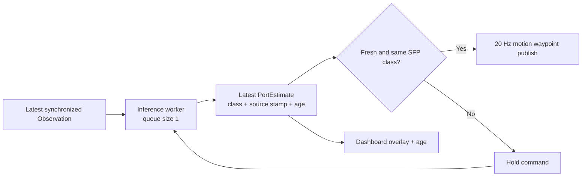

# PATCH_00 - FinalPolicy 실행 및 Runtime 성능

- 작성일: 2026-08-29
- 브랜치: `feature/remind@ac1122b`
- 코드 기준: `feature/remind@ac1122b` + current working tree; AIC code는 PR [#9](https://github.com/Team-Physic/aic-physic/pull/9) merge `ad00899` 포함
- 대상: `ws_aic/src/phy/phy_policy`, `ws_aic/src/phy/phy_dashboard`, `ws_aic/src/aic/aic_engine/config/eval_config.yaml`
- 결론: **`--seed`와 `--num-trials`만으로 재현 가능한 SFP multi-card YAML을 생성·보존하고 Engine에 내부 전달한다. Generator test 1개, FinalPolicy test 13개, generated YAML Engine 초기화 smoke test는 통과했지만 simulator E2E와 실제 overlay FPS·approach duration은 아직 측정하지 않았다.**

### Why?

`feature/approach`의 FinalPolicy가 실제로 실행 가능한지, 어떤 terminal 순서와 환경변수가 필요한지 한 문서에서 확인할 방법이 없었다. merge 전 `bde0df1`에서는 Live YOLO Pose 약 `0.1 FPS`와 느린 robot waypoint가 같은 동기 inference 경로에 결합돼 있었다.

현재 `ws_aic/src/phy/phy_policy/phy_policy/ros/FinalPolicy.py` | [FinalPolicy._stage_approach()](../ws_aic/src/phy/phy_policy/phy_policy/ros/FinalPolicy.py#L369)는 YOLO worker를 한 개 생성한다. [FinalPolicy._track_guard()](../ws_aic/src/phy/phy_policy/phy_policy/ros/FinalPolicy.py#L311)는 완료된 YOLO 결과만 non-blocking poll하고, `ws_aic/src/phy/phy_policy/phy_policy/ros/final_policy_vision.py` | [PortVision.track()](../ws_aic/src/phy/phy_policy/phy_policy/ros/final_policy_vision.py#L507)은 YOLO 호출 없이 KLT를 수행한다. YOLO 대기와 waypoint publish의 곱셈 병목은 제거됐지만 track recovery와 worker shutdown은 완료된 inference를 기다릴 수 있다.

이 PATCH를 최우선으로 둔 이유는 **현재 FinalPolicy 기능 검증 자체를 막는 runtime 병목**이기 때문이다. Gazebo rendering, timestamp, MoveIt, retry 설계는 후속 PATCH로 이동했다.

### What I Made

이 문서에 다음을 고정했다.

- `feature/yolo_klt_fallback` 기준 실행 준비 상태와 제한
- 요청된 `docker exec` simulator 명령
- `--seed`, `--num-trials`로 재현 가능한 SFP scenario를 생성하는 runner
- `phy_dashboard`와 FinalPolicy 실행 순서
- merge 전 0.1 FPS와 로봇 저속의 결합 원인
- merge 후 KLT-only·background YOLO 흐름과 남은 측정 항목
- 변경 후 통과해야 할 정량 기준

FinalPolicy의 background inference 변경과 별도로, runner가 내부 YAML을 생성해 사용자가 `aic_engine_config_file`을 직접 지정하지 않도록 했다.

### 현재 실행 가능 범위

| 항목 | 확인 결과 | 근거 |
|---|---|---|
| Branch | 확인 | `feature/remind`, HEAD `ac1122b`; AIC code는 PR #9 merge `ad00899` 포함 |
| Python policy import | 통과 | `phy_policy.ros.FinalPolicy` module과 동명의 `FinalPolicy` class import 성공 |
| Model file | 확인 | `ws_aic/model/best.pt`, 19,814,408 bytes |
| Model metadata | 확인 | task `pose`, `kpt_shape=[4, 3]`, 11 classes |
| Unit test | 통과 | `test_final_policy.py`: `13 passed` |
| Seeded scenario | generator unit test 통과 | 같은 seed·trial index에서 카드 조합, target, translation이 동일 |
| Multi-card target | generator unit test 통과 | 각 trial에 NIC 카드 1~5개를 생성하며 target rail은 항상 active |
| Supported port type | SFP | 생성 target은 `SFP_00`부터 `SFP_41`까지 10개 class 중 선택 |
| Generated YAML Engine 초기화 | 통과 | 2개 trial parse 및 `AIC Engine initialized successfully!` 확인 |
| 전체 simulator E2E | **미실행** | container/Gazebo/policy를 함께 기동한 완료 결과 없음 |

### `--seed` 기반 SFP scenario 생성

Engine은 여전히 YAML을 입력으로 요구한다. 차이는 사용자가 파일을 준비하거나 `aic_engine_config_file`을 입력하지 않고, `scripts/run-aic-eval.sh`가 `eval_config.yaml`의 `trial_1`을 template로 내부 YAML을 생성한다는 점이다.

```text
--seed N + --num-trials M
→ trial별 seed = SHA-256("aic-eval-v1:N:index")
→ NIC 카드 1~5개와 active rail 선택
→ active rail 중 target rail, port 0/1 선택
→ active 카드별 rail translation 선택
→ generated YAML 저장
→ num_trials와 aic_engine_config_file을 Engine에 내부 전달
```

카드 수, active rail, target rail, target port는 균등 추첨한다. Target은 항상 active rail에 속한다. 각 active 카드의 translation은 `[-0.0215, 0.0234] m` 균등분포에서 독립 추첨해 소수점 6자리로 저장한다. `roll`, `pitch`, `yaw`는 `0.0 rad`로 고정한다.

Generated YAML은 다음 위치에 보존된다.

```text
ws_aic/results/eval_configs/
└── <timestamp>_seed<seed>_trials<num_trials>.yaml
```

YAML에는 `generation.seed`, `generation.num_trials`, `generation.generator_version`을 함께 기록한다. 생성된 trial은 `trial_0001`부터 순서대로 이름을 부여한다. `randomization.nic_cards`는 제거해 Engine이 카드 조합을 다시 변경하지 못하게 한다.

동일한 `seed`와 trial index는 `--num-trials`를 늘려도 기존 trial의 조합을 바꾸지 않는다. Runner mode에서 `num_trials:=...` 또는 `aic_engine_config_file:=...`을 직접 전달하면 실제 조건이 중복되므로 즉시 오류로 종료한다.

### 현재 함수별 동작

| 파일 위치 | 함수 | 역할 |
|---|---|---|
| `scripts/run-aic-eval.sh` | [prepare_seeded_config()](../scripts/run-aic-eval.sh#L13) | 입력: `--seed`, `--num-trials`<br>처리: persistent YAML 경로를 만들고 generator 실행<br>결과: 생성 config와 Engine 내부 launch argument 준비 |
| `scripts/generate_aic_eval_config.py` | [derive_trial_seed()](../scripts/generate_aic_eval_config.py#L22) | 입력: base seed와 trial index<br>처리: generator version을 포함한 SHA-256 계산<br>결과: 다른 trial 수에 영향받지 않는 독립 RNG seed |
| `scripts/generate_aic_eval_config.py` | [generate_config()](../scripts/generate_aic_eval_config.py#L28) | 입력: `trial_1` template, seed, trial 수<br>처리: 카드·target·translation을 물질화하고 rotation 고정<br>결과: N개 SFP trial과 generation metadata |
| `ws_aic/src/aic/aic_engine/src/aic_engine.cpp` | [Engine::initialize()](../ws_aic/src/aic/aic_engine/src/aic_engine.cpp#L448) | 입력: runner가 생성한 YAML과 내부 `num_trials`<br>처리: `randomization.nic_cards`가 실제 map일 때만 runtime randomization하고, 물질화된 YAML은 그대로 parse<br>결과: 생성된 SFP trial을 순서대로 실행 |
| `ws_aic/src/phy/phy_policy/phy_policy/ros/FinalPolicy.py` | [FinalPolicy.insert_cable()](../ws_aic/src/phy/phy_policy/phy_policy/ros/FinalPolicy.py#L455) | 입력: AIC `Task`, 최신 Observation, motion callback<br>처리: Task target 해석, model load, lift-detect, approach 순차 실행<br>결과: SFP approach 성공 여부와 feedback 반환 |
| `ws_aic/src/phy/phy_policy/phy_policy/ros/FinalPolicy.py` | [FinalPolicy._stage_lift_up_detect()](../ws_aic/src/phy/phy_policy/phy_policy/ros/FinalPolicy.py#L163) | 입력: lift 시작 TCP와 camera Observation<br>처리: 40-step lift와 비동기 YOLO multi-hit 확인 병행<br>결과: 일관된 `PortEstimate` lock 또는 stage 실패 |
| `ws_aic/src/phy/phy_policy/phy_policy/ros/FinalPolicy.py` | [FinalPolicy._stage_approach()](../ws_aic/src/phy/phy_policy/phy_policy/ros/FinalPolicy.py#L369) | 입력: triangulated XYZ·normal, stand-off, TCP offset<br>처리: KLT guard와 background YOLO re-anchor를 병행하며 waypoint publish<br>결과: target lock이 유지된 pose command sequence 또는 hold |
| `ws_aic/src/phy/phy_policy/phy_policy/ros/FinalPolicy.py` | [FinalPolicy._track_guard()](../ws_aic/src/phy/phy_policy/phy_policy/ros/FinalPolicy.py#L311) | 입력: 직전 KLT estimate와 background YOLO 결과<br>처리: 최초 lock 반경 검사, 불일치·miss 누적 시 recovery 실행<br>결과: 최신 estimate 승인 또는 motion 중단 |
| `ws_aic/src/phy/phy_policy/phy_policy/ros/final_policy_vision.py` | [target_from_task()](../ws_aic/src/phy/phy_policy/phy_policy/ros/final_policy_vision.py#L108) | 입력: `port_type`, `target_module_name`, `port_name`<br>처리: `nic_card_mount_<rail>/sfp_port_<port>`를 exact class로 변환<br>결과: `SFP_<rail><port>` TargetSpec 또는 명시적 오류 |
| `ws_aic/src/phy/phy_policy/phy_policy/ros/final_policy_vision.py` | [PortVision._projection_data()](../ws_aic/src/phy/phy_policy/phy_policy/ros/final_policy_vision.py#L275) | 입력: left·center·right Image, CameraInfo, center timestamp<br>판정: image span 1 ms 이하 및 center 시각 camera-from-base TF 조회<br>결과: base_link triangulation용 세 projection matrix 또는 폐기 |
| `ws_aic/src/phy/phy_policy/phy_policy/ros/final_policy_vision.py` | [PortVision._detect()](../ws_aic/src/phy/phy_policy/phy_policy/ros/final_policy_vision.py#L337) | 입력: 세 camera image와 exact target class<br>처리: 세 image를 한 YOLO batch로 추론하고 target keypoint만 선택<br>결과: camera별 detection과 subscriber가 있을 때 debug overlay 발행 |
| `ws_aic/src/phy/phy_policy/phy_policy/ros/final_policy_vision.py` | [PortVision.track()](../ws_aic/src/phy/phy_policy/phy_policy/ros/final_policy_vision.py#L507) | 입력: 최신 Observation과 직전 PortEstimate<br>처리: YOLO 호출 없이 KLT·재투영·3D jump 조건 검사<br>결과: 동일 exact class의 갱신 estimate 또는 tracking 실패 |
| `ws_aic/src/phy/phy_policy/phy_policy/ros/motion.py` | [_follow()](../ws_aic/src/phy/phy_policy/phy_policy/ros/motion.py#L85) | 입력: start·target pose, step 수, dt, optional guard<br>처리: S-curve waypoint 생성 후 guard 완료를 기다려 pose publish<br>결과: 전체 경로 완료 또는 command 전 motion 중단 |
| `ws_aic/src/phy/phy_dashboard/phy_dashboard/main.py` | [DashboardNode.__init__()](../ws_aic/src/phy/phy_dashboard/phy_dashboard/main.py#L156) | 입력: 세 debug Image topic과 triangulated PointStamped topic<br>처리: sensor QoS image subscription과 point subscription 생성<br>결과: inference가 발행한 최신 overlay·base_link XYZ 표시 |

### 실행 순서

#### Terminal 1 - Simulator와 AIC Engine

요청한 표준 실행 명령이다. `model_discovery_timeout_seconds:=600` 동안 별도 terminal의 `aic_model` discovery를 기다린다.

소스 변경 후 최초 1회 `aic_engine`을 workspace overlay에 빌드한다. 이 단계가 없으면 `/ws_aic/install`의 이전 binary가 실행될 수 있다.

```bash
docker exec aic_eval_physic bash -lc '
  source /ws_aic/install/setup.bash
  cd /home/swlinux/Desktop/workspace/aic-physic/ws_aic
  colcon build --packages-select aic_engine --symlink-install
'
```

```bash
docker start aic_eval_physic >/dev/null

docker exec -it \
  -e DISPLAY="$DISPLAY" \
  -e XAUTHORITY="$XAUTHORITY" \
  -e LIBGL_ALWAYS_SOFTWARE=0 \
  -e __NV_PRIME_RENDER_OFFLOAD=1 \
  -e __GLX_VENDOR_LIBRARY_NAME=nvidia \
  aic_eval_physic bash -lc '
  source /ws_aic/install/setup.bash
  source /home/swlinux/Desktop/workspace/aic-physic/ws_aic/install/setup.bash
  exec /home/swlinux/Desktop/workspace/aic-physic/scripts/run-aic-eval.sh \
    --seed 1 \
    --num-trials 4 \
    -- \
    ground_truth:=true \
    start_aic_engine:=true \
    gazebo_gui:=false \
    launch_rviz:=true \
    spawn_task_board:=false \
    spawn_cable:=false \
    model_discovery_timeout_seconds:=600
'
```

`--` 앞은 runner option, 뒤는 ROS launch argument다. 아래 범위는 `scripts/run-aic-eval.sh`, `ws_aic/src/aic/aic_bringup/launch/aic_gz_bringup.launch.py`, `ws_aic/src/aic/aic_engine/src/aic_engine.cpp` | [Engine::initialize()](../ws_aic/src/aic/aic_engine/src/aic_engine.cpp#L448)의 검증 조건을 기준으로 한다.

| 파라미터 이름 | 범위 | 기대 효과 |
|---|---|---|
| `--seed` | `0..4294967295` | 카드 수·active rail·target rail·target port·NIC translation을 재현 |
| `--num-trials` | `1` 이상 정수 | `trial_1` template에서 생성하고 실행할 SFP trial 수 지정 |
| `--` | 구분자 1개 | runner option과 ROS launch argument를 명확히 분리. 생략 시 실행 거부 |
| `ground_truth` | `true` / `false` | `true`: `/scoring/tf`를 `/tf`로 relay해 simulator GT frame을 debugging·scoring에 사용. YOLO 정확도를 직접 높이지는 않음 |
| `start_aic_engine` | `true` / `false` | `true`: 같은 launch에서 AIC Engine을 시작해 YAML trial을 실행 |
| `gazebo_gui` | `true` / `false` | `false`: Gazebo server만 실행해 GUI rendering 부하 절감. 이 명령은 RViz 관찰을 위해 `false` 사용 |
| `launch_rviz` | `true` / `false` | `true`: robot·TF·topic을 RViz에서 확인. GPU·display 자원을 추가 사용 |
| `spawn_task_board` | `true` / `false` | 이 workflow는 `false`: 고정 board를 launch에서 중복 생성하지 않고 Engine이 trial YAML scene을 생성하게 함 |
| `spawn_cable` | `true` / `false` | 이 workflow는 `false`: 고정 cable을 중복 생성하지 않고 Engine이 trial별 cable scene을 관리하게 함 |
| `model_discovery_timeout_seconds` | 양의 정수 초, 기본 `30` | 별도 Terminal 3의 `aic_model` 발견을 기다리는 최대 시간. `600`은 수동 실행 준비에 10분 허용 |

`num_trials`와 `aic_engine_config_file` launch argument는 runner가 내부 생성한다. `--` 뒤에서 직접 지정하면 중복 조건으로 판단해 실행하지 않는다.

`DISPLAY`, `XAUTHORITY`, `LIBGL_ALWAYS_SOFTWARE`, `__NV_PRIME_RENDER_OFFLOAD`, `__GLX_VENDOR_LIBRARY_NAME`은 ROS launch parameter가 아니라 container GUI·OpenGL용 environment variable이다.

`DISPLAY`와 `XAUTHORITY`는 container의 RViz가 host X11 display를 사용하게 한다. 현재 container에서 `xdpyinfo`로 X11 접속을 확인했다. 세 NVIDIA/OpenGL 환경변수는 **container 안 RViz·Gazebo rendering 경로**를 선택한다. Host Pixi에서 실행하는 YOLO CPU inference를 가속하지 않는다.

`run-aic-eval.sh`는 generated YAML 경로와 trial 요약을 `[scenario]` log로 출력한 뒤 `/entrypoint.sh`와 그 자식들을 별도 process group으로 시작한다. Blocking `wait` 대신 0.2초 간격으로 상태를 확인하므로 `docker exec -it`에 연결된 terminal의 `Ctrl+C`를 처리한다. `Ctrl+C`, `SIGTERM`, terminal disconnect를 받으면 이 실행의 process group에 바로 `SIGKILL`을 보내 `gz sim -g`, `ros2 launch`, router를 함께 종료하고 원래 host terminal로 반환한다. Graceful shutdown보다 확실한 terminal 반환을 우선한 개발용 실행 방식이다.

#### Terminal 2 - Live Dashboard

Lift 초기 detection부터 보려면 FinalPolicy보다 먼저 실행한다. Debug overlay는 subscriber가 있을 때, 그리고 실제 YOLO inference가 끝날 때만 발행된다.

```bash
cd /home/swlinux/Desktop/workspace/aic-physic/ws_aic/src

PIXI_FROZEN=true pixi run phy_dashboard
```

구독 topic:

- `/final_policy/yolo/left/image`
- `/final_policy/yolo/center/image`
- `/final_policy/yolo/right/image`
- `/final_policy/triangulated_port_xyz`

#### Terminal 3 - FinalPolicy

```bash
cd /home/swlinux/Desktop/workspace/aic-physic/ws_aic/src

AIC_SFP_YOLO_MODEL_PATH=/home/swlinux/Desktop/workspace/aic-physic/ws_aic/model/best.pt \
PIXI_FROZEN=true pixi run ros2 run aic_model aic_model --ros-args \
  -p use_sim_time:=true \
  -p policy:=phy_policy.ros.FinalPolicy
```

다음 두 로그가 먼저 보여야 한다.

```text
FinalPolicy: YOLO device override: auto
[FinalPolicy] target: type=SFP, rail=..., port=..., class=SFP_..
```

### What was problem

#### 0. Generated YAML에서 Engine이 시작 전에 종료됨

Runner는 카드 조합이 이미 확정된 YAML에서 `randomization.nic_cards`를 제거한다. 기존 `ws_aic/src/aic/aic_engine/src/aic_engine.cpp` | [Engine::initialize()](../ws_aic/src/aic/aic_engine/src/aic_engine.cpp#L448)은 missing YAML node의 truthiness만 검사해 runtime randomization branch에 진입했고, 존재하지 않는 `min_count`를 읽으며 종료했다.

```text
Failed to randomize NIC cards: invalid node; first invalid key: "min_count"
Engine failed to initialize
```

따라서 Terminal 1에서 Engine process가 먼저 죽고, Terminal 3의 FinalPolicy는 Task를 받을 수 없었다. 현재는 `nic_randomization.IsMap()`일 때만 해당 branch를 실행한다.

#### 1. Merge 전 approach command가 YOLO 완료를 기다림

`ws_aic/src/phy/phy_policy/phy_policy/ros/motion.py` | [_follow()](../ws_aic/src/phy/phy_policy/phy_policy/ros/motion.py#L85)은 `step_guard`가 반환된 뒤에만 pose target을 publish한다.

```python
# ws_aic/src/phy/phy_policy/phy_policy/ros/motion.py | _follow()
for index in range(max(1, steps)):
    # ... 생략: S-curve waypoint 계산
    # Tracking 검사가 끝날 때까지 현재 loop와 다음 pose command가 모두 정지한다.
    if step_guard is not None and not step_guard(index, pose):
        return False
    policy.set_pose_target(
        move_robot, pose, stiffness=stiffness, damping=damping
    )
    policy.sleep_for(dt)
```

merge 전 `bde0df1`의 `FinalPolicy._track_guard()`는 guard 내부에서 inference를 호출했다. 현재 owner는 `ws_aic/src/phy/phy_policy/phy_policy/ros/FinalPolicy.py` | [FinalPolicy._track_guard()](../ws_aic/src/phy/phy_policy/phy_policy/ros/FinalPolicy.py#L311)다.

```python
# ws_aic/src/phy/phy_policy/phy_policy/ros/FinalPolicy.py@bde0df1 | FinalPolicy._track_guard()
observation = get_observation()
# PortVision.track() 내부가 먼저 세 camera YOLO batch를 실행한다.
tracked = vision.track(observation, provisional)
if tracked is not None:
    self._estimate = tracked
    return True
# Track 실패 시 같은 Observation으로 full estimate YOLO를 다시 실행할 수 있다.
reacquired = vision.estimate(observation)
```

#### 2. Merge 전 KLT가 YOLO 호출을 대체하지 않음

merge 전 `bde0df1`의 `PortVision.track()`은 optical flow 전에 YOLO detection을 실행했다. 현재 owner는 `ws_aic/src/phy/phy_policy/phy_policy/ros/final_policy_vision.py` | [PortVision.track()](../ws_aic/src/phy/phy_policy/phy_policy/ros/final_policy_vision.py#L507)다.

```python
# ws_aic/src/phy/phy_policy/phy_policy/ros/final_policy_vision.py@bde0df1 | PortVision.track()
# 세 camera YOLO batch가 먼저 완료되어야 KLT 계산으로 진행한다.
current_detections = self._detect(data["images"], data["headers"])
# ... 생략: previous/current grayscale 변환
tracked = track_keypoints(
    previous_gray,
    current_gray,
    previous_detection["keypoints"],
    self.forward_backward_max_px,
)
```

따라서 merge 전 KLT는 detection association 검사였고 YOLO 실행 빈도를 낮추지 못했다.

#### 3. Merge 전 지연이 waypoint 수만큼 누적됨

merge 전 `bde0df1` 성공 경로의 추정식:

$$
T_{\mathrm{approach}}
\gtrsim
N_{\mathrm{step}}
\left(T_{\mathrm{YOLO,batch}} + \Delta t\right)
$$

$T_{\mathrm{approach}}$는 merge 전 approach loop wall time(s), $N_{\mathrm{step}}=80$, $T_{\mathrm{YOLO,batch}}$는 세 camera batch 한 번의 동기 inference 시간(s), $\Delta t=0.05\,\mathrm{s}$는 waypoint 뒤 sleep이다. 모든 tracking이 첫 시도에 성공한다고 가정한 과거 구조의 하한이며 TF 조회, 재시도, controller 지연, settle time은 포함하지 않는다.

- Perception이 없을 때 명목 command 시간: $80\times0.05=4.0\,\mathrm{s}$
- 로컬 model-only 측정 `T_YOLO,batch=0.600 s`: 약 $80\times0.650=52\,\mathrm{s}$
- 사용자 관측 Live rate가 batch 기준 `0.1 FPS`, 즉 약 `10 s/batch`로 지속될 경우: 약 $80\times10.05=804\,\mathrm{s}$

마지막 값은 runtime log 전체를 계측한 결과가 아니라 사용자 관측값을 merge 전 control flow에 대입한 추정이다. **현재 merge 후 구조에는 이 곱셈식을 적용하지 않는다.**

#### 4. Live 0.1 FPS는 model 연산만의 결과가 아님

동일 `best.pt`에 validation image 3개를 넣은 CPU batch smoke benchmark 결과:

```text
batch_seconds=0.600
batch_fps=1.666
image_throughput_fps=4.998
ultralytics_inference_ms_per_image=188.797
```

실제 Live 약 `0.1 FPS`가 이보다 크게 느리므로 다음 비용이 함께 존재할 가능성이 높다.

- Gazebo physics·세 camera rendering과 YOLO가 host CPU·memory bandwidth를 경쟁
- 매 waypoint Observation 변환, 정확시각 TF 조회, triangulation 수행
- 각 result의 `plot()`과 ROS Image 직렬화·publish
- tracking 실패 시 tracking 단계와 full estimation 단계가 각각 YOLO 실행
- 동기 guard 때문에 모든 비용이 motion command 주기에 직접 합산

이는 원인 후보다. component별 timer가 아직 없어 각 비율은 확정하지 못했다.

#### 5. 현재 GPU 실행 경로가 검증되지 않음

로컬 GPU는 NVIDIA GeForce GTX 1050, compute capability `sm_61`이다. 설치된 Torch가 보고한 architecture 목록은 `sm_50`, `sm_60`, `sm_70`, `sm_75`, `sm_80`, `sm_86`, `sm_90`이며 `sm_61`이 명시되지 않는다. 이 목록만으로 오류 원인을 확정할 수는 없지만, 이 환경에서 실제 `no kernel image is available for execution on the device` 오류가 재현됐다. 따라서 **현재 `.pt` 실행은 CPU를 기본값으로 유지해야 한다.** GPU를 쓰려면 현 Torch·Ultralytics build가 지원하는 새 GPU에서 `AIC_YOLO_DEVICE=0`을 검증하거나, GTX 1050을 포함해 모든 CUDA extension을 다시 build해야 한다. 후자는 유지보수 비용이 커서 첫 해결안이 아니다.

### How it changed

#### PATCH 우선순위 변경

| 이전 | 변경 | 효과 |
|---|---|---|
| Gazebo rendering이 `PATCH_00` | FinalPolicy 실행·perception/control 병목이 `PATCH_00` | 현재 feature 검증을 막는 문제를 첫 작업으로 지정 |
| 기존 PATCH `00..07` | 기존 문서를 `01..08`로 이동 | 기존 내용 보존, 번호만 우선순위에 맞게 변경 |
| Isaac Lab `PATCH_07` | Isaac Lab `PATCH_08` | 현재 적용 계획이 없는 simulator 검토를 마지막에 유지 |

#### 즉시 가능한 운용

1. **정확성 우선 실행:** 위 명령처럼 `AIC_YOLO_DEVICE=cpu` 사용.
2. **병목 분리 측정:** 현재 표준 명령은 `gazebo_gui:=false`, `launch_rviz:=true`다. Gazebo rendering 영향을 비교할 때만 별도 run에서 `gazebo_gui:=true`로 A/B 측정.
3. **OpenVINO 후보 측정:** 현재 `.pt`와 같은 validation set에서 속도와 Pose mAP를 먼저 비교.

Ultralytics 공식 문서는 Pose model의 OpenVINO export와 exported model의 predict·validation을 지원한다. 설치 의존성을 runtime 자동 설치에 맡기지 말고 `openvino>=2024.0.0`을 Pixi manifest와 lock에 먼저 선언해야 한다.

```bash
cd /home/swlinux/Desktop/workspace/aic-physic/ws_aic/src

PIXI_FROZEN=true pixi run yolo export \
  model=../model/best.pt \
  format=openvino \
  imgsz=640
```

Export와 project dependency 추가 후의 검증 후보:

```bash
AIC_SFP_YOLO_MODEL_PATH=/home/swlinux/Desktop/workspace/aic-physic/ws_aic/model/best_openvino_model \
AIC_YOLO_DEVICE=intel:cpu \
PIXI_FROZEN=true pixi run ros2 run aic_model aic_model --ros-args \
  -p use_sim_time:=true \
  -p policy:=phy_policy.ros.FinalPolicy
```

현재 `YOLO(model_path)`와 `device` 전달 구조는 exported model 형식과 맞지만, **이 repository에서 OpenVINO export·실행은 아직 검증하지 않았다.**

#### 반영된 구조와 남은 최적화

현재 merge는 inference worker 하나와 latest result 하나를 사용한다.



현재 구현:

1. `ws_aic/src/phy/phy_policy/phy_policy/ros/FinalPolicy.py` | [FinalPolicy._stage_approach()](../ws_aic/src/phy/phy_policy/phy_policy/ros/FinalPolicy.py#L369)가 단일 background YOLO worker를 시작한다.
2. [FinalPolicy._track_guard()](../ws_aic/src/phy/phy_policy/phy_policy/ros/FinalPolicy.py#L311)는 완료된 result만 non-blocking poll하고 KLT estimate를 우선 사용한다.
3. `ws_aic/src/phy/phy_policy/phy_policy/ros/final_policy_vision.py` | [PortVision.track()](../ws_aic/src/phy/phy_policy/phy_policy/ros/final_policy_vision.py#L507)은 YOLO 호출 없이 optical flow와 geometry만 계산한다.
4. background YOLO가 latest KLT를 같은 target으로 확인하면 YOLO timestamp에서 현재 frame까지 KLT로 re-anchor한다.
5. KLT miss 또는 YOLO 불일치가 누적되면 robot을 hold하고 [FinalPolicy._recover_target()](../ws_aic/src/phy/phy_policy/phy_policy/ros/FinalPolicy.py#L267)이 정지 이후 timestamp의 연속 YOLO 결과만 승인한다.

남은 최적화:

1. `AIC_YOLO_IMGSZ`를 추가해 `640/416/320`의 Pose mAP와 triangulation reprojection 오차를 측정한다.
2. `inference duration`, source ROS stamp, publish wall time, overlay age, effective batch FPS를 log와 dashboard에 표시한다.
3. simulator에서 approach duration과 recovery hold 시간을 측정한 뒤에만 `AIC_APPROACH_STEPS`와 `AIC_APPROACH_DT`를 조정한다.

### 검증 기준

| 항목 | 통과 기준 | 실패 의미 |
|---|---|---|
| Overlay freshness | 실제 새 inference 기준 `>=2 Hz`, age `<=500 ms` | dashboard가 과거 target을 현재값처럼 표시 |
| Motion publish | fresh estimate가 있을 때 명목 `20 Hz`에 근접 | inference가 control loop를 계속 block |
| Stale safety | age threshold 초과 시 새 pose command 없음 | 오래된 port 위치로 robot 이동 |
| Approach duration | 명목 4 s + bounded hold, `80 × inference latency` 구조 제거 | 동기 guard 병목 잔존 |
| Model optimization | 기존 대비 Pose mAP50-95 감소 `<=0.01` | 속도 향상 대신 keypoint 정확도 훼손 |
| Geometry | reprojection RMS와 3D jump threshold 위반 없음 | 빠른 model이 triangulation 안정성 훼손 |
| Multi-card identity | generated YAML의 target rail이 active이고 FinalPolicy가 지정된 `SFP_<rail><port>`를 유지 | rail·port identity lock 실패 |

`>=2 Hz`, `<=500 ms`, mAP 감소 `<=0.01`은 **제안 acceptance threshold**다. 실제 simulator 측정 후 안전성과 controller 요구 주기에 맞춰 확정해야 한다.

### 검증 명령과 결과

```bash
cd /home/swlinux/Desktop/workspace/aic-physic/ws_aic/src

PIXI_FROZEN=true pixi run python \
  ../../scripts/test_generate_aic_eval_config.py

PYTHONPATH=/home/swlinux/Desktop/workspace/aic-physic/ws_aic/src/phy/phy_policy \
.pixi/envs/default/bin/python -m pytest -q \
  phy/phy_policy/test/test_final_policy.py
```

결과:

- Scenario generator: `1 test`, `OK`
- FinalPolicy: `13 passed`
- AIC Engine build: `1 package finished`
- Generated YAML smoke: `Successfully parsed 2 trial(s)`, `AIC Engine initialized successfully!`

Generator test는 동일 seed 재현성, 20개 trial 생성, target rail 활성, port 범위, translation 범위, rotation 고정을 검증한다. FinalPolicy test는 target parsing, triangulation/tracking helper와 policy stage를 검증한다. Engine smoke는 simulator 없이 generated YAML의 초기화만 검증했으므로 마지막 endpoint check의 `aic_adapter_node` 부재 오류는 예상된 종료다. **Gazebo, AIC Engine, dashboard를 함께 실행한 E2E 성능 검증은 아니다.**

### 참고 자료

- [Ultralytics Pose task 공식 문서](https://docs.ultralytics.com/tasks/pose): Pose model export format, predict, Box/Pose validation metric.
- [Ultralytics OpenVINO 공식 문서](https://docs.ultralytics.com/integrations/openvino): OpenVINO export, `intel:cpu` 실행, exported model validation 절차.
