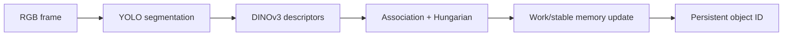
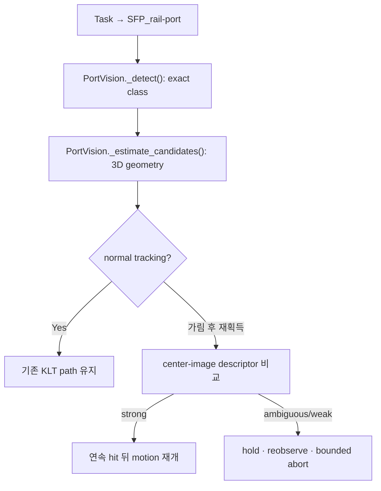

# PATCH_01 - REMIND ReID Tracker 적용 검토

- 작성일: 2026-08-26
- 브랜치: `feature/remind`
- AIC 코드 기준: `ad00899` (PR [#9](https://github.com/Team-Physic/aic-physic/pull/9) merge)
- 외부 코드 기준: `fork/remind-reid-tracker`의 `main@f88ea1d5`
- 원본: <https://github.com/JungSeong/remind-reid-tracker>
- 대상: cable·gripper 가림 또는 시야 이탈 뒤 FinalPolicy target 재식별
- 결론: **KLT를 ReID로 교체하지 않는다. KLT는 연속 frame의 단기 tracking, ReID는 가림·시야 이탈 뒤 장기 recovery에 사용한다. 현재 YOLO Pose·3-camera triangulation·geometry gate는 유지하고, 그 조건을 통과한 재획득 후보만 appearance memory로 추가 검증한다.**

### Why?

현재 FinalPolicy는 `SFP_<rail><port>` exact class, KLT optical flow, 재투영 오차, 3D 이동량으로 인접 frame의 target을 보호한다. 그러나 cable이나 robot arm이 port를 완전히 가리거나 camera가 다른 곳을 본 뒤 돌아오면 직전 pixel patch가 사라져 KLT 연속성이 끊긴다.

이때 기존 로직은 안전하게 hold할 수 있지만, 다시 보인 candidate가 가려지기 전과 같은 물리 port인지 appearance로 확인하지 못한다. REMIND의 가치도 여기다. detection model 교체가 아니라 **장시간 시야 이탈 후 identity 복구**다.

### What I Made

- 요청 저장소를 [`fork/remind-reid-tracker`](../fork/remind-reid-tracker)에 shallow clone했다.
- 실제 `main@f88ea1d5`의 perception → association → update 흐름과 dependency를 확인했다.
- AIC의 현재 target 보호 흐름과 REMIND 입력 차이를 함수 단위로 연결했다.
- 장점·한계·최소 적용 위치·실험 통과 기준을 정의했다.
- `feature/yolo_klt_fallback` 전체를 `feature/approach`에 merge하고, merge 결과에서 `feature/remind`를 다시 분기했다.
- ReID runtime 코드는 아직 이식하지 않았다. 이 문서는 구현 전 검증 PATCH다.

#### Clone 상태

```text
# fork/remind-reid-tracker | git metadata
origin  https://github.com/JungSeong/remind-reid-tracker.git
branch  main
HEAD    f88ea1d5d81da0a8ed28b206df6d4dab48327342
mode    shallow clone
```

저장소는 parent repository의 submodule이 아니다. 자체 `.git`을 가진 독립 clone이며 현재 parent Git에서는 `fork/` 전체가 untracked로 보인다.

### What was problem

#### 1. 현재 KLT는 긴 가림 이후 identity를 복구하지 못함

[`ws_aic/src/phy/phy_policy/phy_policy/ros/final_policy_vision.py | track_keypoints()`](../ws_aic/src/phy/phy_policy/phy_policy/ros/final_policy_vision.py#L166)은 이전 image의 keypoint patch를 다음 image에서 optical flow로 찾는다.

$$
\mathbf d^{*}
=
\underset{\mathbf d}{\operatorname{argmin}}
\sum_{\mathbf x \in W}
\left[
I_t(\mathbf x)-I_{t+1}(\mathbf x+\mathbf d)
\right]^2
$$

$\mathbf d^{*}$는 인접 frame 사이 pixel 이동량, $W$는 keypoint 주변 patch다. cable이 patch를 완전히 가리거나 target이 frame 밖으로 나가면 비교할 appearance가 없어 추적이 실패한다. KLT는 짧은 연속 이동 추적이며 과거 object의 재식별 모델이 아니다.

[`ws_aic/src/phy/phy_policy/phy_policy/ros/FinalPolicy.py | FinalPolicy._track_guard()`](../ws_aic/src/phy/phy_policy/phy_policy/ros/FinalPolicy.py#L310)은 KLT 실패 또는 background YOLO 불일치 후 recovery를 실행하고 target-lock 반경 안의 새 YOLO 결과를 연속 확인한다. 위치 기반 재획득은 있지만 appearance identity 검증은 없다.

#### KLT를 ReID로 교체하지 않는 이유

| 구간 | KLT | ReID |
|---|---|---|
| 인접 frame의 작은 이동 | 적합: pixel optical flow가 가볍고 직접적 | 과함: descriptor inference와 memory matching 필요 |
| 완전 가림·시야 이탈 | 부적합: 이전 patch 연속성 소실 | 적합: 과거 prototype과 재등장 candidate 비교 |
| 동일형 port 안전성 | class·재투영·3D gate와 함께 사용 | appearance 단독 판정 금지 |
| 권장 실행 시점 | target이 계속 보이는 정상 approach | KLT 실패 후 YOLO 재획득 시점만 |

따라서 정상 상태는 YOLO로 고정한 keypoint를 KLT로 갱신하고, KLT가 끊기면 robot을 hold한 뒤 YOLO + geometry + ReID로 같은 target인지 확인한다. Strong match가 연속 확인되면 새 keypoint를 KLT 기준점으로 다시 설정한다.

#### 2. REMIND 입력은 YOLO segmentation, AIC 입력은 YOLO Pose

[`fork/remind-reid-tracker/detection/yolo_segmenter.py | YoloSegmenter.segment()`](../fork/remind-reid-tracker/detection/yolo_segmenter.py#L134)은 instance mask가 없는 YOLO result를 버린다. 현재 AIC model은 bounding box와 port corner 4개를 출력한다.

따라서 REMIND의 detector를 그대로 연결할 수 없다. 새 segmentation model을 추가하는 대신 현재 4 keypoint의 convex hull을 근사 mask로 만들고, 필요한 경우 card context가 포함되도록 margin crop을 사용하면 된다. 단, 가려진 keypoint가 3개 미만이면 memory를 갱신하지 않아 오염을 막아야 한다.

#### 3. REMIND 전체 pipeline은 control loop에 과함

[`fork/remind-reid-tracker/pipeline/reid_pipeline.py | ReIDPipeline.process_frame()`](../fork/remind-reid-tracker/pipeline/reid_pipeline.py#L130)은 매 frame마다 perception, association, update를 순차 실행한다.



AIC의 목적은 전체 scene multi-object tracking이 아니라 Task가 지정한 port 하나를 안전하게 유지하는 것이다. 여러 class의 global Hungarian assignment, part clustering, neighbor graph 전체를 즉시 이식하면 현재 YOLO latency와 motion 지연을 더 키운다.

#### 4. 동일형 port는 appearance만으로 구분하기 어려움

SFP port들은 외형이 거의 같다. Port crop의 DINOv3 cosine similarity만으로 `SFP_41`과 인접 port를 확실히 구분한다는 보장이 없다. Task class와 base-link XYZ를 hard gate로 유지하고 appearance는 추가 evidence로만 사용해야 한다.

REMIND의 object similarity 개념은 다음과 같다.

$$
s_{\mathrm{app}}(d,o)
=
\max_k
\frac{
\mathbf g_d^{\mathsf T}\mathbf e_k^{(o)}
}{
\lVert\mathbf g_d\rVert_2\lVert\mathbf e_k^{(o)}\rVert_2
}
$$

$d$는 현재 detection, $o$는 과거 target, $\mathbf g_d$는 현재 descriptor, $\mathbf e_k^{(o)}$는 memory prototype이다. 값이 1에 가까울수록 appearance가 유사하다. 이 값 자체에는 Task rail·port와 base-link 위치가 없다.

#### 5. 현재 Pixi 환경에 REMIND dependency가 부족함

[`fork/remind-reid-tracker/environment.yml`](../fork/remind-reid-tracker/environment.yml)은 `transformers`, `scikit-learn`, `scipy`, `ultralytics`를 요구한다. 현재 AIC Pixi 환경 검사 결과:

```text
# ws_aic/src/.pixi/envs/default | importlib.util.find_spec()
transformers: false
sklearn:      false
scipy:        false
ultralytics:  true
```

[`fork/remind-reid-tracker/features/dino_extractor.py | DinoExtractor.load_model()`](../fork/remind-reid-tracker/features/dino_extractor.py#L29)은 Hugging Face에서 DINOv3 processor와 weight를 읽는다. model access, weight 저장 공간, GPU memory와 latency 검증도 필요하다.

### How it changed

#### REMIND 실제 흐름

| 파일 위치 | 함수 | 역할 |
|---|---|---|
| [`fork/remind-reid-tracker/pipeline/reid_pipeline.py`](../fork/remind-reid-tracker/pipeline/reid_pipeline.py#L130) | `ReIDPipeline.process_frame()` | Input: RGB frame·frame ID·timestamp<br>Process: perception → association → update 순차 실행<br>Result: persistent identity와 stage timing 생성 |
| [`fork/remind-reid-tracker/perception/perception_engine.py`](../fork/remind-reid-tracker/perception/perception_engine.py#L170) | `PerceptionEngine.process_frame()` | Input: frame과 detection mask<br>Process: DINOv3 object·part·background feature 추출<br>Result: detection별 descriptor evidence 생성 |
| [`fork/remind-reid-tracker/pipeline/association_stage.py`](../fork/remind-reid-tracker/pipeline/association_stage.py#L35) | `AssociationStage.process_frame()` | Input: 현재 detections와 memory descriptor<br>Process: 같은 class 후보의 similarity·context·assignment 계산<br>Result: match·create·ambiguous decision 생성 |
| [`fork/remind-reid-tracker/pipeline/update_stage.py`](../fork/remind-reid-tracker/pipeline/update_stage.py#L24) | `UpdateStage.process_frame()` | Input: association decision과 최신 descriptor<br>Process: lifecycle 및 work/stable memory 갱신<br>Result: 다음 frame에서 사용할 object memory 생성 |

#### 현재 AIC 보호 흐름

| 파일 위치 | 함수 | 역할 |
|---|---|---|
| [`ws_aic/src/phy/phy_policy/phy_policy/ros/final_policy_vision.py`](../ws_aic/src/phy/phy_policy/phy_policy/ros/final_policy_vision.py#L108) | `target_from_task()` | Input: Task의 port type·module·port name<br>Process: rail·port index를 `SFP_<rail><port>`로 변환<br>Result: YOLO exact-class hard gate 생성 |
| [`ws_aic/src/phy/phy_policy/phy_policy/ros/final_policy_vision.py`](../ws_aic/src/phy/phy_policy/phy_policy/ros/final_policy_vision.py#L337) | `PortVision._detect()` | Input: synchronized 3-camera image와 YOLO Pose result<br>Process: target class와 일치하고 4 keypoint가 유효한 detection만 보존<br>Result: triangulation 가능한 camera별 후보 생성 |
| [`ws_aic/src/phy/phy_policy/phy_policy/ros/final_policy_vision.py`](../ws_aic/src/phy/phy_policy/phy_policy/ros/final_policy_vision.py#L417) | `PortVision._estimate_candidates()` | Input: 두 camera 이상의 동일 target detections<br>Process: triangulation·workspace·재투영 오차 검사<br>Result: reprojection RMS가 가장 낮은 base-link port pose 후보 생성 |
| [`ws_aic/src/phy/phy_policy/phy_policy/ros/final_policy_vision.py`](../ws_aic/src/phy/phy_policy/phy_policy/ros/final_policy_vision.py#L507) | `PortVision.track()` | Input: 직전 PortEstimate와 최신 Observation<br>Process: YOLO 호출 없이 KLT·재투영·3D jump 조건 검사<br>Result: 연속 target 갱신 또는 tracking 실패 반환 |
| [`ws_aic/src/phy/phy_policy/phy_policy/ros/FinalPolicy.py`](../ws_aic/src/phy/phy_policy/phy_policy/ros/FinalPolicy.py#L55) | `_matches_locked_target()` | Input: 최초 lock, 새 PortEstimate, 허용 반경<br>Process: exact class와 base-link XYZ 거리 검사<br>Result: background YOLO·KLT candidate 승인 여부 반환 |
| [`ws_aic/src/phy/phy_policy/phy_policy/ros/FinalPolicy.py`](../ws_aic/src/phy/phy_policy/phy_policy/ros/FinalPolicy.py#L163) | `FinalPolicy._stage_lift_up_detect()` | Input: lift 중 최신 Observation과 비동기 YOLO 결과<br>Process: 기본 5회·10 mm 내 일관된 detection 누적<br>Result: 일관성 충족 후에만 최초 target lock 생성 |
| [`ws_aic/src/phy/phy_policy/phy_policy/ros/FinalPolicy.py`](../ws_aic/src/phy/phy_policy/phy_policy/ros/FinalPolicy.py#L310) | `FinalPolicy._track_guard()` | Input: KLT 결과와 background YOLO 결과<br>Process: 최초 lock 반경 검사와 불일치 시 bounded recovery<br>Result: motion 허용 또는 approach hold |

#### 장점

- cable·gripper 가림 뒤 같은 target의 appearance memory를 다시 비교 가능.
- 직전 frame이 없어도 work/stable prototype으로 장기 재획득 가능.
- similarity가 애매하면 `ambiguous`로 유지해 잘못된 port 확정을 미룰 수 있음.
- 현재 YOLO Pose를 detector로 유지 가능. keypoint mask adapter만 별도 필요.
- Task class·triangulated XYZ와 결합하면 appearance-only tracker보다 강한 안전 gate 구성 가능.

#### 한계

- REMIND는 monocular RGB·instance mask 기반. ROS timestamp, TF, 3-camera fusion을 제공하지 않음.
- DINOv3·part clustering·Hungarian 전체 실행은 현재 0.1 FPS 병목을 악화할 수 있음.
- 동일형 SFP port는 작은 port crop만으로 descriptor 분리가 안 될 수 있음.
- DINOv3 weight는 별도 license와 Hugging Face access 조건 확인 필요.
- 연구 repository 결과가 AIC wrist-camera·occlusion 환경의 성능을 보장하지 않음.
- appearance 오판을 직접 motion command로 연결하면 위험. class·geometry hard gate를 대체하면 안 됨.

#### 최소 적용 위치



1. `PortVision._detect()`가 만든 4 keypoint convex hull에서 center-camera crop과 mask를 생성한다.
2. `PortVision._estimate_candidates()`의 class·3D·재투영 조건을 통과한 candidate만 ReID 입력으로 보낸다.
3. 정상 연속 frame에서는 현재 KLT를 유지한다. ReID는 `_track_guard()`의 재획득 경로에서만 실행한다.
4. trial 시작인 `FinalPolicy.insert_cable()`에서 target memory를 초기화한다. 이전 board memory를 다음 trial로 넘기지 않는다.
5. descriptor inference는 control thread 밖에서 실행하고 ROS image timestamp를 함께 저장한다.
6. 첫 구현은 target 하나, center camera, global descriptor, NumPy cosine similarity만 사용한다. 성능 부족이 측정될 때만 part/context/Hungarian을 추가한다.

#### 구현 상태 구분

| 상태 | 내용 |
|---|---|
| 현재 구현 | YOLO device auto-selection, lift multi-hit lock, KLT-only interpolation, background YOLO re-anchor·recovery |
| 이번 PATCH 제안 | 가림 뒤 YOLO 재획득 후보에 center-camera appearance descriptor 추가 |
| Merge 상태 | PR [#9](https://github.com/Team-Physic/aic-physic/pull/9)로 `feature/yolo_klt_fallback` 전체가 `feature/approach` ancestry에 포함되고 `feature/remind`가 merge commit `ad00899`에서 분기 |
| 보류 | REMIND 전체 part/context/Hungarian pipeline과 새 segmentation model |

#### 권장 decision order

1. Task class 불일치 → 즉시 거부.
2. triangulation·workspace·재투영 실패 → 즉시 거부.
3. 이전 target XYZ jump 초과 → 즉시 거부.
4. 가림 뒤 재획득일 때만 appearance memory 비교.
5. strong match 연속 2회 → motion 재개.
6. ambiguous/weak → hold 후 bounded retry, 소진 시 abort.

#### 검증 case와 통과 기준

| Case | 확인값 | 통과 기준 |
|---|---|---|
| 정상 approach | ReID 추가 latency | motion publish path 직접 block `0 ms` |
| cable 완전 가림 후 해제 | target ID | 원래 target으로 복귀 |
| gripper 가림 후 해제 | false reacquisition | `0` |
| target 시야 이탈 후 복귀 | reacquisition | 연속 2회 strong 뒤 재개 |
| 동일형 인접 port 동시 노출 | identity switch | sequence당 `0` |
| 다른 port가 target class로 오분류 | motion command | hold 또는 abort |
| trial 전환 후 같은 class 재등장 | memory scope | 이전 trial prototype 미사용 |

Offline 기록에서 same-target와 different-port cosine similarity 분포가 분리되지 않으면 ReID runtime 이식을 중단한다. 그 경우 card 전체 context 또는 Task Board geometry를 강화하는 편이 더 단순하고 안전하다.

### 구현하지 않은 항목

- REMIND/DINOv3 runtime의 AIC 코드 이식
- `transformers`, `scikit-learn`, `scipy` dependency 추가
- DINOv3 weight 다운로드와 license 동의
- keypoint convex-hull adapter 구현
- ROS ReID topic/node와 motion decision 변경
- Gazebo E2E occlusion benchmark

### 참고 자료

- [JungSeong REMIND clone](../fork/remind-reid-tracker/README.md): 이번 검토에 고정한 실제 local source.
- [REMIND method](../fork/remind-reid-tracker/REMIND_METHOD.md): descriptor, association, memory update 설명.
- [REMIND GitHub](https://github.com/JungSeong/remind-reid-tracker): 요청한 repository.
- [REMIND paper, arXiv:2607.09267](https://arxiv.org/abs/2607.09267): 연구 목적과 평가 근거.
- [DINOv3 ViT-S/16 model card](https://huggingface.co/facebook/dinov3-vits16-pretrain-lvd1689m): model access와 license 확인 위치.
