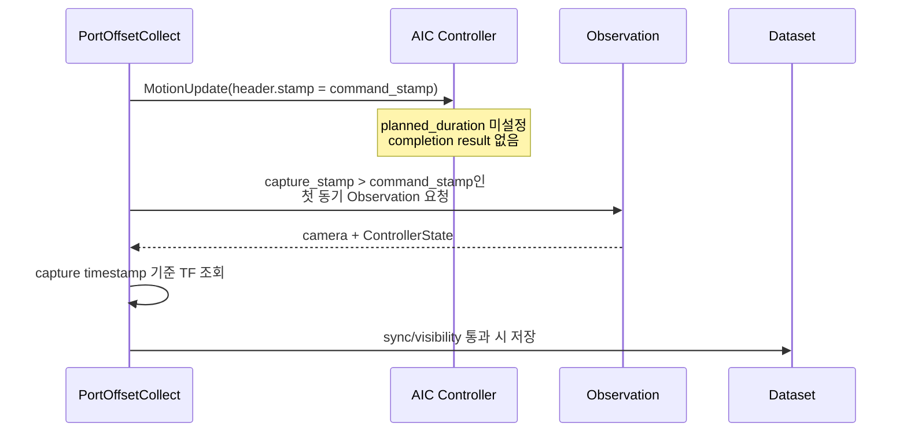
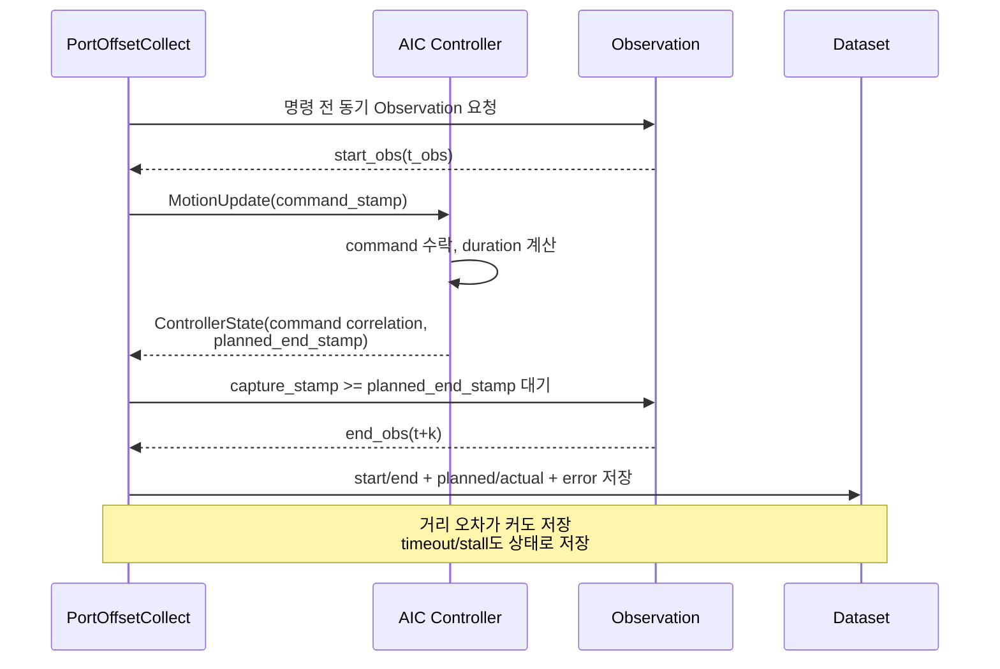

# PATCH_03 - Planned Motion Timestamp 설계

- 작성일: 2026-08-05
- 최종 수정일: 2026-08-09
- 검토 브랜치: `feature/data-collection-node`
- 검토 커밋: `e7e9342f73be19c71fa69abf53af9d98923eac94`
- 범위: `PortOffsetCollect`의 명령 시작·계획 종료·실제 종료 시각 정의와 데이터셋 적용 지점
- 구현 상태: 설계 및 코드 감사 완료, 로직 미적용

결론:

- `controller_accept_stamp + planned_duration`은 데이터 구간의 계획 종료 경계로 타당하지만 실제 도달을 증명하지 않는다.
- 실제 오차와 완료 상태는 어느 방식을 쓰더라도 별도 label로 남겨야 한다.

### Why?

#### 방법의 정당성

여기서 “planning된 시간”은 경로 계산에 걸린 CPU 시간이 아니라, 명령을 controller가 수락한 뒤 목표 reference에 도달하도록 계획한 **motion duration `k`**를 뜻한다.

ROS 2 표준은 trajectory 시작시각과 각 waypoint의 상대 도달시간을 분리한다. 따라서 계획 종료시각을 시작시각과 계획 duration의 합으로 두는 것은 표준 trajectory 시간 모델과 일치한다. 다만 계획시각과 실제 기계의 도달시각은 같은 개념이 아니다.

`ws_aic/src/aic/aic_controller/src/aic_controller.cpp` | [Controller::update()](../ws_aic/src/aic/aic_controller/src/aic_controller.cpp#L787)의 제안식:

$$
t_{\mathrm{plan\_end}} = t_{\mathrm{accept}} + T_{\mathrm{plan}}
$$

$t_{\mathrm{accept}}$는 controller가 명령을 실제로 수락한 ROS 시각, $T_{\mathrm{plan}}$은 reference 이동에 배정한 시간(s), $t_{\mathrm{plan\_end}}$는 계획상 reference가 목표에 도달하는 ROS 시각이다. publisher의 발행시각이 아니라 controller 수락시각을 쓰므로 통신 지연과 다음 control tick까지의 대기시간이 계획 시작점에 섞이지 않는다. 이 값은 측정 경계이며 실제 도달 증거는 아니다.

| 자료 조사 | 확인한 사실 | 이 프로젝트에 적용한 판단 |
|---|---|---|
| [ros2_control Kilted - Trajectory Representation](https://control.ros.org/kilted/doc/ros2_controllers/joint_trajectory_controller/doc/trajectory.html) | `JointTrajectoryPoint.time_from_start`는 trajectory 시작시각 기준의 상대 waypoint 도달시각이다. | controller가 정한 시작시각과 duration으로 절대 `planned_end_stamp`를 계산할 수 있다. |
| [ros2_control Kilted - Joint Trajectory Controller](https://control.ros.org/kilted/doc/ros2_controllers/joint_trajectory_controller/doc/userdoc.html) | action interface는 실행 monitoring과 tolerance/result를 제공한다. Topic interface는 fire-and-forget이므로 실행 결과를 알려주지 않는다. | 현재 `MotionUpdate` topic만으로는 완료 flag를 만들 수 없다. controller 상태 확장 또는 action 사용이 필요하다. |
| [control_msgs Kilted - FollowJointTrajectory](https://docs.ros.org/en/kilted/p/control_msgs/action/FollowJointTrajectory.html) | goal trajectory, feedback의 desired/actual/error, result code, path/goal tolerance와 `goal_time_tolerance`를 정의한다. | “계획 종료”와 “실제 성공/실패”를 별도 필드로 기록하는 구조가 표준 action의 의미와 일치한다. |
| [ros2_control Kilted - Speed scaling](https://control.ros.org/kilted/doc/ros2_controllers/joint_trajectory_controller/doc/speed_scaling.html) | speed scaling 때문에 실제 실행시간이 `time_from_start`보다 길어질 수 있으며, 실제 실행시각이 중요하면 외부 monitoring이 필요하다. | `planned_end_stamp`를 실제 완료 증거로 사용하면 안 된다. planned/actual 시각을 함께 저장해야 한다. |

이 판단의 핵심:

1. `planned_end_stamp`는 **언제 측정할지 정하는 고정 기준**이다.
2. `actual_completion_stamp` 또는 controller result는 **실제로 완료했는지 판단하는 관측값**이다.
3. 목표 거리 이내인 sample만 저장하면 제어 실패가 데이터에서 사라진다. 따라서 거리·속도·controller error는 저장 여부가 아니라 label이어야 한다.

#### 정당한 사용과 잘못된 사용

| 사용 | 판단 | 이유 |
|---|---|---|
| 계획 종료 직후 첫 동기 Observation 선택 | 타당 | 모든 명령에 동일한 시간 기준을 적용한다. |
| `planned_end_stamp`를 실제 정지시각이라고 표기 | 부당 | 외란, 장력, saturation, speed scaling, tracking failure를 반영하지 못한다. |
| 계획 종료의 거리 오차가 커도 sample 저장 | 타당 | 제어 오차 발생 여부·크기·발생시각을 학습/평가할 수 있다. |
| 거리 threshold를 만족한 sample만 저장 | 부당 | 실패 population을 제거하는 selection bias가 생긴다. |

#### 용어 정의

| 개념 | 쉬운 설명 | 이 보고서에서 구분해야 하는 이유 |
|---|---|---|
| Saturation | controller가 계산한 명령이 actuator 또는 설정 한계를 넘을 때 최대·최소값으로 잘라내는 동작이다. | 계획한 reference가 빨라도 실제 force·torque·velocity가 제한되어 tracking 지연이나 잔류 오차가 생길 수 있다. |
| Speed scaling | trajectory의 시간 진행률을 scaling factor로 늦추거나 멈추는 동작이다. | 계획된 `time_from_start`보다 실제 trajectory 종료가 늦어질 수 있으므로 planned timestamp를 actual completion으로 볼 수 없다. |
| `FollowJointTrajectory` | 시간표가 포함된 joint trajectory를 controller에 전달하고 feedback/result를 받는 ROS action이다. | 계획 종료와 실제 성공·실패를 분리하는 ROS 2 표준 실행 구조를 현재 custom `MotionUpdate`와 비교할 수 있다. |

#### Saturation

`ws_aic/src/aic/aic_controller/src/actions/cartesian_impedance_action.cpp` | [CartesianImpedanceAction::compute()](../ws_aic/src/aic/aic_controller/src/actions/cartesian_impedance_action.cpp#L40)의 saturation은 다음 clip 연산으로 표현할 수 있다.

$$
\tau_{\mathrm{applied},k}
=
\operatorname{clip}\!\left(
\tau_{\mathrm{command},k},
-\tau_{k,\max},
\tau_{k,\max}
\right)
$$

$\tau_{\mathrm{command},k}$는 $k$번째 joint에 요구한 torque, $\tau_{k,\max}$는 허용 최대 torque, $\tau_{\mathrm{applied},k}$는 실제 controller 출력이다. 요구값이 한계를 넘으면 초과분이 사라지므로 목표를 계획속도로 따라가지 못할 수 있다. 같은 함수는 Cartesian control wrench도 [`maximum_wrench`](../ws_aic/src/aic/aic_bringup/config/aic_ros2_controllers.yaml#L53)로 먼저 제한한 뒤 joint torque를 제한한다.

[ros2_control Controller Manager 문서](https://control.ros.org/kilted/doc/ros2_control/controller_manager/doc/userdoc.html)도 command-limit enforcement가 활성화되면 joint limit 밖의 command를 허용 범위로 clamp한다고 정의한다. 이 프로젝트의 위 clip은 custom AIC controller가 자체적으로 수행하는 같은 종류의 제한이다.

#### Speed Scaling

[ros2_control speed scaling 문서](https://control.ros.org/kilted/doc/ros2_controllers/joint_trajectory_controller/doc/speed_scaling.html)의 trajectory 진행은 다음처럼 표현된다.

$$
\Delta t_{\mathrm{trajectory}}
=
f\,\Delta t_{\mathrm{control}},
\qquad 0\leq f\leq 1
$$

$f$는 speed scaling factor다. 예를 들어 $f=0.5$이면 controller 시간이 $1\,\mathrm{s}$ 흘러도 trajectory는 $0.5\,\mathrm{s}$만 진행하므로 완료까지 계획시간의 두 배가 걸린다. $f=0$이면 trajectory 진행이 멈춘다.

`ws_aic/src/aic/aic_controller/src/aic_controller.cpp` | [Controller::clamp_reference_to_limits()](../ws_aic/src/aic/aic_controller/src/aic_controller.cpp#L1281)도 `MODE_VELOCITY` command 전체에 공통 factor $\alpha$를 곱한다.

$$
\mathbf{v}_{\mathrm{applied}}
=
\alpha\mathbf{v}_{\mathrm{command}},
\qquad 0<\alpha\leq 1
$$

그러나 이것은 command가 velocity limit를 넘지 않게 하는 **velocity saturation**이다. trajectory의 시간축을 계속 조절하는 표준 runtime speed scaling과 다르다. 현재 `ws_aic/src/phy/phy_policy/data_generator/data_generator/port_offset_runtime.py` | [set_pose_target()](../ws_aic/src/phy/phy_policy/data_generator/data_generator/port_offset_runtime.py#L243)은 `MODE_POSITION`을 사용하므로 이 velocity branch는 PortOffset 수집 경로에서 실행되지 않는다. 대신 같은 `Controller::clamp_reference_to_limits()`의 position branch가 workspace translation과 rotation limit 밖의 target pose를 clamp한다.

### What I Made

코드는 변경하지 않았다. 다음 산출물을 작성했다.

- 현재 명령 발행부터 sample 저장까지의 실제 코드 흐름 감사
- 표준 ROS 2 trajectory/action 의미에 근거한 planned/actual timestamp 분리 원칙
- 현재 custom Cartesian controller에 맞춘 최소 적용안
- CNN 학습용 `t -> t+k` sample pair와 제어 오차 평가 metadata 정의
- saturation·speed scaling 개념과 simulator 내 외란·장력·tracking failure 존재 가능성 감사
- 참조한 내부 코드와 외부 자료의 정확한 위치

### What was problem

#### 현재 lifecycle



현재 동기화는 camera·ControllerState·TF의 **같은 관측시각**을 맞춘다. 그러나 그 관측시각이 motion의 계획 종료시각인지 확인하지 않는다.

#### 현재 timestamp 동기화 수식

`ws_aic/src/phy/phy_policy/data_generator/data_generator/port_offset_dataset.py` | [_observation_sync_metadata()](../ws_aic/src/phy/phy_policy/data_generator/data_generator/port_offset_dataset.py#L105)는 다음 두 시간 차이를 계산한다.

$$
\Delta t_{\mathrm{camera}}
=
\max(t_L,t_C,t_R)-\min(t_L,t_C,t_R)
$$

$$
\Delta t_{\mathrm{controller}}
=
\left|t_{\mathrm{controller}}-t_C\right|
$$

$t_L$, $t_C$, $t_R$은 left/center/right image의 ROS timestamp, $t_{\mathrm{controller}}$는 `ControllerState.header.stamp`다. 단위는 모두 ns이며 center image 시각 $t_C$가 sample 기준시각이다. $\Delta t_{\mathrm{camera}}$가 작을수록 세 image가 같은 장면에 가깝고, $\Delta t_{\mathrm{controller}}$가 작을수록 robot state가 center image와 가까운 시각의 값이다.

`ws_aic/src/phy/phy_policy/data_generator/data_generator/port_offset_dataset.py` | [_tf_sync_metadata()](../ws_aic/src/phy/phy_policy/data_generator/data_generator/port_offset_dataset.py#L211)는 동적 TF에 대해 다음 차이를 계산한다.

$$
\Delta t_{\mathrm{TF}}
=
\max_j\left|t_{\mathrm{TF},j}-t_C\right|
$$

여기서 $j$는 timestamp 검사가 필요한 동적 TF source다. static TF는 시간에 따라 변하지 않으므로 이 최대값에서 제외한다. 최종 sample은 세 값이 모두 허용 오차 $\varepsilon_{\mathrm{sync}}$ 이하일 때만 동기화가 유효하다.

$$
\mathrm{sync\_valid}
=
(\Delta t_{\mathrm{camera}}\leq\varepsilon_{\mathrm{sync}})
\land
(\Delta t_{\mathrm{controller}}\leq\varepsilon_{\mathrm{sync}})
\land
(\Delta t_{\mathrm{TF}}\leq\varepsilon_{\mathrm{sync}})
$$

$\varepsilon_{\mathrm{sync}}$는 `collect_sync_tolerance_ns`다. 이 조건은 sensor끼리 같은 시각 범위에 있음을 뜻할 뿐, motion이 끝났음을 뜻하지 않는다.

#### Simulator 내 존재 가능성 조사

아래 판정은 source·URDF/SDF·controller 설정에 대한 **정적 감사 결과**다. 특정 trial에서 실제로 발생했다는 runtime 증거는 아니다.

| 현상 | 판정 | 코드 근거 | 해석 |
|---|---|---|---|
| 외란 | 기본 외란 존재, 수동 주입 가능 | [`aic.sdf`](../ws_aic/src/aic/aic_description/world/aic.sdf#L86)는 Bullet physics·중력·contact system을 사용하고 GUI `ApplyForceTorque` plugin을 로드한다. [`axia80_m20_macro.xacro`](../ws_aic/src/aic/aic_assets/models/Axia80%20M20/axia80_m20_macro.xacro#L65)는 F/T sensor Gaussian noise를 설정한다. | 중력·충돌/contact·sensor noise는 기본 실행에도 존재한다. GUI force/torque는 사용자가 가할 때만 존재한다. 자동 random external-force injector는 찾지 못했다. |
| 케이블 장력 | 구속력 형태로 발생 가능성 높음 | [`scenario.py \| _cable_config()`](../ws_aic/src/phy/phy_data_collection/phy_data_collection/portoffset_randomization/scenario.py#L198)은 cable을 gripper에 attach한다. [`CablePlugin.cc \| CablePlugin::PreUpdate()`](../ws_aic/src/aic/aic_gazebo/src/CablePlugin.cc#L155)는 detachable fixed joint를 만든다. [`cable_base_c_rotated/model.sdf`](../ws_aic/src/aic/aic_assets/models/cable_base_c_rotated/model.sdf#L1)는 질량·마찰·ball joint를 가진 dynamic link chain이다. | elastic spring 장력 모델은 아니다. 그러나 중력·접촉·마찰·joint constraint와 gripper 고정으로 TCP에 cable tension과 유사한 constraint load가 전달될 수 있다. 크기는 runtime 측정이 필요하다. |
| Saturation | 구현되어 있어 발생 가능 | [`cartesian_impedance_action.cpp \| CartesianImpedanceAction::compute()`](../ws_aic/src/aic/aic_controller/src/actions/cartesian_impedance_action.cpp#L40)은 wrench와 joint torque를 각각 설정 한계로 clamp한다. [`joint_impedance_action.cpp \| JointImpedanceAction::compute()`](../ws_aic/src/aic/aic_controller/src/actions/joint_impedance_action.cpp#L39)도 joint torque를 clamp한다. | 큰 pose error, contact 또는 cable load가 한계를 요구하면 실제 출력이 잘린다. 특정 수집 trial에서 clamp가 활성화됐는지는 현재 metadata로 확인할 수 없다. |
| 표준 speed scaling | 현재 simulator 경로에서 근거 없음 | [`ur_gz.urdf.xacro`](../ws_aic/src/aic/aic_description/urdf/ur_gz.urdf.xacro#L229)는 `gz_ros2_control/GazeboSimSystem`을 사용한다. 저장소에서 `speed_scaling`, `speed_scaling_interface`, `speed_slider` 설정을 찾지 못했다. | UR driver/JTC의 runtime speed-scaling factor가 적용되는 구조로 보이지 않는다. host 부하로 `real_time_factor`가 낮아지는 현상은 ROS simulation time 기준 trajectory speed scaling과 다르다. |
| Tracking failure | detector와 target reset 존재 | [`aic_controller.cpp \| Controller::update()`](../ws_aic/src/aic/aic_controller/src/aic_controller.cpp#L952)은 pose error가 크고 일정 시간 수렴하지 않으면 `Tracking error is not converging!`을 기록하고 target을 현재 상태로 reset한다. [`aic_ros2_controllers.yaml`](../ws_aic/src/aic/aic_bringup/config/aic_ros2_controllers.yaml#L112)에 timeout과 error threshold가 있다. | collision·cable load·saturation 등으로 수렴하지 않으면 계획 목표가 취소될 수 있다. 로직은 존재하지만 실제 발생 횟수는 수집 log/metadata 없이는 알 수 없다. |

외란이 control에 들어가는 경로도 존재한다. `ws_aic/src/aic/aic_controller/src/aic_controller.cpp` | [Controller::interpolate_impedance_parameters()](../ws_aic/src/aic/aic_controller/src/aic_controller.cpp#L1731)은 F/T sensor wrench를 tare하고 base frame으로 변환해 force feedback에 사용한다. `ws_aic/src/phy/phy_policy/data_generator/data_generator/port_offset_runtime.py` | [set_pose_target()](../ws_aic/src/phy/phy_policy/data_generator/data_generator/port_offset_runtime.py#L243)은 translation force feedback gain을 `0.5`로 설정한다. 따라서 contact·cable load·sensor noise가 단순 관측값에만 머물지 않고 command wrench에 영향을 줄 수 있다.

#### Runtime 확인 방법

| 확인 대상 | 최소 측정 | 판정 방법 |
|---|---|---|
| Saturation | controller가 계산한 pre-clamp wrench/torque와 post-clamp 출력, clamp flag | 한 축이라도 pre-clamp와 post-clamp가 다르면 해당 control tick에서 saturation 발생이다. 현재 이 flag가 없어 controller telemetry 추가가 필요하다. |
| Speed scaling | `ros2 control list_hardware_interfaces`와 controller parameter/interface 목록 | `speed_scaling` state/command interface와 factor consumer가 모두 없으면 표준 runtime speed scaling은 적용되지 않는다. |
| Cable constraint load | `/fts_broadcaster/wrench`의 cable attach·detach 동일 motion 비교 | tare 조건을 맞춘 뒤 wrench 차이를 비교한다. 이 값은 cable만의 순수 장력이 아니라 gravity·contact·sensor noise가 합쳐진 TCP wrench다. |
| Tracking failure | `aic_controller`의 `Tracking error is not converging!` log와 `ControllerState.tcp_error` | 동일 command correlation 구간에서 log 발생시각, error, reset 상태를 함께 저장한다. |

따라서 “외란·장력·saturation·tracking failure를 simulator가 전혀 만들지 않는다”는 가정은 틀리다. 반대로 정적 코드 존재만으로 특정 sample이 해당 현상의 영향을 받았다고 단정할 수도 없다. planned timestamp와 함께 runtime 상태를 기록해야 구분할 수 있다.

#### 현재 코드 근거

| 파일 위치 | 함수 | 역할 |
|---|---|---|
| [`ws_aic/src/phy/phy_policy/data_generator/data_generator/port_offset_runtime.py`](../ws_aic/src/phy/phy_policy/data_generator/data_generator/port_offset_runtime.py#L243) | `set_pose_target()` | `MotionUpdate.header.stamp`에 publisher의 ROS 시각을 기록한다.<br>명령을 보내고 그 stamp만 `ns`로 반환한다.<br>controller 수락시각·계획 duration·결과는 받지 않는다. |
| [`ws_aic/src/phy/phy_policy/data_generator/data_generator/port_offset_stage_motion.py`](../ws_aic/src/phy/phy_policy/data_generator/data_generator/port_offset_stage_motion.py#L169) | `_stage_collect()` | target pose 명령 뒤 `_wait_for_synchronized_observation()`을 즉시 호출한다.<br>하한은 `command_stamp_ns`뿐이어서 `t+k` 이전 관측도 선택될 수 있다.<br>선택한 center image 시각으로 plug TF와 label을 계산한다. |
| [`ws_aic/src/phy/phy_policy/data_generator/data_generator/port_offset_dataset.py`](../ws_aic/src/phy/phy_policy/data_generator/data_generator/port_offset_dataset.py#L105) | `_observation_sync_metadata()` | left/center/right image와 ControllerState timestamp 존재 여부를 검사한다.<br>center image를 기준으로 camera/controller skew를 계산한다.<br>허용 오차를 넘으면 Observation을 폐기한다. |
| [`ws_aic/src/phy/phy_policy/data_generator/data_generator/port_offset_dataset.py`](../ws_aic/src/phy/phy_policy/data_generator/data_generator/port_offset_dataset.py#L169) | `_wait_for_synchronized_observation()` | `capture_stamp > min_capture_stamp`인 첫 동기 Observation을 반환한다.<br>현재 rejection 이름도 `capture_not_after_command`이다.<br>계획 종료시각이나 실제 완료상태는 검사하지 않는다. |
| [`ws_aic/src/phy/phy_policy/data_generator/data_generator/port_offset_dataset.py`](../ws_aic/src/phy/phy_policy/data_generator/data_generator/port_offset_dataset.py#L273) | `_save_xyz_rpy_sample()` | sync가 유효하고 port가 필요한 camera 수에 보이면 image와 JSON을 저장한다.<br>command pose·label·visibility·timestamps를 기록한다.<br>planned end, actual end, 도달 오차는 현재 schema에 없다. |
| [`ws_aic/src/aic/aic_controller/src/aic_controller.cpp`](../ws_aic/src/aic/aic_controller/src/aic_controller.cpp#L787) | `Controller::update()` | 새 `MotionUpdate`를 읽고 target을 clamp한 뒤 reference interpolation을 호출한다.<br>`remaining_time_to_target_seconds_`를 사용하지만 양수 duration을 설정하는 코드가 없다.<br>현재 tracking-error timeout은 stall 대응이며 성공 완료시각을 발행하지 않는다. |
| [`ws_aic/src/aic/aic_controller/src/aic_controller.cpp`](../ws_aic/src/aic/aic_controller/src/aic_controller.cpp#L1257) | `Controller::populate_controller_state()` | 현재 TCP pose/velocity, reference pose, TCP error와 mode를 발행한다.<br>message 생성시각만 `header.stamp`에 기록한다.<br>active command, planned end, completion 상태는 발행하지 않는다. |
| [`ws_aic/src/aic/aic_controller/src/aic_controller.cpp`](../ws_aic/src/aic/aic_controller/src/aic_controller.cpp#L1610) | `Controller::update_reference_linear_interpolation()` | remaining time이 양수면 translation linear interpolation과 rotation SLERP를 수행한다.<br>0이면 target pose를 reference에 즉시 대입한다.<br>현재 remaining time이 0에서 시작하므로 position 명령은 즉시 target reference가 된다. |
| [`ws_aic/src/aic/aic_controller/src/joint_state.cpp`](../ws_aic/src/aic/aic_controller/src/joint_state.cpp#L33) | `JointState::JointState(JointTrajectoryPoint&, ...)` | `JointTrajectoryPoint`에서 positions와 velocities만 복사한다.<br>message에 존재하는 `time_from_start`는 읽지 않는다.<br>따라서 현재 joint command도 planned duration을 controller에 전달하지 못한다. |
| [`ws_aic/src/aic/aic_bringup/scripts/home_robot.py`](../ws_aic/src/aic/aic_bringup/scripts/home_robot.py#L102) | `HomeTrajectoryNode.send_trajectory()` | non-AIC 경로에서 이미 `FollowJointTrajectory` goal을 생성한다.<br>마지막 point의 `time_from_start.sec = 1`을 설정한다.<br>저장소 안에 표준 action 사용 예가 있지만 PortOffset의 Cartesian `MotionUpdate` 경로와는 별개다. |

#### 정확히 참조한 현재 코드

##### `ws_aic/src/phy/phy_policy/data_generator/data_generator/port_offset_stage_motion.py | _stage_collect()`

[`_stage_collect()` 원문`](../ws_aic/src/phy/phy_policy/data_generator/data_generator/port_offset_stage_motion.py#L221)

```python
# ws_aic/src/phy/phy_policy/data_generator/data_generator/port_offset_stage_motion.py | _stage_collect()
command_stamp_ns = self.set_pose_target(
    move_robot,
    pose,
    stiffness=ctx["collect_stiffness"],
    damping=ctx["collect_damping"],
)
save_obs, timestamps = self._wait_for_synchronized_observation(
    get_observation,
    min_capture_stamp_ns=command_stamp_ns,
)
```

이 코드는 “명령보다 최신”만 보장한다. `capture_stamp_ns >= planned_end_stamp_ns`는 보장하지 않는다.

##### `ws_aic/src/phy/phy_policy/data_generator/data_generator/port_offset_dataset.py | _wait_for_synchronized_observation()`

[`_wait_for_synchronized_observation()` 원문`](../ws_aic/src/phy/phy_policy/data_generator/data_generator/port_offset_dataset.py#L169)

```python
# ws_aic/src/phy/phy_policy/data_generator/data_generator/port_offset_dataset.py | _wait_for_synchronized_observation()
if sync_valid and min_capture_stamp_ns is not None and capture_stamp_ns is not None:
    sync_valid = int(capture_stamp_ns) > int(min_capture_stamp_ns)
```

timestamp 동기화는 구현되어 있지만 motion phase 동기화는 구현되어 있지 않다.

##### `ws_aic/src/aic/aic_controller/src/aic_controller.cpp | Controller::update()`

[`Controller::update()` 원문`](../ws_aic/src/aic/aic_controller/src/aic_controller.cpp#L884)

```cpp
// ws_aic/src/aic/aic_controller/src/aic_controller.cpp | Controller::update()
update_reference_linear_interpolation(
    last_tool_reference_, target_state_.value(),
    remaining_time_to_target_seconds_, params_.control_frequency,
    motion_update_.trajectory_generation_mode.mode,
    new_tool_reference);
```

`remaining_time_to_target_seconds_`는 선언되어 있지만, 검토 커밋 전체 검색 결과 생성자와 cleanup에서 `0.0`으로 설정될 뿐 양수 값이 대입되지 않는다. 즉 현재 이름만 존재하고 planned duration 기능은 동작하지 않는다.

### How it changed

아직 코드에 적용하지 않았다. 아래는 권장 변경안이다.

#### 선택 가능한 방법

| 방법 | 계획 종료시각 | 실제 완료 판정 | 현재 프로젝트 적합성 |
|---|---|---|---|
| `FollowJointTrajectory` action | 명령 발행자 또는 planner가 설정한 마지막 point의 `time_from_start` | action feedback/result와 tolerance | action 자체는 시간을 계산하지 않는다. PortOffset은 Cartesian `MotionUpdate`를 사용하므로 controller 경로 변경이 크다. |
| AIC controller 내부 velocity-limited duration | controller 수락시각 + translation/rotation 제한 기반 duration | `ControllerState`에 상태·오차를 추가 | 현재 구조의 최소 변경. PortOffset에 우선 권장한다. |

MoveIt planning, RViz 조작과 Cartesian message 적용 판단은 [PATCH_05 - MoveIt 적용 판단](PATCH_05_moveit_application.md)으로 분리했다.

#### 권장 duration 계산

현재 Cartesian reference generator는 translation linear interpolation과 quaternion SLERP를 사용한다. 따라서 “주어진 velocity limit를 넘지 않으면서 가장 짧은 계획시간”을 다음 최적화 문제로 표현할 수 있다.

`ws_aic/src/aic/aic_controller/src/aic_controller.cpp` | [Controller::update()](../ws_aic/src/aic/aic_controller/src/aic_controller.cpp#L787)의 제안식:

$$
\underset{T}{\operatorname{minimize}}\;T
\quad\text{subject to}\quad
|\Delta p_i|\leq v_{i,\max}T\;(i\in\{x,y,z\}),
\quad
\theta\leq\omega_{\max}T,
\quad
T\geq T_s
$$

결정변수 $T$는 계획 duration(s) 하나다. $\Delta p_i=p_{\mathrm{target},i}-p_{\mathrm{reference},i}$는 `base_link` 좌표계의 축별 이동거리(m), $v_{i,\max}$는 축별 최대속도(m/s), $\theta$는 최단 회전각(rad), $\omega_{\max}$는 최대 각속도(rad/s), $T_s=1/f_{\mathrm{control}}$은 한 control cycle의 시간(s)이다. 각 제약은 계획시간 동안 허용속도로 해당 이동을 끝낼 수 있어야 한다는 뜻이다.

unit quaternion $q_{\mathrm{reference}}$, $q_{\mathrm{target}}$ 사이의 최단 회전각은 다음과 같다.

$$
\theta
=
2\arccos\!\left(
\left|q_{\mathrm{reference}}\cdot q_{\mathrm{target}}\right|
\right)
$$

quaternion $q$와 $-q$가 같은 자세를 나타내므로 내적의 절댓값을 사용한다. 구현할 때는 부동소수점 오차를 막기 위해 내적의 절댓값을 $[0,1]$로 clamp해야 한다. $\theta=0$이면 회전이 없고, $\theta$가 클수록 더 긴 rotation duration이 필요하다.

위 최적화 문제의 최소 feasible duration은 다음과 같이 바로 계산된다.

$$
T_{\mathrm{translation}}
=
\max_{i\in\{x,y,z\}}
\frac{|\Delta p_i|}{v_{i,\max}}
$$

$$
T_{\mathrm{rotation}}
=
\frac{\theta}{\omega_{\max}}
$$

$$
T_{\mathrm{plan}}
=
\max\!\left(
T_{\mathrm{translation}},
T_{\mathrm{rotation}},
T_s
\right)
$$

translation과 rotation을 동시에 진행하므로 둘 중 더 오래 걸리는 동작이 전체 계획시간을 정한다. 한 cycle보다 짧은 command가 생기지 않도록 $T_s$도 하한에 포함한다.

검토한 실제 설정은 [`aic_ros2_controllers.yaml`](../ws_aic/src/aic/aic_bringup/config/aic_ros2_controllers.yaml#L95)의 $v_{i,\max}=0.25\,\mathrm{m/s}$, $\omega_{\max}=2.0\,\mathrm{rad/s}$, $f_{\mathrm{control}}=500\,\mathrm{Hz}$다. 따라서 $T_s=2\,\mathrm{ms}$다.

예를 들어 TCP가 한 축으로 $0.05\,\mathrm{m}$ 이동하고 $0.2\,\mathrm{rad}$ 회전한다면 $T_{\mathrm{translation}}=0.05/0.25=0.2\,\mathrm{s}$, $T_{\mathrm{rotation}}=0.2/2.0=0.1\,\mathrm{s}$다. 두 동작 중 translation이 더 오래 걸리므로 $T_{\mathrm{plan}}=0.2\,\mathrm{s}$가 된다.

이 식은 velocity limit만 반영한 기구학적 reference model이다. acceleration, jerk, collision, cable 장력, robot inertia, tracking delay와 외란은 포함하지 않는다. 따라서 “reference를 생성하기 위한 최소 계획시간”이지 “실제 로봇이 반드시 정지하는 시간”이 아니다. 해당 효과까지 계획에 포함해야 할 때만 더 완전한 trajectory planner나 dynamics-aware planner를 도입한다.

#### 적용할 코드 위치

| 파일 위치 | 함수 또는 설정 | 변경 요약 |
|---|---|---|
| [`ws_aic/src/aic/aic_controller/src/aic_controller.cpp`](../ws_aic/src/aic/aic_controller/src/aic_controller.cpp#L787) | `Controller::update()` | 새 command stamp를 처음 본 tick을 `controller_accept_stamp`로 기록한다.<br>clamp된 target과 직전 reference로 `planned_duration`을 한 번 계산한다.<br>실제 `period`로 remaining time을 줄이고 reference 종료 tick도 기록한다. |
| [`ws_aic/src/aic/aic_controller/src/aic_controller.cpp`](../ws_aic/src/aic/aic_controller/src/aic_controller.cpp#L1257) | `Controller::populate_controller_state()` | active command stamp와 controller accept stamp를 발행한다.<br>planned duration/end 및 reference complete를 발행한다.<br>현재 pose/velocity/error는 유지해 planned end의 실제 상태를 함께 제공한다. |
| [`ws_aic/src/aic/aic_interfaces/aic_control_interfaces/msg/ControllerState.msg`](../ws_aic/src/aic/aic_interfaces/aic_control_interfaces/msg/ControllerState.msg#L1) | `ControllerState` message | `active_command_stamp`, `controller_accept_stamp`, `planned_duration`, `planned_end_stamp`를 추가한다.<br>`reference_complete`, `reference_complete_stamp`, `completion_status`를 추가한다.<br>계획과 실제를 같은 clock domain의 별도 필드로 유지한다. |
| [`ws_aic/src/phy/phy_policy/data_generator/data_generator/port_offset_runtime.py`](../ws_aic/src/phy/phy_policy/data_generator/data_generator/port_offset_runtime.py#L243) | `set_pose_target()` | publisher `command_stamp` 반환 동작은 유지한다.<br>이 값은 command correlation key로만 사용한다.<br>motion 시작 기준은 matching ControllerState의 `controller_accept_stamp`를 사용한다. |
| [`ws_aic/src/phy/phy_policy/data_generator/data_generator/port_offset_stage_motion.py`](../ws_aic/src/phy/phy_policy/data_generator/data_generator/port_offset_stage_motion.py#L169) | `_stage_collect()` | 명령 전 동기 Observation을 `start` sample로 보존한다.<br>matching ControllerState에서 `planned_end_stamp`를 받은 뒤 end capture를 시작한다.<br>계획 종료의 오차가 커도 `end` sample을 폐기하지 않고 상태 label과 함께 저장한다. |
| [`ws_aic/src/phy/phy_policy/data_generator/data_generator/port_offset_dataset.py`](../ws_aic/src/phy/phy_policy/data_generator/data_generator/port_offset_dataset.py#L169) | `_wait_for_synchronized_observation()` | 하한을 command stamp가 아니라 `planned_end_stamp`로 받는다.<br>`capture_stamp >= planned_end_stamp`인 첫 동기 Observation을 선택한다.<br>경계 이후 capture 지연도 `capture_after_planned_end_ns`로 반환한다. |
| [`ws_aic/src/phy/phy_policy/data_generator/data_generator/port_offset_dataset.py`](../ws_aic/src/phy/phy_policy/data_generator/data_generator/port_offset_dataset.py#L273) | `_save_xyz_rpy_sample()` | start/end timestamp와 plan/status/error를 JSON에 기록한다.<br>`command_delta`, `achieved_delta`, `tracking_residual`을 분리한다.<br>거리 error를 sample admission filter로 사용하지 않는다. |

#### 변경 후 lifecycle



#### CNN 학습 pair

`ws_aic/src/phy/phy_policy/data_generator/data_generator/port_offset_stage_motion.py` | [_stage_collect()](../ws_aic/src/phy/phy_policy/data_generator/data_generator/port_offset_stage_motion.py#L169)의 제안식:

시작 image $I_t$와 이동 label을 연결하기 위해 position delta를 다음처럼 분리한다.

$$
\Delta\mathbf{p}_{\mathrm{cmd}}^{B}=\mathbf{p}_{\mathrm{target}}^{B}-\mathbf{p}_{\mathrm{start}}^{B}
$$

$$
\Delta\mathbf{p}_{\mathrm{ach}}^{B}=\mathbf{p}_{\mathrm{end}}^{B}-\mathbf{p}_{\mathrm{start}}^{B}
$$

$$
\mathbf{e}_{p}^{B}=\mathbf{p}_{\mathrm{target}}^{B}-\mathbf{p}_{\mathrm{end}}^{B}=\Delta\mathbf{p}_{\mathrm{cmd}}^{B}-\Delta\mathbf{p}_{\mathrm{ach}}^{B}
$$

위 첨자 $B$는 모든 position이 `base_link` 좌표계에 표현됐다는 뜻이다. $\Delta\mathbf{p}_{\mathrm{cmd}}^{B}$는 명령한 이동량(m), $\Delta\mathbf{p}_{\mathrm{ach}}^{B}$는 계획 종료 관측에서 실제로 이동한 양(m), $\mathbf{e}_{p}^{B}$는 남은 position tracking error(m)다. $\|\mathbf{e}_{p}^{B}\|$가 클수록 예상보다 덜 움직였거나 다른 위치에 도달했다는 뜻이지만, sample을 버리는 기준으로 사용하지 않는다.

orientation은 quaternion이나 RPY를 단순히 빼지 않고 relative rotation으로 계산한다.

$$
\boldsymbol{\phi}_{\mathrm{cmd}}^{B}=\operatorname{Log}\!\left(\mathbf{R}_{\mathrm{target}}^{B}(\mathbf{R}_{\mathrm{start}}^{B})^{\mathsf{T}}\right)
$$

$$
\boldsymbol{\phi}_{\mathrm{ach}}^{B}=\operatorname{Log}\!\left(\mathbf{R}_{\mathrm{end}}^{B}(\mathbf{R}_{\mathrm{start}}^{B})^{\mathsf{T}}\right)
$$

$$
\mathbf{e}_{R}^{B}=\operatorname{Log}\!\left(\mathbf{R}_{\mathrm{target}}^{B}(\mathbf{R}_{\mathrm{end}}^{B})^{\mathsf{T}}\right)
$$

$\mathbf{R}^{B}$는 `base_link` 기준 rotation matrix다. $\operatorname{Log}:SO(3)\rightarrow\mathbb{R}^{3}$는 relative rotation을 “회전축 × 회전각” vector로 바꾸며 단위는 rad다. $\boldsymbol{\phi}_{\mathrm{cmd}}^{B}$는 명령 회전, $\boldsymbol{\phi}_{\mathrm{ach}}^{B}$는 실제 회전, $\mathbf{e}_{R}^{B}$는 계획 종료에 남은 orientation error다. $\|\mathbf{e}_{R}^{B}\|=0$이면 목표와 실제 orientation이 같다.

여기서 $SO(3)$은 3차원에서 길이와 각도를 보존하는 모든 정상 rotation matrix의 집합이다. 쉽게 말해 scale이나 reflection 없이 자세만 나타내는 행렬들이다.

- 제어 명령을 모사하려면 $I_t\rightarrow(\Delta\mathbf{p}_{\mathrm{cmd}}^{B},\boldsymbol{\phi}_{\mathrm{cmd}}^{B})$를 학습한다.
- 실제 plant/controller 결과를 학습하려면 $(I_t,\Delta\mathbf{p}_{\mathrm{cmd}}^{B},\boldsymbol{\phi}_{\mathrm{cmd}}^{B})\rightarrow(\Delta\mathbf{p}_{\mathrm{ach}}^{B},\boldsymbol{\phi}_{\mathrm{ach}}^{B})$를 사용한다.
- commanded, achieved, residual label을 모두 저장해야 제어 실패를 숨기지 않고 목적별로 선택할 수 있다.

#### 권장 timestamp metadata

```yaml
# Proposed owner: ws_aic/src/phy/phy_policy/data_generator/data_generator/port_offset_dataset.py | _save_xyz_rpy_sample()
motion:
  command_stamp_ns: 0
  controller_accept_stamp_ns: 0
  planned_duration_ns: 0
  planned_end_stamp_ns: 0
  start_capture_stamp_ns: 0
  end_capture_stamp_ns: 0
  capture_after_planned_end_ns: 0
  reference_complete_stamp_ns: null
  actual_completion_stamp_ns: null
  completion_status: reached | timeout | stalled | preempted
  arrival_error:
    translation_m: 0.0
    rotation_rad: 0.0
    linear_speed_mps: 0.0
    angular_speed_radps: 0.0
```

모든 절대시각은 Gazebo `/clock`을 따르는 ROS time을 사용한다. timeout 대기 자체만 `time.monotonic_ns()`로 측정한다. 두 clock을 서로 빼지 않는다.

### 검증 기준

구현 후 최소 smoke test:

1. command 1개마다 동일한 `active_command_stamp`를 가진 plan record가 정확히 1개 생성된다.
2. `controller_accept_stamp_ns >= command_stamp_ns`다.
3. `planned_end_stamp_ns = controller_accept_stamp_ns + planned_duration_ns`다.
4. 저장된 end sample은 `end_capture_stamp_ns >= planned_end_stamp_ns`다.
5. camera·ControllerState·동적 TF skew는 기존 `sync_tolerance_ns` 이내다.
6. 의도적으로 목표를 방해한 case도 삭제되지 않고 `timeout` 또는 `stalled` 및 실제 오차와 함께 저장된다.
7. 정상 case와 방해 case 모두 dataset row 수에 포함되어 selection bias가 생기지 않는다.

### 참조 코드 및 자료 출처

#### 내부 코드

외부 구현 코드를 복사하지 않았다. 설계 판단에 직접 참조한 내부 코드는 아래와 같다.

| 저장소 코드 | 참조 내용 |
|---|---|
| [`port_offset_runtime.py \| set_pose_target()`](../ws_aic/src/phy/phy_policy/data_generator/data_generator/port_offset_runtime.py#L243) | command publisher timestamp 생성 |
| [`port_offset_stage_motion.py \| _stage_collect()`](../ws_aic/src/phy/phy_policy/data_generator/data_generator/port_offset_stage_motion.py#L169) | command 후 Observation/TF/label 저장 순서 |
| [`port_offset_dataset.py \| _observation_sync_metadata()`](../ws_aic/src/phy/phy_policy/data_generator/data_generator/port_offset_dataset.py#L105) | camera/controller timestamp 동기화 기준 |
| [`port_offset_dataset.py \| _wait_for_synchronized_observation()`](../ws_aic/src/phy/phy_policy/data_generator/data_generator/port_offset_dataset.py#L169) | command 이후 첫 Observation 선택 조건 |
| [`port_offset_dataset.py \| _save_xyz_rpy_sample()`](../ws_aic/src/phy/phy_policy/data_generator/data_generator/port_offset_dataset.py#L273) | 현재 JSON metadata schema와 저장 filter |
| [`aic_controller.cpp \| Controller::update()`](../ws_aic/src/aic/aic_controller/src/aic_controller.cpp#L787) | command 수신, reference 생성, remaining-time 처리 |
| [`aic_controller.cpp \| Controller::populate_controller_state()`](../ws_aic/src/aic/aic_controller/src/aic_controller.cpp#L1257) | 현재 ControllerState 발행 필드 |
| [`aic_controller.cpp \| Controller::update_reference_linear_interpolation()`](../ws_aic/src/aic/aic_controller/src/aic_controller.cpp#L1610) | translation interpolation과 rotation SLERP 동작 |
| [`aic_controller.hpp \| timing members`](../ws_aic/src/aic/aic_controller/include/aic_controller/aic_controller.hpp#L339) | 선언만 존재하는 duration/remaining 변수 |
| [`joint_state.cpp \| JointState::JointState()`](../ws_aic/src/aic/aic_controller/src/joint_state.cpp#L33) | `JointTrajectoryPoint.time_from_start` 미사용 확인 |
| [`MotionUpdate.msg`](../ws_aic/src/aic/aic_interfaces/aic_control_interfaces/msg/MotionUpdate.msg#L1) | command에 계획 duration/result 필드 없음 확인 |
| [`ControllerState.msg`](../ws_aic/src/aic/aic_interfaces/aic_control_interfaces/msg/ControllerState.msg#L1) | state에 command correlation/plan/completion 필드 없음 확인 |
| [`home_robot.py \| HomeTrajectoryNode.send_trajectory()`](../ws_aic/src/aic/aic_bringup/scripts/home_robot.py#L102) | 저장소 내 `FollowJointTrajectory`와 `time_from_start` 사용 예 |
| [`aic_ros2_controllers.yaml`](../ws_aic/src/aic/aic_bringup/config/aic_ros2_controllers.yaml#L95) | 실제 velocity limit와 control frequency |
| [`cartesian_impedance_action.cpp \| CartesianImpedanceAction::compute()`](../ws_aic/src/aic/aic_controller/src/actions/cartesian_impedance_action.cpp#L40) | control wrench와 joint torque saturation |
| [`joint_impedance_action.cpp \| JointImpedanceAction::compute()`](../ws_aic/src/aic/aic_controller/src/actions/joint_impedance_action.cpp#L39) | joint impedance torque saturation |
| [`aic_controller.cpp \| Controller::clamp_reference_to_limits()`](../ws_aic/src/aic/aic_controller/src/aic_controller.cpp#L1281) | velocity/position command limit 처리 |
| [`aic_controller.cpp \| Controller::interpolate_impedance_parameters()`](../ws_aic/src/aic/aic_controller/src/aic_controller.cpp#L1731) | F/T sensor feedback이 controller input으로 들어가는 경로 |
| [`scenario.py \| _cable_config()`](../ws_aic/src/phy/phy_data_collection/phy_data_collection/portoffset_randomization/scenario.py#L198) | PortOffset scenario의 gripper-cable attach 설정 |
| [`CablePlugin.cc \| CablePlugin::PreUpdate()`](../ws_aic/src/aic/aic_gazebo/src/CablePlugin.cc#L155) | cable과 end effector의 detachable fixed joint 생성 |
| [`cable_base_c_rotated/model.sdf`](../ws_aic/src/aic/aic_assets/models/cable_base_c_rotated/model.sdf#L1) | cable 질량·마찰·ball-joint constraint 모델 |
| [`aic.sdf`](../ws_aic/src/aic/aic_description/world/aic.sdf#L86) | physics, gravity, contact, 수동 force/torque plugin |
| [`ur_gz.urdf.xacro`](../ws_aic/src/aic/aic_description/urdf/ur_gz.urdf.xacro#L229) | simulator ros2_control hardware plugin 확인 |
| [`axia80_m20_macro.xacro`](../ws_aic/src/aic/aic_assets/models/Axia80%20M20/axia80_m20_macro.xacro#L65) | simulated F/T sensor Gaussian noise |

#### 외부 자료

| 출처 | 사용 범위 |
|---|---|
| [ros2_control Kilted - Trajectory Representation](https://control.ros.org/kilted/doc/ros2_controllers/joint_trajectory_controller/doc/trajectory.html) | trajectory start와 `time_from_start`의 의미 검증 |
| [ros2_control Kilted - Joint Trajectory Controller](https://control.ros.org/kilted/doc/ros2_controllers/joint_trajectory_controller/doc/userdoc.html) | action monitoring과 topic fire-and-forget 차이 검증 |
| [control_msgs Kilted - FollowJointTrajectory](https://docs.ros.org/en/kilted/p/control_msgs/action/FollowJointTrajectory.html) | feedback/result/tolerance 구조 검증 |
| [ros2_control Kilted - Speed scaling](https://control.ros.org/kilted/doc/ros2_controllers/joint_trajectory_controller/doc/speed_scaling.html) | 계획시간과 실제 실행시간이 달라질 수 있음 검증 |
| [Gazebo Sim - Apply Force and Torque](https://gazebosim.org/api/sim/9/apply_force_torque.html) | simulation link에 GUI로 force/torque를 가하는 plugin 동작과 단위 검증 |
| [gz_ros2_control Kilted](https://control.ros.org/kilted/doc/gz_ros2_control/doc/index.html) | `GazeboSimSystem` effort interface와 custom actuator dynamics 범위 검증 |
| [ros2_control Kilted - Controller Manager](https://control.ros.org/kilted/doc/ros2_control/controller_manager/doc/userdoc.html) | command limit 밖의 값을 clamp하는 joint-limit enforcement 의미 검증 |

자료는 개념과 API 의미 검증에만 사용했다. 외부 문서의 sample code는 복사하지 않았다.
