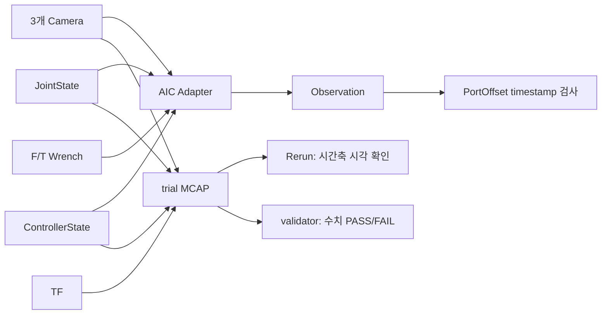

# PATCH_04 - Rerun 기반 센서 Timestamp 동기화 디버깅

- 작성일: 2026-08-10
- 브랜치: `feature/data-collection-node`
- 코드 기준: `e7e9342f73be19c71fa69abf53af9d98923eac94` + working tree
- 대상: Gazebo 시작, 세 Camera, 동적 TCP, AIC Adapter, trial MCAP, Rerun, offline validator
- 구현 상태: 코드 변경 없이 적용 가능성과 실행 절차 작성
- 결론: **Gazebo보다 먼저 MCAP recorder를 시작해야 최초 `/clock`, Camera 첫 frame, JointState·ControllerState 시작을 비교할 수 있다. 세 Camera는 모두 20 Hz로 설정되지만 독립 sensor라서 동시 시작은 보장되지 않는다. PortOffset의 Camera–TCP 관계는 정확히 같은 시각의 pose가 아니라 center Image와 30 ms 이내인 과거 ControllerState를 사용한다. Rerun은 event 주기와 지연 구간을 찾는 도구이며 정확한 차이는 raw timestamp 계산으로 확정해야 한다.**

### Why?

현재 `Observation` 하나에 세 Camera, JointState, ControllerState, F/T sensor가 함께 들어 있다. 하지만 같은 ROS message에 들어 있다는 사실만으로 같은 순간에 측정됐다고 판단할 수 없다. 각 내부 message는 자신의 `header.stamp`를 가지며, AIC Adapter는 Camera 촬영 시각을 기준으로 이전에 도착한 state를 골라 함께 넣는다.

또한 기존 PortOffset 자동 recorder는 Gazebo를 먼저 실행하고 기본 `5 s`를 기다린 뒤 시작한다. 이 MCAP은 trial 중 동기화 검사에는 사용할 수 있지만 Gazebo 최초 `/clock`과 세 Camera의 첫 frame은 이미 지나갔을 수 있다. **simulation 및 sensor 시작 지연을 측정할 때는 Zenoh router와 recorder를 먼저 실행하고 Gazebo launch를 마지막에 시작해야 한다.**

Rerun은 MCAP에 기록된 topic을 시간축에 나열하고, 특정 시점으로 이동하면서 Camera 영상·JointState·TF 등을 함께 볼 수 있다. 공식 [MCAP message 형식 문서](https://rerun.io/docs/concepts/logging-and-ingestion/mcap/message-formats)에 따르면 ROS 2 `Header.stamp`는 `ros2_timestamp` 또는 `ros2_duration` timeline으로 만들어진다. Viewer의 [Timeline](https://rerun.io/docs/reference/viewer/timeline)은 topic별 event 위치를 확대하고 임의 시점으로 이동할 수 있다.

다만 Rerun이 이 프로젝트의 `30 ms` 허용 기준을 자동으로 판정하지는 않는다. Viewer에 여러 값이 동시에 보이는 것도 timestamp가 같다는 증거가 아니다. Rerun은 현재 시점 이전의 마지막 값을 계속 보여 주는 방식도 사용하므로, **화면 내용뿐 아니라 timeline event 위치와 실제 timestamp 숫자를 확인해야 한다.**

#### 개념

| 개념 | 쉬운 설명 | 이 프로젝트에서의 판단 기준 |
|---|---|---|
| 같은 clock | 모든 timestamp가 같은 시계를 기준으로 생성됨 | simulation에서는 ROS simulation time을 사용해야 함 |
| 같은 timestamp | 두 message의 `sec`, `nanosec` 값이 완전히 같음 | Camera hardware trigger처럼 정확한 동시 촬영을 주장할 때 필요 |
| 허용 오차 안의 동기화 | timestamp가 다르지만 정해진 범위 안에 있음 | PortOffset 수집기는 center Camera 기준 기본 `30 ms` 사용 |
| `header.stamp` | sensor 또는 producer가 측정값에 붙인 시각 | sensor 동기화 판단에 사용 |
| MCAP 기록 시각 | recorder가 message를 받은 시각 | 통신·queue 지연이 포함될 수 있어 측정 시각 대신 사용하지 않음 |
| Rerun timeline | 여러 topic의 event가 발생한 시점을 한 줄씩 보여 주는 화면 | 누락, 지연, 주기 차이, timestamp 몰림을 찾는 데 사용 |

“하나의 timestamp로 통합한다”는 표현보다 다음처럼 구분하는 편이 정확하다.

| 질문 | 확인할 값 |
|---|---|
| 같은 시계를 사용하는가? | ROS simulation time 또는 system time 사용 여부 |
| 정확히 동시에 측정됐는가? | `header.stamp` 완전 일치 여부 |
| 학습 sample로 함께 써도 되는가? | 기준 timestamp와 각 sensor의 차이가 허용 오차 이하인지 |

### What I Made

코드는 변경하지 않았다. 다음 내용을 정리했다.

- 현재 AIC Adapter의 Camera·JointState·ControllerState·F/T 결합 방식 감사
- Gazebo 최초 `/clock`과 sensor별 첫 `header.stamp`를 기록하는 별도 시작 순서
- 세 Camera의 생성 설정·주기·첫 frame 동시성 보장 여부
- center Image와 동적 TCP pose 사이의 현재 동기화 수준
- PortOffset 수집기의 timestamp 승인 범위와 검사에서 빠진 sensor 식별
- 기존 trial MCAP을 Rerun으로 여는 최소 절차
- Rerun Viewer에서 잘못된 동기화를 찾는 방법
- 기존 offline validator와 Rerun의 역할 분리
- 전체 sensor 검사가 필요할 때 한 trial에 추가로 기록할 topic 목록

### What was problem

#### 기존 자동 MCAP은 simulation 기동 시점을 포함하지 않음

`ws_aic/src/phy/phy_data_collection/phy_data_collection/collect_portoffset_randomization_data.py` | [_run_trial()](../ws_aic/src/phy/phy_data_collection/phy_data_collection/collect_portoffset_randomization_data.py#L186)은 Gazebo를 실행한 뒤 `policy_start_wait_s`만큼 기다리고 `start_rosbag()`을 호출한다. 기본 대기값은 `5 s`다.

```python
# ws_aic/src/phy/phy_data_collection/phy_data_collection/collect_portoffset_randomization_data.py | _run_trial()
# Gazebo와 Zenoh router가 먼저 시작된다.
simulator_proc = start_gazebo(...)

# 기본 5 s 동안 최초 /clock과 sensor message가 recorder 없이 발행될 수 있다.
time.sleep(wait_s)

# 이후 trial 구간만 기록한다.
rosbag_session = start_rosbag(...)
```

따라서 기존 `--record-rosbag true` 결과에서 처음 발견된 Camera message는 **sensor의 실제 첫 frame이 아니라 recorder가 시작된 뒤 처음 받은 frame**이다.

현재 Pixi 환경도 확인이 필요하다. `ws_aic/src/phy/phy_data_collection/phy_data_collection/portoffset_randomization/runtime.py` | [start_rosbag()](../ws_aic/src/phy/phy_data_collection/phy_data_collection/portoffset_randomization/runtime.py#L123)은 `-s mcap`을 지정하지만, 2026-08-10 현재 `pixi run ros2 bag record --help`에는 `sqlite3`만 표시되고 `ros2 pkg prefix rosbag2_storage_mcap`은 `Package not found`를 반환했다. **`ros-kilted-rosbag2-storage-mcap`을 Pixi `phy` feature에 추가하기 전에는 현재 host recorder의 MCAP 생성을 전제로 하면 안 된다.**

#### 현재 데이터 흐름



#### 세 Camera의 주기와 시작 동시성

`ws_aic/src/aic/aic_assets/models/Basler Camera/basler_camera_macro.xacro`의 [Camera sensor 설정](../ws_aic/src/aic/aic_assets/models/Basler%20Camera/basler_camera_macro.xacro#L84)은 각 Camera에 다음 값을 독립적으로 설정한다.

```xml
<!-- ws_aic/src/aic/aic_assets/models/Basler Camera/basler_camera_macro.xacro | basler_camera macro -->
<!-- 각 sensor는 20 Hz로 계속 frame을 생성하지만 공통 trigger는 선언하지 않는다. -->
<sensor name="${name}" type="camera">
  <update_rate>20.0</update_rate>
  <always_on>true</always_on>
</sensor>
```

세 Camera 모두 같은 macro와 `20 Hz`, 즉 명목상 `50 ms` 주기를 사용한다. 하지만 left, center, right는 각각 별도 Gazebo `<sensor>` instance다. 공통 hardware trigger, 공유 frame counter, 동일한 최초 `header.stamp` 조건은 없다. 따라서 다음을 구분해야 한다.

| 질문 | 코드가 보장하는 값 | 실측 필요 여부 |
|---|---|---|
| 세 Camera가 launch에 포함되는가? | 세 sensor 모두 같은 robot description에 생성됨 | 아니오 |
| 세 Camera의 설정 주기가 같은가? | 모두 20 Hz | 실제 누락·jitter는 실측 |
| 세 Camera 첫 frame이 같은 시각인가? | 보장 없음 | **MCAP 첫 stamp 비교 필요** |
| Observation의 세 frame이 가까운가? | left 기준 center/right 각각 1 ms 이하 | raw topic과 Observation 모두 확인 |

#### AIC Adapter가 실제로 묶는 방법

`ws_aic/src/aic/aic_adapter/src/aic_adapter.cpp` | [AicAdapterNode::image_callback()](../ws_aic/src/aic/aic_adapter/src/aic_adapter.cpp#L127)은 left Camera 시각을 기준으로 center와 right Camera가 각각 `1 ms` 이내일 때만 `Observation`을 만든다.

$$
|t_i-t_L| \le 1\,\mathrm{ms},
\qquad i\in\{C,R\}
$$

$t_L$, $t_C$, $t_R$은 left, center, right Image의 ROS `header.stamp`다. 각 Camera는 left와 `1 ms` 이내지만 center와 right가 left의 서로 반대쪽에 있으면 전체 Camera 시각 범위는 최대 `2 ms`가 될 수 있다. 따라서 “세 Camera timestamp가 완전히 같다”는 뜻은 아니다.

같은 함수는 JointState, ControllerState, F/T Wrench에 대해 Camera 이후의 미래 값은 쓰지 않고 left Camera 시각보다 작거나 같은 값 중 가장 최근 값을 선택한다.

$$
t_{\mathrm{state}}
=
\max\{t_k\mid t_k\le t_L\}
$$

$t_k$는 deque에 저장된 state timestamp다. 이 선택은 미래 값을 섞지 않는 장점이 있지만 Camera와 state의 최대 시간 차이를 제한하지 않는다. 오래된 state만 남아 있어도 `Observation`이 발행될 수 있다.

#### 동적 TCP와 Camera 사이의 현재 동기화

세 Camera는 움직이는 `tool0`에 fixed joint로 부착된다. 따라서 Camera extrinsic은 고정이지만 `base_link` 기준 Camera pose는 TCP와 함께 계속 변한다.

`ws_aic/src/aic/aic_controller/src/aic_controller.cpp` | [Controller::populate_controller_state()](../ws_aic/src/aic/aic_controller/src/aic_controller.cpp#L1257)은 controller update에서 읽은 `current_tool_state_.pose`와 `get_node()->now()`를 같은 `ControllerState`에 기록한다. Controller manager와 AIC controller의 설정 주기는 모두 `500 Hz`, 명목상 `2 ms`다.

PortOffset에서는 `ws_aic/src/phy/phy_policy/data_generator/data_generator/port_offset_dataset.py` | [_observation_sync_metadata()](../ws_aic/src/phy/phy_policy/data_generator/data_generator/port_offset_dataset.py#L105)이 center Image와 선택된 ControllerState의 차이를 검사한다.

$$
\Delta t_{\mathrm{TCP-camera}}
=
|t_{\mathrm{controller}}-t_C|
\le 30\,\mathrm{ms}
$$

$t_C$는 center Image 촬영 simulation time, $t_{\mathrm{controller}}$는 그 Image보다 미래가 아닌 최신 ControllerState simulation time이다. 이 조건은 pose가 촬영 시각에서 최대 30 ms 이전임을 뜻한다. **동일 timestamp의 TCP pose를 보장하거나 두 state 사이를 보간하지는 않는다.**

`ws_aic/src/phy/phy_policy/data_generator/data_generator/port_offset_frames.py` | [_base_to_camera_optical_matrix()](../ws_aic/src/phy/phy_policy/data_generator/data_generator/port_offset_frames.py#L76)은 선택된 `ControllerState.tcp_pose`와 고정 extrinsic으로 `base_link` 기준 Camera pose를 계산한다.

$$
T_{B\leftarrow C}(t_s)
=
T_{B\leftarrow TCP}(t_s)
T_{TCP\leftarrow tool0}
T_{tool0\leftarrow C}
$$

$B$는 `base_link`, $C$는 Camera optical frame, $t_s=t_{\mathrm{controller}}$다. 마지막 두 transform은 fixed joint에서 얻은 고정 extrinsic이고 첫 transform만 동적이다. Camera Image 시각은 $t_C$이므로 로봇이 빠르게 움직일수록 $|t_C-t_s|$가 pixel projection 오차로 이어질 수 있다. 더 강한 보장이 필요하면 `base_link <- camera optical` TF를 **각 Image의 `header.stamp`로 직접 조회**해야 한다.

#### PortOffset 수집기가 추가로 검사하는 범위

`ws_aic/src/phy/phy_policy/data_generator/data_generator/port_offset_dataset.py` | [_observation_sync_metadata()](../ws_aic/src/phy/phy_policy/data_generator/data_generator/port_offset_dataset.py#L105)은 center Image를 sample 기준시각으로 사용한다.

$$
\Delta t_{\mathrm{camera}}
=
\max(t_L,t_C,t_R)-\min(t_L,t_C,t_R)
$$

$$
\Delta t_{\mathrm{controller}}
=
|t_{\mathrm{controller}}-t_C|
$$

두 값이 기본 허용 오차 `30 ms` 이하인 Observation만 승인한다. 이어서 `ws_aic/src/phy/phy_policy/data_generator/data_generator/port_offset_dataset.py` | [_tf_sync_metadata()](../ws_aic/src/phy/phy_policy/data_generator/data_generator/port_offset_dataset.py#L211)은 움직이는 plug TF와 center Image의 시각 차이도 같은 허용 오차로 검사한다. trial 중 고정된 port snapshot과 `/tf_static`은 시각 차이 검사에서 제외한다.

#### 현재 sensor별 보장 수준

| 데이터 | AIC Adapter 처리 | PortOffset 추가 검사 | 현재 판단 |
|---|---|---|---|
| Left·Center·Right Image | center/right가 left 기준 각각 `1 ms` 이내 | 전체 Camera 범위가 `30 ms` 이내 | Camera는 근접 동기화됨. 완전 동일 timestamp는 아님 |
| CameraInfo | 마지막 값을 복사하고 해당 Image timestamp로 덮어씀 | 별도 검사 없음 | 표시된 stamp는 실제 수신시각이 아니라 Image에 맞춘 값 |
| JointState | left Image 이전의 가장 최근 값 선택 | 별도 검사 없음 | 오래된 JointState가 포함될 가능성 있음 |
| ControllerState | left Image 이전의 가장 최근 값 선택 | center Image 기준 `30 ms` 이내 | PortOffset sample에서는 허용 오차 보장 |
| F/T Wrench | left Image 이전의 가장 최근 값 선택 | 별도 검사 없음 | 오래된 Wrench가 포함될 가능성 있음 |
| 움직이는 plug TF | Adapter가 Observation에 넣지 않음 | center Image 시각으로 조회하고 `30 ms` 검사 | PortOffset sample에서는 허용 오차 보장 |
| 동적 TCP·Camera pose | left Image 이전의 최신 ControllerState TCP 사용 | center Image 기준 ControllerState가 `30 ms` 이내인지 검사 | 근접 동기화만 보장; exact-time TF·보간 없음 |
| 고정 port TF | trial 시작 시 한 번 snapshot | 정적 source로 처리 | 같은 trial 동안 움직이지 않는다는 전제 사용 |

결론적으로 현재 시스템은 **Camera + ControllerState + 필요한 TF**에 대해서는 PortOffset sample 단위의 근접 동기화를 검사한다. **JointState와 F/T Wrench까지 포함한 전체 Observation 동기화는 아직 보장하지 않는다.**

#### 코드 근거

| 파일 위치 | 함수 | 역할 |
|---|---|---|
| `ws_aic/src/aic/aic_adapter/src/aic_adapter.cpp` | [AicAdapterNode::image_callback()](../ws_aic/src/aic/aic_adapter/src/aic_adapter.cpp#L127) | 입력: 세 Camera, CameraInfo, state deque<br>처리: Camera 시각 검사 후 가장 최근의 과거 JointState·ControllerState·Wrench 선택<br>결과: 하나의 `Observation` 발행 |
| `ws_aic/src/aic/aic_controller/src/aic_controller.cpp` | [Controller::populate_controller_state()](../ws_aic/src/aic/aic_controller/src/aic_controller.cpp#L1257) | 입력: 현재 controller와 robot state<br>처리: controller node의 현재 ROS 시각을 `header.stamp`로 기록<br>결과: Camera와 비교 가능한 ControllerState 생성 |
| `ws_aic/src/phy/phy_policy/data_generator/data_generator/port_offset_dataset.py` | [_observation_sync_metadata()](../ws_aic/src/phy/phy_policy/data_generator/data_generator/port_offset_dataset.py#L105) | 입력: 세 Image와 ControllerState timestamp<br>판정: center Image 기준 Camera·ControllerState 차이를 허용 오차와 비교<br>결과: 승인 여부와 `skew_ns` metadata 반환 |
| `ws_aic/src/phy/phy_policy/data_generator/data_generator/port_offset_dataset.py` | [_tf_sync_metadata()](../ws_aic/src/phy/phy_policy/data_generator/data_generator/port_offset_dataset.py#L211) | 입력: capture 시각과 port·plug TF<br>판정: 동적 TF만 capture 시각과 비교하고 정적 source 제외<br>결과: TF별 timestamp·skew·transform 기록 |
| `ws_aic/src/phy/phy_policy/data_generator/data_generator/port_offset_frames.py` | [_base_to_camera_optical_matrix()](../ws_aic/src/phy/phy_policy/data_generator/data_generator/port_offset_frames.py#L76) | 입력: 선택된 ControllerState TCP pose와 Camera 이름<br>처리: TCP pose에 고정 tool0·Camera extrinsic 합성<br>결과: `base_link` point를 Camera optical frame으로 보내는 행렬 반환 |
| `ws_aic/src/phy/phy_data_collection/phy_data_collection/collect_portoffset_randomization_data.py` | [_run_trial()](../ws_aic/src/phy/phy_data_collection/phy_data_collection/collect_portoffset_randomization_data.py#L186) | 입력: trial 설정과 recorder 활성화 여부<br>처리: Gazebo 실행·기본 5 s 대기 후 recorder 시작<br>결과: trial MCAP은 생성하지만 simulation 최초 기동 구간은 기록하지 못함 |
| `ws_aic/src/phy/phy_data_collection/phy_data_collection/portoffset_randomization/runtime.py` | [start_rosbag()](../ws_aic/src/phy/phy_data_collection/phy_data_collection/portoffset_randomization/runtime.py#L123) | 입력: trial 출력 경로와 topic 목록<br>처리: `ros2 bag record -s mcap` 실행<br>결과: Rerun이 직접 열 수 있는 trial MCAP 생성 |
| `ws_aic/src/phy/phy_data_collection/phy_data_collection/portoffset_validation.py` | [read_trial_sources()](../ws_aic/src/phy/phy_data_collection/phy_data_collection/portoffset_validation.py#L264) | 입력: trial MCAP과 저장 sample metadata<br>처리: 정확한 Image·ControllerState timestamp와 TF tree 복원<br>결과: sample 검증에 사용할 원본 message 집합 반환 |
| `ws_aic/src/phy/phy_data_collection/phy_data_collection/portoffset_validation.py` | [validate_sample()](../ws_aic/src/phy/phy_data_collection/phy_data_collection/portoffset_validation.py#L321) | 입력: dataset sample과 MCAP 원본<br>판정: Camera·ControllerState·plug TF 시각 및 JPEG·label 일치 확인<br>결과: sample별 PASS/FAIL과 오류 이유 반환 |

### How it changed

현재 코드는 그대로 두고 디버깅 흐름만 다음처럼 확장한다.

| 이전 확인 방법 | 추가할 확인 방법 | 효과 |
|---|---|---|
| terminal log에서 개별 timestamp 확인 | Rerun timeline에서 모든 topic event를 확대해 비교 | 누락·주기 차이·지연 구간을 빠르게 찾음 |
| RViz에서 최신 sensor 값 확인 | Rerun에서 MCAP을 멈추고 과거 시점 반복 확인 | 재현 가능한 offline 분석 가능 |
| validator의 최종 PASS/FAIL 확인 | Rerun으로 실패 구간을 먼저 찾은 뒤 validator JSON 확인 | 수치 실패가 발생한 장면과 sensor 상태를 함께 해석 |

Rerun은 기존 validator를 대체하지 않는다.

| 도구 | 답할 수 있는 질문 |
|---|---|
| Rerun | 어느 topic이 늦거나 빠른가? 특정 구간에서 frame이 빠졌는가? 영상과 robot state 변화가 눈으로 자연스러운가? |
| `validate_portoffset_trial` | 실제 timestamp 차이가 허용값 이하인가? 저장 JPEG와 MCAP 원본이 byte 단위로 일치하는가? TF와 label 오차가 기준 이내인가? |

## 적용 절차

### 1. 현재 도구 상태와 MCAP plugin 확인

현재 Pixi lock에는 Rerun `0.26.2`가 이미 설치되어 있다. 기존 문서의 `rerun mcap info --full`은 이 버전에 없으므로 사용하지 않는다.

```bash
cd /home/swlinux/Desktop/workspace/aic-physic/ws_aic/src
pixi run rerun --version
pixi run ros2 pkg prefix rosbag2_storage_mcap
```

두 번째 명령이 `Package not found`이면 `pixi.toml`의 `phy` feature에 MCAP storage plugin을 추가한다.

```bash
cd /home/swlinux/Desktop/workspace/aic-physic/ws_aic/src
pixi add --feature phy ros-kilted-rosbag2-storage-mcap
pixi run ros2 bag record --help
```

`--storage` 선택지에 `mcap`이 보여야 다음 단계로 진행한다.

### 2. Zenoh router를 Gazebo와 분리해 먼저 실행

`/entrypoint.sh`은 router와 Gazebo를 연속 실행하므로 이번 측정에서는 사용하지 않는다. Terminal 1:

```bash
cd /home/swlinux/Desktop/workspace/aic-physic/ws_aic/src
export RMW_IMPLEMENTATION=rmw_zenoh_cpp
export ZENOH_CONFIG_OVERRIDE='transport/shared_memory/enabled=false'
pixi run ros2 run rmw_zenoh_cpp rmw_zenohd
```

### 3. MCAP recorder를 Gazebo보다 먼저 실행

Terminal 2에서 `Recording...` 또는 topic 대기 로그를 확인한다. `--use-sim-time`은 첫 `/clock` 전에는 message를 쓰지 않고, Gazebo simulation time을 bag log time으로 사용한다.

```bash
cd /home/swlinux/Desktop/workspace/aic-physic/ws_aic/src
export RMW_IMPLEMENTATION=rmw_zenoh_cpp
export ZENOH_CONFIG_OVERRIDE='transport/shared_memory/enabled=false'

pixi run ros2 bag record -s mcap --use-sim-time \
  -o /home/swlinux/Desktop/workspace/aic-physic/rosbags/startup_sync \
  --topics \
  /clock \
  /left_camera/image /center_camera/image /right_camera/image \
  /joint_states \
  /aic_controller/controller_state \
  /tf /tf_static
```

출력 디렉터리는 실행 전에 존재하지 않아야 한다.

### 4. Gazebo만 마지막에 실행

Terminal 3에서 evaluation container의 설치 workspace를 직접 launch한다. 별도 router를 이미 실행했으므로 `/entrypoint.sh`을 호출하지 않는다.

```bash
export DBX_CONTAINER_MANAGER=docker

distrobox enter -r aic_eval_physic -- bash -lc '
  source /ws_aic/install/setup.bash
  export RMW_IMPLEMENTATION=rmw_zenoh_cpp
  export ZENOH_CONFIG_OVERRIDE="transport/shared_memory/enabled=false"
  exec ros2 launch aic_bringup aic_gz_bringup.launch.py \
    ground_truth:=true \
    start_aic_engine:=false \
    gazebo_gui:=true \
    launch_rviz:=false \
    spawn_task_board:=false \
    spawn_cable:=false
'
```

최초 message를 충분히 기록한 뒤 Terminal 2의 recorder를 `Ctrl+C`로 먼저 종료해 MCAP을 finalize한다. 그다음 Gazebo와 router를 종료한다.

### 5. 계산할 값

`/clock`에는 `Header`가 없으므로 첫 message의 `clock` 필드를 simulation 관측 시작 $t_0$로 사용한다. Camera·JointState·ControllerState는 각 message의 `header.stamp`를 사용한다.

$$
\Delta t_{\mathrm{start},x}=t_{x,\mathrm{first}}-t_0
$$

세 Camera 시작 편차와 frame 주기는 다음과 같이 계산한다.

$$
S_{\mathrm{camera}}=\max(t_{L,0},t_{C,0},t_{R,0})-\min(t_{L,0},t_{C,0},t_{R,0})
$$

$$
P_{i,k}=t_{i,k+1}-t_{i,k},\qquad P_{\mathrm{nominal}}=50\,\mathrm{ms}
$$

$S_{\mathrm{camera}}$가 0일 때만 첫 frame timestamp가 완전히 같다. $P_{i,k}$ 분포로 20 Hz 유지, jitter, frame 누락을 확인한다. ControllerState와 center Image는 각 center frame보다 미래가 아닌 최신 state를 골라 $t_C-t_{\mathrm{controller}}$를 계산한다.

### 6. Rerun에서 확인

```bash
cd /home/swlinux/Desktop/workspace/aic-physic/ws_aic/src
pixi run ros2 bag info /home/swlinux/Desktop/workspace/aic-physic/rosbags/startup_sync
pixi run rerun /home/swlinux/Desktop/workspace/aic-physic/rosbags/startup_sync/*.mcap
```

Viewer에서 `ros2_duration` timeline을 선택하고 millisecond 단위까지 확대한다. 세 Image event의 시작 위치·간격, `/joint_states`·ControllerState의 시작 위치, robot motion 중 Camera event와 state event 간격을 확인한다. **같은 화면에 값이 보이는지만 보면 안 된다. Rerun은 cursor 이전의 마지막 값을 유지할 수 있으므로 event 점과 Selection panel의 timestamp를 함께 본다.**

Rerun으로 확인 가능한 것은 주기 차이, frame 누락, 큰 지연 구간, 동작과 영상의 정성적 대응이다. `/clock.clock`과 모든 `header.stamp`의 정확한 차이, 1 ms·30 ms PASS/FAIL은 MCAP message를 수치로 읽어 계산해야 한다. 현재 `validate_portoffset_trial`은 저장 sample 검증용이며 simulation 최초 시작 편차와 JointState 편차를 계산하지 않는다.

### 7. 현재 판정 기준

| 항목 | 현재 기준 | 의미 |
|---|---:|---|
| Camera 명목 주기 | `50 ms` | 20 Hz 설정; 실제 분포 측정 필요 |
| left-center, left-right Image | 각각 `1 ms` 이하 | Adapter가 Observation을 만드는 조건 |
| 세 Image 전체 span | PortOffset `30 ms` 이하 | 저장 승인 조건; Adapter 통과 frame은 이보다 강함 |
| ControllerState-center Image | `30 ms` 이하 | PortOffset 저장 승인 조건 |
| 첫 Camera 시작 span | 기준 없음 | 여러 정상 실행의 분포를 먼저 측정해야 함 |
| JointState-camera | 기준 없음 | 여러 정상 실행의 분포를 먼저 측정해야 함 |

## 제한 사항

- $t_0$는 recorder가 처음 관측한 `/clock.clock`이다. Gazebo process 생성 wall time 자체가 아니며, process 기동 지연까지 필요하면 별도의 monotonic wall-clock event를 기록해야 한다.
- Rerun은 timestamp를 보여 주지만 이 프로젝트의 근접 동기화 규칙을 자동으로 이해하지 않는다.
- Rerun에 여러 sensor가 동시에 표시된다는 사실만으로 같은 시각의 측정이라고 결론 내리면 안 된다.
- `aic_control_interfaces/ControllerState`와 `aic_model_interfaces/Observation`은 custom message다. Rerun은 reflection으로 내용을 읽을 수 있지만 표준 Image·TF처럼 자동으로 최적 시각화되지 않을 수 있다.
- 현재 기본 MCAP에는 F/T Wrench와 CameraInfo가 없다. 전체 Observation 감사에는 debug trial의 topic 확장이 필요하다.
- 이 보고서 작성 시 workspace에 실행 가능한 trial MCAP이 없어 실제 Viewer 화면은 검증하지 못했다.
- live ROS 2 bridge는 추가하지 않는다. 공식 [ROS 2 연동 문서](https://rerun.io/docs/howto/integrations/ros2-nav-turtlebot)는 native ROS 지원이 아직 없다고 설명하므로, 현재는 이미 존재하는 MCAP 경로가 더 단순하고 재현 가능하다.

## 검증

정적 코드 감사와 기존 timestamp 회귀 테스트를 수행했다.

```text
test_port_offset_timestamp_sync.py: 12 passed in 2.13s
rerun-cli: 0.26.2
rosbag2_storage_mcap: Package not found
```

실행 명령:

```bash
cd /home/swlinux/Desktop/workspace/aic-physic/ws_aic/src
.pixi/envs/default/bin/pytest \
  phy/phy_policy/data_generator/test/test_port_offset_timestamp_sync.py -q
```

검증 범위는 Camera·ControllerState·TF의 현재 helper와 rejection 동작, 설치된 Rerun CLI 버전, host Pixi의 MCAP plugin 부재 확인이다. **MCAP plugin 설치, Gazebo보다 앞선 recorder 실행, Rerun GUI 표시, 실제 Camera·TCP skew 측정은 아직 E2E 검증하지 않았다.**

## 최종 판단

Rerun은 이 프로젝트에 의미가 있다. 특히 terminal log만으로 찾기 어려운 **topic별 주기 차이, frame 누락, command 이후 sensor 반응 지연, TF 시간 불연속**을 같은 화면에서 반복 확인할 수 있다.

하지만 현재 상태를 “모든 센서가 하나의 timestamp로 통합됐다”고 표현하면 틀리다. 정확한 표현은 다음과 같다.

> AIC Adapter는 세 Camera를 근접 정렬하고 과거의 최근 robot state를 하나의 Observation에 묶는다. PortOffset 수집기는 그중 Camera·ControllerState·필요한 TF가 허용 오차 안에 있는지 추가 검사한다. JointState와 F/T Wrench의 최대 시각 차이는 아직 검사하지 않는다.

따라서 권장 흐름은 **MCAP 기록 → Rerun으로 문제 구간 탐색 → 기존 validator로 정확한 PASS/FAIL 확정 → 필요할 때만 JointState·F/T skew 검사 추가**다.
