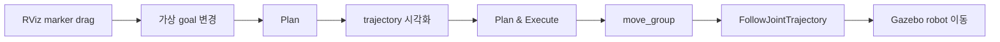

# PATCH_05 - MoveIt 적용 판단

- 작성일: 2026-08-06
- 최종 수정일: 2026-08-09
- 검토 브랜치: `feature/data-collection-node`
- 검토 커밋: `e7e9342f73be19c71fa69abf53af9d98923eac94`
- 범위: AIC robot의 MoveIt planning, RViz 조작, Cartesian trajectory message와 controller 통합
- 구현 상태: 설계 및 코드 감사 완료, MoveIt runtime·configuration 미적용

결론:

- MoveIt은 Cartesian 목표도 받지만 collision-free path를 찾고 검증하는 중심 상태는 robot joint configuration이므로 joint-space planning에 특히 강하다.
- 목표 joint angle을 이미 알고 있다면 joint-space command 작성은 단순하지만, vision이 제공하는 port pose에서 그 angle을 구하는 문제까지 쉬워지는 것은 아니다.
- 직접 Cartesian interpolation보다 IK·path search·collision checking·time parameterization을 수행하므로 계산량과 planning latency가 커지고 실행시간의 변동성도 높아질 수 있다.
- Port 근처 정렬은 일부 joint의 hard lock보다 TCP 오차를 기준으로 joint movement cost에 차등을 두는 방식이 더 적절하다. 선택한 joint 수가 정렬 자유도보다 작으면 목표 pose에 도달할 수 없기 때문이다.
- Joint 선택은 TCP와의 물리적 거리로 정하지 않고 pre-insertion 자세의 Jacobian column을 port frame에서 해석한 뒤 Gazebo의 작은 joint motion으로 검증해야 한다.
- 현재 AIC에는 `moveit_msgs`만 있고 `move_group`, SRDF/configuration, RViz MotionPlanning plugin과 trajectory execution controller가 없어 RViz marker로 Gazebo robot을 바로 움직일 수 없다.
- MoveIt UI를 처음 확인할 때는 AIC Kilted 환경을 변경하지 않고 공식 `main-jazzy-tutorial-source` Docker image를 사용한다. 지속적인 Jazzy 개발에는 별도 home을 가진 `jazzy-release` Distrobox가 적합하다.
- 권장 경계는 MoveIt으로 free-space에서 pre-insertion pose까지 이동하고, 접촉·장력·정밀 보정이 필요한 마지막 구간은 기존 AIC Cartesian impedance controller로 실행하는 방식이다.

### Why?

MoveIt을 planned timestamp 계산기로만 보면 현재 단일 Cartesian command에 비해 통합 범위가 지나치게 커진다. 반대로 Task Board 회피, self-collision 검사, 다양한 시작 joint configuration과 여러 waypoint가 필요하면 단순 직선 interpolation만으로 안전한 경로를 선택할 수 없다.

따라서 다음 세 질문을 분리해야 한다.

1. 목표를 어느 좌표계로 지정하는가: joint target 또는 Cartesian TCP pose.
2. planner가 어떤 상태에서 경로를 탐색하는가: robot joint configuration.
3. 실제 접촉 motion을 무엇으로 제어하는가: trajectory controller 또는 impedance controller.

MoveIt의 도입 여부는 “Cartesian 목표를 쓰는가”보다 “목표까지 가는 경로 선택과 collision 검증이 필요한가”로 판단해야 한다.

또한 port에 가까운 wrist joint가 정렬에 유리하다고 바로 가정할 수 없다. 같은 joint도 robot 자세에 따라 TCP translation·rotation에 미치는 영향이 달라지므로 현재 자세의 Jacobian과 실제 작은 motion을 함께 확인해야 한다.

### 개념

| 개념 | 쉬운 설명 | AIC에서의 의미 |
|---|---|---|
| Joint space | 각 robot joint angle의 조합으로 자세를 표현하는 공간 | 한 상태를 $\mathbf{q}=[q_1,\ldots,q_6]^{\mathsf T}$로 표현하며 joint limit·self-collision을 직접 검사할 수 있다. |
| Cartesian space | TCP의 XYZ와 orientation으로 목표를 표현하는 공간 | camera와 port 기준으로 목표 pose를 지정하기 쉽지만 같은 TCP pose에 여러 IK 해가 존재할 수 있다. |
| Inverse Kinematics | 원하는 TCP pose를 만드는 joint configuration을 찾는 계산 | Cartesian goal을 MoveIt planning state로 변환하는 연결 단계다. |
| Jacobian | 각 joint의 작은 회전이 현재 자세에서 TCP의 어느 방향 이동·회전을 만드는지 나타낸 표 | 일부 joint만으로 필요한 port 정렬축을 제어할 수 있는지 확인한다. |
| Planning Scene | robot state와 rigid environment collision geometry를 관리하는 world model | Task Board를 collision object로 등록해야 회피 경로의 의미가 생긴다. |
| Time parameterization | waypoint path에 velocity·acceleration limit를 적용해 timestamp를 추가하는 후처리 | 마지막 point의 `time_from_start`를 planned duration으로 사용할 수 있다. |
| RViz MotionPlanning | marker로 가상 goal을 지정하고 plan을 계산·시각화·실행하는 MoveIt plugin | marker drag는 실제 motion이 아니며 `Plan & Execute`와 controller 연결이 있어야 Gazebo가 움직인다. |

### What I Made

코드는 변경하지 않았다. 다음 내용을 정리했다.

- MoveIt의 joint-space 강점과 Cartesian goal 처리 관계
- 일부 joint만 사용하는 port 정렬의 가능 조건과 권장 weighted control
- Jacobian의 행·열·원소·단위와 selected-joint 검증 절차
- 공식 MoveIt tutorial repository와 AIC UR5e 적용 순서
- ROS 2 Jazzy·MoveIt 공식 Docker image와 Distrobox 생성·검증·정리 절차
- 직접 AIC interpolation과 MoveIt planning의 계산 범위 비교
- MoveIt이 유리한 구간과 부적합한 접촉 구간
- 현재 repository의 MoveIt·RViz·controller 준비 상태
- `moveit_msgs/CartesianTrajectoryPoint` 적용 시 최소·전체 migration 범위
- RViz marker에서 Gazebo execution까지 필요한 통합 순서

### What was problem

#### MoveIt은 joint-space 전용인가?

완전히 joint-space 전용은 아니다. MoveIt motion request는 joint goal 또는 end-effector Cartesian pose를 받을 수 있다. Cartesian goal을 받으면 IK를 통해 가능한 joint configuration 후보를 구하고, planner는 robot configuration의 연속 경로를 탐색한다.

현재 저장소에 구현되지 않은 MoveIt planning의 개념식:

$$
\mathbf{q}_{\mathrm{goal}}
\in
\left\{\mathbf{q}\mid
\operatorname{FK}(\mathbf{q})=\mathbf{T}_{\mathrm{goal}}
\right\}
$$

$\mathbf{T}_{\mathrm{goal}}$은 기준 frame에서 원하는 TCP pose, $\mathbf{q}$는 6개 UR joint angle(rad), $\operatorname{FK}$는 joint state를 TCP pose로 바꾸는 forward kinematics다. IK 해가 여러 개면 같은 Cartesian goal에 여러 joint configuration이 대응할 수 있다.

planner가 선택하는 경로는 다음 제약을 만족해야 한다.

$$
\underset{\mathbf{q}(s)}{\operatorname{minimize}}
\quad J[\mathbf{q}(s)]
$$

$$
\text{subject to}\quad
\mathbf{q}(0)=\mathbf{q}_{\mathrm{start}},
\quad
\operatorname{FK}(\mathbf{q}(1))=\mathbf{T}_{\mathrm{goal}},
$$

$$
\mathbf{q}_{\min}\leq\mathbf{q}(s)\leq\mathbf{q}_{\max},
\qquad
\operatorname{collision}(\mathbf{q}(s))=\mathrm{false}.
$$

$s\in[0,1]$은 path 진행률, $J$는 planner가 사용하는 path cost, $\mathbf{q}_{\min}$과 $\mathbf{q}_{\max}$는 joint limit다. 실제 objective와 탐색 방식은 OMPL·Pilz·CHOMP 등 선택한 planner에 따라 달라진다. 핵심은 Cartesian goal도 최종적으로 valid joint path로 풀어야 한다는 점이다.

따라서 “MoveIt은 joint space에서 더 유리하다”는 이해는 대체로 맞다. 더 정확한 표현은 **Cartesian goal을 받을 수 있지만 joint limit·self-collision·kinematic feasibility를 포함한 configuration-space path planning이 MoveIt의 핵심 강점**이라는 것이다.

#### Joint space에서 프로그래밍하기가 더 쉬운가?

목표 joint angle을 이미 알고 있다면 더 쉽다. `q_goal` 배열을 지정하면 Cartesian pose를 IK로 변환할 필요가 없고, 어떤 joint가 얼마나 움직이는지도 명시적으로 보인다. MoveIt은 planning group 단위의 joint target을 직접 받을 수 있다.

그러나 port 정렬 입력은 camera가 측정한 entrance XYZ와 방향이다. 이 값은 Cartesian task이므로 joint target을 사용하려면 결국 IK 또는 Jacobian 계산으로 joint angle을 구해야 한다. 따라서 다음을 구분해야 한다.

| 상황 | 더 단순한 입력 | 이유 |
|---|---|---|
| Home·observation pose처럼 joint configuration을 미리 알고 있음 | Joint target | 알려진 angle을 그대로 재사용하며 IK 해 선택이 없다. |
| Camera가 port와 TCP의 XYZ·orientation 오차를 측정함 | Cartesian target | perception 결과와 제어 목표의 좌표 표현이 같다. |
| 특정 joint를 반드시 고정해야 함 | Joint constraint 또는 제한된 planning group | 움직일 joint를 명시할 수 있지만 Cartesian target의 도달 가능성을 별도로 확인해야 한다. |

즉 MoveIt이 joint-space API를 제공해 command 작성은 쉬워질 수 있지만, **port pose를 올바른 joint angle로 바꾸는 기구학 문제까지 없어지는 것은 아니다.**

#### 계산량과 planning latency

`ws_aic/src/aic/aic_controller/src/aic_controller.cpp` | [Controller::update_reference_linear_interpolation()](../ws_aic/src/aic/aic_controller/src/aic_controller.cpp#L1610)은 이미 정해진 시작·목표 pose 사이에서 translation linear interpolation과 rotation SLERP를 계산한다. 경로 후보를 탐색하거나 environment collision을 검사하지 않으므로 control tick당 계산 범위가 작고 일정하다.

MoveIt은 요청에 따라 다음 작업을 추가로 수행한다.

1. Cartesian goal이면 IK candidate 계산
2. joint-space path candidate 탐색
3. 각 candidate state의 joint limit·self-collision·environment collision 검사
4. constraint와 feasibility 검사
5. 성공한 path의 time parameterization과 선택적 smoothing

따라서 직접 interpolation보다 계산량이 많고 planning 시간이 길어질 수 있다는 이해도 맞다. 특히 collision checking은 planning 중 반복 호출되며 [MoveIt Kinematics 문서](https://moveit.picknik.ai/main/doc/concepts/kinematics.html)는 planning 계산비용의 큰 부분을 차지할 수 있다고 설명한다.

다만 이 repository에서 MoveIt benchmark를 실행하지 않았으므로 “몇 ms 또는 몇 배 느리다”는 수치는 증명되지 않았다. planning time은 planner, obstacle 수, collision mesh 복잡도, IK 난이도, constraint와 timeout에 따라 달라지며 실패하기 어려운 단순 scene에서는 충분히 빠를 수도 있다. MoveIt planning은 일반적으로 non-real-time 상위 계획 단계이고, 500 Hz AIC control loop를 대체하는 계산이 아니다.

#### 현재 project 상태

| 구성 요소 | 현재 상태 | 근거와 영향 |
|---|---|---|
| MoveIt message | 있음 | [`ws_aic/src/pixi.toml`](../ws_aic/src/pixi.toml#L29)에 `moveit_msgs`만 dependency로 존재한다. |
| MoveIt runtime·`move_group` | 없음 | repository와 Pixi share에서 planning runtime·configuration을 찾지 못했다. |
| RViz 2 | 있음 | [`aic_gz_bringup.launch.py \| RViz launch setup`](../ws_aic/src/aic/aic_bringup/launch/aic_gz_bringup.launch.py#L174)은 `launch_rviz:=true`에서 일반 `aic.rviz`를 연다. |
| RViz MotionPlanning plugin | 없음 | [`aic.rviz`](../ws_aic/src/aic/aic_bringup/rviz/aic.rviz#L1)은 RobotModel·Image·TF display만 설정한다. |
| MoveIt configuration | 없음 | SRDF, planning group, `kinematics.yaml`, planning pipeline과 `moveit_controllers.yaml`이 없다. |
| Trajectory execution controller | 없음 | [`aic_ros2_controllers.yaml`](../ws_aic/src/aic/aic_bringup/config/aic_ros2_controllers.yaml#L1)은 custom `aic_controller`를 등록하고 `joint_trajectory_controller`는 등록하지 않는다. |

현재 `launch_rviz:=true`는 visualization만 제공한다. marker goal, planning과 execution 기능은 활성화하지 않는다.

### How it changed

#### MoveIt이 유리한 구체적 상황

| 상황 | MoveIt이 제공하는 이점 | 현재 프로젝트 예 |
|---|---|---|
| 장애물 회피 | 여러 joint path 후보를 collision checking해 안전한 경로 선택 | Task Board에 부딪히지 않고 위쪽에서 pre-insertion pose로 접근 |
| 다양한 시작 자세 | 현재 joint state에서 IK·joint limit·self-collision을 다시 검증 | trial마다 다른 초기 configuration에서 동일 port 접근 |
| 여러 waypoint와 constraint | 중간 자세·orientation·joint constraint를 하나의 plan에 포함 | Home → observation → board 위쪽 → pre-insertion |
| joint limit가 중요한 큰 이동 | TCP 목표만 보지 않고 각 joint의 feasibility를 검사 | wrist flip, singularity 근처와 joint limit 회피 |
| 표준 trajectory 실행 | time-parameterized `JointTrajectory`와 `FollowJointTrajectory` 연결 | planned path의 desired/actual/error와 result 사용 |
| RViz interactive 검증 | marker로 goal을 바꾸고 reachability·collision·path 확인 | observation pose와 pre-insertion pose 후보를 GUI로 시험 |

#### Port 근처에서 일부 joint만 움직이는 방법

먼저 joint 번호의 의미를 구분해야 한다. 현재 [`aic_ros2_controllers.yaml | joints`](../ws_aic/src/aic/aic_bringup/config/aic_ros2_controllers.yaml#L37)의 1·2번은 `shoulder_pan_joint`, `shoulder_lift_joint`다. TCP에 물리적으로 가까운 distal joint는 4~6번 `wrist_1_joint`, `wrist_2_joint`, `wrist_3_joint`다. 그러나 TCP와 물리적으로 가깝다는 사실이 원하는 XYZ 보정에 유리함을 뜻하지는 않는다. Wrist joint는 주로 orientation을 바꾸며 shoulder·elbow가 TCP position에 크게 관여한다.

##### Jacobian 행렬이 뜻하는 것

UR5e에는 회전 joint가 6개 있고 TCP motion도 translation 3축과 rotation 3축으로 표현하므로 Jacobian은 현재 자세마다 계산되는 $6\times6$ 행렬이다.

`ws_aic/src/aic/aic_controller/src/aic_controller.cpp` | [Controller::update()](../ws_aic/src/aic/aic_controller/src/aic_controller.cpp#L787)이 계산하는 관계:

$$
\begin{bmatrix}
v_x\\v_y\\v_z\\\omega_x\\\omega_y\\\omega_z
\end{bmatrix}
=
\underbrace{
\begin{bmatrix}
J_{x,1}&J_{x,2}&J_{x,3}&J_{x,4}&J_{x,5}&J_{x,6}\\
J_{y,1}&J_{y,2}&J_{y,3}&J_{y,4}&J_{y,5}&J_{y,6}\\
J_{z,1}&J_{z,2}&J_{z,3}&J_{z,4}&J_{z,5}&J_{z,6}\\
J_{\omega x,1}&J_{\omega x,2}&J_{\omega x,3}&J_{\omega x,4}&J_{\omega x,5}&J_{\omega x,6}\\
J_{\omega y,1}&J_{\omega y,2}&J_{\omega y,3}&J_{\omega y,4}&J_{\omega y,5}&J_{\omega y,6}\\
J_{\omega z,1}&J_{\omega z,2}&J_{\omega z,3}&J_{\omega z,4}&J_{\omega z,5}&J_{\omega z,6}
\end{bmatrix}}_{\mathbf J(\mathbf q)}
\begin{bmatrix}
\dot q_1\\\dot q_2\\\dot q_3\\\dot q_4\\\dot q_5\\\dot q_6
\end{bmatrix}
$$

오른쪽 joint velocity 6개(rad/s)에 Jacobian을 곱하면 왼쪽 TCP linear velocity 3개(m/s)와 angular velocity 3개(rad/s)가 나온다. 행과 열의 의미는 다음과 같다.

| 행렬 부분 | 의미 | 읽는 방법 |
|---|---|---|
| 열 1~6 | 각 joint 하나의 영향 | 4열은 `wrist_1_joint`만 양의 방향으로 움직였을 때 생기는 TCP motion이다. |
| 행 1~3 | TCP의 X/Y/Z linear motion | 값의 단위는 m/rad이며 부호는 기준 frame 축의 양·음 방향이다. |
| 행 4~6 | TCP의 X/Y/Z angular motion | joint velocity를 곱하면 rad/s 단위의 회전속도가 된다. |
| 원소 $J_{x,4}$ | 4번 joint가 TCP X motion에 주는 민감도 | 절댓값이 크면 작은 4번 joint 회전으로 X가 많이 변하고, 0에 가까우면 거의 변하지 않는다. |

예를 들어 현재 자세에서 4열이 다음과 같다고 가정한다. 이는 설명용 숫자이며 AIC에서 측정한 값이 아니다.

$$
\mathbf J_{:,4}
=
\begin{bmatrix}
0.20&-0.05&0.01&0&0&1.0
\end{bmatrix}^{\mathsf T}
$$

4번 joint를 $\Delta q_4=0.01\,\mathrm{rad}$만큼 움직이면 작은 motion 근사에서 TCP는 X 방향 $0.20\times0.01=0.002\,\mathrm{m}=2\,\mathrm{mm}$, Y 방향 $-0.5\,\mathrm{mm}$, Z 방향 $0.1\,\mathrm{mm}$ 이동하고 Z축으로 약 $0.01\,\mathrm{rad}$ 회전한다. 즉 joint 하나도 TCP 한 축만 움직이는 것이 아니라 여러 translation·rotation을 동시에 만들 수 있다.

“Jacobian으로 확인한다”는 말은 각 column에 작은 joint 변화량을 곱하여 다음을 확인한다는 뜻이다.

1. 해당 joint가 port의 lateral 오차를 줄이는 방향으로 TCP를 움직이는가.
2. 동시에 원하지 않는 insertion-axis 이동이나 orientation 오차를 크게 만드는가.
3. 선택한 joint column들을 조합하면 필요한 정렬축을 모두 만들 수 있는가.
4. 같은 방향의 column만 있어 해가 불안정해지는 singularity에 가까운가.

`ws_aic/src/aic/aic_controller/src/aic_controller.cpp` | [Controller::update()](../ws_aic/src/aic/aic_controller/src/aic_controller.cpp#L787)는 `base_link` 기준 Jacobian을 계산한다. Port 정렬용으로 해석할 때는 linear·angular 부분을 entrance frame 축으로 회전시켜 “port 기준 좌우·상하·삽입 방향”으로 읽어야 한다. 동일 TCP 지점에서 축 표현만 바꾸는 경우에는 base-to-port rotation을 두 블록에 적용한다. Jacobian은 robot 자세 $\mathbf q$에 따라 달라지므로 Home에서 얻은 값을 pre-insertion 자세에 그대로 사용할 수 없다.

실제 확인 절차:

1. Pre-insertion 자세에서 `/joint_states`의 현재 $\mathbf q$를 읽는다.
2. 현재 코드와 같은 KDL solver로 `gripper/tcp` Jacobian을 계산한다.
3. Jacobian을 target entrance frame 축으로 표현한다.
4. 각 joint에 $0.01\,\mathrm{rad}$를 가정하고 예상 TCP 변화 $\mathbf J_{:,i}\Delta q_i$를 표로 만든다.
5. Gazebo에서 contact 전에 실제로 같은 joint를 $0.01\,\mathrm{rad}$ 움직여 TF 변화와 비교한다.
6. 예측과 실제가 일치한 뒤 필요한 joint 집합을 선택한다.

이 검사는 작은 변화에 대한 1차 근사다. 이동량이 커지면 자세가 변하면서 Jacobian도 변하므로 매 control step 재계산해야 한다. Cable 장력, 접촉력, joint friction과 controller tracking error는 Jacobian 자체에 포함되지 않으므로 Gazebo 실제 motion 검증도 필요하다.

선택한 joint 집합을 $S$라고 하면 작은 정렬 motion의 가능 범위는 해당 joint의 Jacobian column으로 결정된다.

`ws_aic/src/aic/aic_controller/src/actions/cartesian_impedance_action.cpp` | [CartesianImpedanceAction::compute()](../ws_aic/src/aic/aic_controller/src/actions/cartesian_impedance_action.cpp#L40)에 적용할 제안식:

$$
\Delta\mathbf{x}
\approx
\mathbf{J}_S(\mathbf{q})\,\Delta\mathbf{q}_S
$$

$\Delta\mathbf{x}$는 port 기준 TCP 보정량으로 translation은 m, rotation은 rad다. $\Delta\mathbf{q}_S$는 움직이도록 허용한 joint의 각도 변화(rad), $\mathbf{J}_S$는 `base_link` 기준 전체 Jacobian에서 그 joint column만 선택한 행렬이다. 정확한 보정이 가능하려면 목표 보정량이 $\mathbf{J}_S$의 column space 안에 있어야 한다.

joint를 2개만 허용하면 $\operatorname{rank}(\mathbf{J}_S)\leq2$이므로 독립적인 보정 축도 최대 2개다. 예를 들어 lateral X/Y만 보정하고 orientation과 insertion depth를 이미 만족한다면 가능할 수 있다. 반면 XYZ와 port-axis orientation을 함께 맞추는 일반적인 정렬에는 부족하다. 또한 자세에 따라 rank가 낮아지거나 singularity에 가까워질 수 있다.

따라서 joint를 완전히 고정하는 hard constraint보다, 덜 움직이기 원하는 joint에 높은 비용을 주는 weighted differential IK가 안전하다.

`ws_aic/src/aic/aic_controller/src/actions/cartesian_impedance_action.cpp` | [CartesianImpedanceAction::compute()](../ws_aic/src/aic/aic_controller/src/actions/cartesian_impedance_action.cpp#L40)에 적용할 제안식:

$$
\underset{\Delta\mathbf{q}}{\operatorname{minimize}}
\quad
\left\|\mathbf{W}_x\left(\mathbf{J}\Delta\mathbf{q}-\Delta\mathbf{x}\right)\right\|_2^2
+
\lambda\left\|\mathbf{W}_q\Delta\mathbf{q}\right\|_2^2
$$

첫 항은 TCP 정렬오차를 줄이고, 두 번째 항은 joint movement를 억제한다. $\mathbf{W}_x$는 보정할 Cartesian 축의 중요도, $\mathbf{W}_q$는 각 joint의 이동 비용, $\lambda$는 정렬 정확도와 joint movement 사이의 가중치다. 가급적 고정할 joint의 $\mathbf{W}_q$ 값을 크게 두되 무한대로 잠그지 않으면, 선호 joint만으로 목표를 만들 수 없을 때 다른 joint가 최소한으로 보조할 수 있다.

`ws_aic/src/aic/aic_controller/src/aic_controller.cpp` | [Controller::update()](../ws_aic/src/aic/aic_controller/src/aic_controller.cpp#L787)는 6D TCP error와 전체 6개 joint Jacobian을 계산하고, `ws_aic/src/aic/aic_controller/src/actions/cartesian_impedance_action.cpp` | [CartesianImpedanceAction::compute()](../ws_aic/src/aic/aic_controller/src/actions/cartesian_impedance_action.cpp#L40)은 $\boldsymbol{\tau}=\mathbf{J}^{\mathsf T}\mathbf{w}$로 전체 joint torque를 생성한다. 특정 joint 우선순위나 hard mask는 없다. `target_mode: joint`도 존재하지만 `ws_aic/src/aic/aic_controller/src/aic_controller.cpp` | [Controller::on_configure()](../ws_aic/src/aic/aic_controller/src/aic_controller.cpp#L140)의 `JointMotionUpdate` 검증은 6개 joint target을 모두 요구한다.

| 단계 | 권장 방식 | 판단 |
|---|---|---|
| Port에서 먼 free-space 접근 | MoveIt 전체 arm planning | collision·joint limit를 확인하며 pre-insertion pose까지 이동한다. |
| Port 근처 비접촉 정렬 | Cartesian error + weighted differential IK 또는 MoveIt Servo | vision 출력은 그대로 쓰고 불필요한 joint movement만 soft penalty로 억제한다. |
| 실제 접촉·삽입 | 현재 AIC Cartesian impedance | stiffness·damping·wrench 제한을 유지하며 접촉 오차에 대응한다. |

MoveIt Servo는 Cartesian `TwistStamped` 또는 joint jog command를 받아 Jacobian/IK로 연속 command를 만들고 singularity·collision·joint limit 검사를 제공한다. 다만 현재 AIC에도 Jacobian 기반 Cartesian impedance가 있으므로, **MoveIt Servo를 즉시 추가하기보다 현재 controller에 joint weighting이 실제로 필요한지 측정하는 것이 최소 변경**이다.

#### MoveIt 실습 환경

ROS 2 Jazzy Docker/Distrobox 구성, Panda demo, GPU·GUI 확인 절차는 [PATCH_06 - MoveIt 실습 환경](PATCH_06_moveit_practice_environment.md)으로 분리했다.

#### MoveIt이 과한 상황

다음 조건에서는 기존 AIC Cartesian command가 더 작다.

- 목표 pose가 하나이고 이동거리가 짧다.
- 직선 translation과 orientation SLERP면 충분하다.
- waypoint마다 Observation을 저장하고 다음 command를 조건부로 결정한다.
- 필요한 출력이 planned duration 하나뿐이다.
- contact force와 cable load에 대응하는 impedance control이 핵심이다.

MoveIt Planning Scene은 rigid robot/environment geometry 중심이다. 현재 cable은 Gazebo dynamic multi-link model과 constraint로 움직이므로 cable deformation·장력·contact dynamics를 MoveIt path planning만으로 재현할 수 없다.

#### 권장 hybrid workflow


MoveIt은 free-space approach를 담당하고 AIC controller는 접촉 가능성이 큰 정밀 구간을 담당한다. 이 경계는 MoveIt의 collision-aware planning 강점과 impedance controller의 force-response 강점을 각각 사용한다.

#### `CartesianTrajectoryPoint` message 적용

현재 Pixi environment에는 `ws_aic/src/.pixi/envs/default/share/moveit_msgs/msg/CartesianTrajectoryPoint.msg`가 생성되어 있다.

```text
# ws_aic/src/.pixi/envs/default/share/moveit_msgs/msg/CartesianTrajectoryPoint.msg
CartesianPoint point
builtin_interfaces/Duration time_from_start
```

`CartesianPoint`는 pose·velocity·acceleration을 담고 `time_from_start`는 trajectory 시작 기준 planned arrival duration을 담는다. message 자체는 시간을 계산하거나 actual completion을 판정하지 않는다.

단일-point PortOffset 경로에 적용할 제안 schema:

```text
# ws_aic/src/aic/aic_interfaces/aic_control_interfaces/msg/MotionUpdate.msg | proposed schema
std_msgs/Header header
moveit_msgs/CartesianTrajectoryPoint target_state

float64[36] target_stiffness
float64[36] target_damping
geometry_msgs/Wrench feedforward_wrench_at_tip
float64[6] wrench_feedback_gains_at_tip
TrajectoryGenerationMode trajectory_generation_mode
```

| 파일 위치 | 함수 또는 설정 | 변경 요약 |
|---|---|---|
| `ws_aic/src/aic/aic_interfaces/aic_control_interfaces/msg/MotionUpdate.msg` | [`MotionUpdate` schema](../ws_aic/src/aic/aic_interfaces/aic_control_interfaces/msg/MotionUpdate.msg#L1) | 이전: top-level pose·velocity 전달<br>변경: `CartesianTrajectoryPoint target_state`로 교체<br>효과: Cartesian state와 planned duration을 한 point로 전달 |
| `ws_aic/src/aic/aic_interfaces/aic_control_interfaces/CMakeLists.txt` | [`rosidl_generate_interfaces`](../ws_aic/src/aic/aic_interfaces/aic_control_interfaces/CMakeLists.txt#L36) | 이전: `moveit_msgs` interface dependency 없음<br>변경: `find_package`와 `DEPENDENCIES`에 추가<br>효과: nested Cartesian message generation 가능 |
| `ws_aic/src/aic/aic_interfaces/aic_control_interfaces/package.xml` | [`moveit_msgs` dependency](../ws_aic/src/aic/aic_interfaces/aic_control_interfaces/package.xml#L18) | 이전: package dependency 미선언<br>변경: `<depend>moveit_msgs</depend>` 추가<br>효과: build dependency graph 일치 |
| `ws_aic/src/aic/aic_controller/src/aic_controller.cpp` | [Controller::update()](../ws_aic/src/aic/aic_controller/src/aic_controller.cpp#L787) | 이전: top-level pose·velocity를 읽고 remaining time은 0<br>변경: 새 command에서 nested point와 `time_from_start` 초기화<br>효과: 기존 linear/SLERP interpolation이 지정 duration 동안 동작 |
| `ws_aic/src/phy/phy_policy/data_generator/data_generator/port_offset_runtime.py` | [set_pose_target()](../ws_aic/src/phy/phy_policy/data_generator/data_generator/port_offset_runtime.py#L243) | 이전: `MotionUpdate.pose` 설정<br>변경: nested pose와 planned duration 설정<br>효과: plan과 actual-completion label 분리 |

PortOffset 최소 경로는 위 5개 파일이다. `MotionUpdate.msg`는 breaking interface이므로 저장소 전체 호환성을 유지하려면 `.pose`·`.velocity`를 직접 사용하는 8개 publisher/reader도 함께 수정해야 한다. interface 3개, controller 1개, Cartesian publisher/reader 9개를 합치면 총 13개 파일 수준이다.

#### RViz에서 직접 시험하기

[검토한 블로그](https://istein.tistory.com/42)는 ROS 1 MoveIt 사례다. marker drag는 RViz의 가상 Query Goal State만 바꾸며, Gazebo가 움직이려면 plan과 controller execution이 모두 성공해야 한다.



현재 robot으로 시험하려면 다음 준비가 필요하다.

1. ROS 2 Kilted MoveIt runtime과 RViz MotionPlanning plugin을 Pixi environment에 추가한다.
2. MoveIt Setup Assistant로 `aic_moveit_config` package를 만들고 SRDF arm group, `gripper/tcp` end effector, self-collision matrix, kinematics와 joint limit를 설정한다.
3. `joint_trajectory_controller`와 `FollowJointTrajectory` action을 설정하고 `moveit_controllers.yaml`에 같은 controller와 6개 UR joint를 등록한다.
4. 동일 command interface를 사용하는 `aic_controller`와 trajectory controller를 동시에 active할 수 없으면 실행 구간에 맞춰 switch한다.
5. Gazebo·joint state·`move_group`·MoveIt RViz를 실행하고 `base_link`, `robot_description`, `/monitored_planning_scene`, arm planning group을 설정한다.
6. marker 이동 후 `Plan`으로 collision과 trajectory를 먼저 확인하고 성공한 plan만 `Plan & Execute`한다.

빠른 UI 학습은 공식 MoveIt tutorial demo가 가장 작다. 현재 AIC robot을 움직이려면 configuration과 controller 연결이 먼저다. `aic_controller`를 그대로 실행 backend로 사용하려면 `FollowJointTrajectory`를 AIC command로 변환하고 feedback/result를 반환하는 custom bridge가 추가로 필요하다.

### 검증 기준

구현 후 최소 검증:

1. RViz marker만 이동했을 때 Gazebo joint state는 변하지 않는다.
2. `Plan` 성공 시 `/display_planned_path`에 trajectory가 표시된다.
3. 각 waypoint의 `time_from_start`가 단조 증가한다.
4. `Plan & Execute` 전에 active trajectory controller와 MoveIt controller mapping이 일치한다.
5. execution feedback의 desired·actual·error와 final result를 기록한다.
6. pre-insertion 도달 후 AIC Cartesian impedance controller로 안전하게 switch한다.
7. planning time과 collision-check count 또는 planner status를 기록해 계산비용을 실제 측정한다.
8. Port 근처 자세마다 보정 대상 축으로 제한한 $\mathbf{J}_S$의 rank와 minimum singular value를 기록한다.
9. 전체-joint Cartesian control, soft-weighted control, 일부-joint hard lock을 같은 case에서 비교한다.
10. 최종 translation·orientation error, joint별 이동량, 정렬시간, peak wrench와 실패율을 함께 비교한다.

일부 joint 방식이 “더 적절하다”는 결론은 8~10번 결과에서 정렬오차와 실패율을 유지하면서 불필요한 joint 이동이나 peak wrench가 감소할 때만 확정할 수 있다. 현재는 기구학적으로 가능한 조건과 권장 실험 설계까지 확인한 상태다.

#### Jazzy container 절차 검증 상태

2026-08-07 host read-only 확인에서 Docker `29.1.3`, Docker Compose `2.40.3`, Distrobox `1.7.0` 실행 파일이 존재했다. 문서의 CPU·NVIDIA Distrobox 생성 명령은 `distrobox create --dry-run`으로 Docker create command가 정상 생성되는 것까지 확인했다. `moveit/moveit2:main-jazzy-tutorial-source`와 `moveit/moveit2:jazzy-release` image는 아직 local에 없었다.

따라서 이 절차의 image tag, Compose 실행 방식과 Distrobox option은 공식 문서로 검증했지만, 약 2.1 GB image pull과 RViz GUI E2E 실행은 수행하지 않았다. 실제 완료 판정은 위 공통 확인 1~7을 모두 통과한 뒤 기록한다.

### 참조 코드 및 자료 출처

#### 내부 코드

| 저장소 코드 | 참조 내용 |
|---|---|
| [`ws_aic/src/pixi.toml`](../ws_aic/src/pixi.toml#L29) | 현재 `moveit_msgs`만 dependency로 존재 |
| [`MotionUpdate.msg`](../ws_aic/src/aic/aic_interfaces/aic_control_interfaces/msg/MotionUpdate.msg#L1) | 현재 Cartesian pose·velocity와 impedance field 구조 |
| [`aic_controller.cpp \| Controller::update()`](../ws_aic/src/aic/aic_controller/src/aic_controller.cpp#L787) | Cartesian command 수신과 remaining-time 연결 지점 |
| [`aic_controller.cpp \| Controller::update_reference_linear_interpolation()`](../ws_aic/src/aic/aic_controller/src/aic_controller.cpp#L1610) | 현재 translation linear interpolation과 rotation SLERP |
| [`port_offset_runtime.py \| set_pose_target()`](../ws_aic/src/phy/phy_policy/data_generator/data_generator/port_offset_runtime.py#L243) | 현재 single Cartesian target publisher |
| [`aic_gz_bringup.launch.py \| RViz launch setup`](../ws_aic/src/aic/aic_bringup/launch/aic_gz_bringup.launch.py#L174) | 일반 RViz launch 경로 |
| [`aic.rviz`](../ws_aic/src/aic/aic_bringup/rviz/aic.rviz#L1) | 현재 RobotModel·Image·TF display 구성 |
| [`aic_ros2_controllers.yaml`](../ws_aic/src/aic/aic_bringup/config/aic_ros2_controllers.yaml#L1) | custom AIC controller와 trajectory controller 부재 |
| [`CablePlugin.cc \| CablePlugin::PreUpdate()`](../ws_aic/src/aic/aic_gazebo/src/CablePlugin.cc#L155) | gripper-cable dynamic constraint |

#### 외부 자료

| 출처 | 사용 범위 |
|---|---|
| [MoveIt - Motion Planning](https://moveit.picknik.ai/main/doc/concepts/motion_planning.html) | joint·Cartesian goal, collision·constraint와 trajectory 생성 범위 |
| [MoveIt - Kinematics](https://moveit.picknik.ai/main/doc/concepts/kinematics.html) | IK plugin과 collision checking 계산비용 판단 |
| [MoveIt - Move Group C++ Interface](https://moveit.picknik.ai/main/doc/examples/move_group_interface/move_group_interface_tutorial.html) | planning group, joint target과 path constraint 동작 |
| [MoveIt - Realtime Servo](https://moveit.picknik.ai/main/doc/examples/realtime_servo/realtime_servo_tutorial.html) | Cartesian·joint jog command, Jacobian/IK와 singularity·collision 보호 |
| [`moveit/moveit2_tutorials`](https://github.com/moveit/moveit2_tutorials) | 공식 RViz·planning·execution 기초 실습 코드 |
| [MoveIt - Getting Started](https://moveit.picknik.ai/main/doc/tutorials/getting_started/getting_started.html) | 별도 workspace source build와 Docker 선택 기준 |
| [MoveIt - Docker Guide](https://moveit.picknik.ai/main/doc/how_to_guides/how_to_setup_docker_containers_in_ubuntu.html) | 공식 Compose 파일, Jazzy tutorial image, CPU·GPU service와 second shell 실행법 |
| [Docker Hub - `moveit/moveit2` tags](https://hub.docker.com/r/moveit/moveit2/tags) | `main-jazzy-tutorial-source`, `jazzy-release` image 존재와 architecture·크기 확인 |
| [Distrobox - `distrobox create`](https://distrobox.it/usage/distrobox-create/) | `--image`, `--name`, `--pull`, `--home`, `--nvidia` 사용법 |
| [ROS 2 Jazzy - Panda MoveIt test config](https://docs.ros.org/en/jazzy/p/moveit_resources_panda_moveit_config/) | Distrobox의 RViz planning·execution 확인용 Panda configuration |
| [`UniversalRobots/Universal_Robots_ROS2_Driver`](https://github.com/UniversalRobots/Universal_Robots_ROS2_Driver) | Kilted 지원과 UR5e용 `ur_moveit_config` 적용 구조 |
| [MoveIt - Time Parameterization](https://moveit.picknik.ai/main/doc/examples/time_parameterization/time_parameterization_tutorial.html) | velocity·acceleration·timestamp 후처리 |
| [MoveIt - `move_group`](https://moveit.picknik.ai/main/doc/concepts/move_group.html) | Planning Scene과 `FollowJointTrajectory` controller 연결 |
| [MoveIt - Quickstart in RViz](https://moveit.picknik.ai/main/doc/tutorials/quickstart_in_rviz/quickstart_in_rviz_tutorial.html) | marker, `Plan`, `Plan & Execute` 의미 |
| [MoveIt - Setup Assistant](https://moveit.picknik.ai/main/doc/examples/setup_assistant/setup_assistant_tutorial.html) | SRDF·planning group·controller config 생성 |
| [MoveIt - Configuration](https://moveit.picknik.ai/main/doc/how_to_guides/moveit_configuration/moveit_configuration_tutorial.html) | config package와 `moveit_controllers.yaml` 구조 |
| [moveit_msgs Kilted](https://docs.ros.org/en/kilted/p/moveit_msgs/index.html) | `CartesianTrajectoryPoint` interface 존재 확인 |
| [검토 블로그 - MoveIt 입문](https://istein.tistory.com/42) | ROS 1 RViz/Gazebo 사례 확인; 판단은 공식 MoveIt 2 문서로 교차검증 |

자료는 architecture와 interface 의미 검증에만 사용했다. runtime benchmark와 AIC MoveIt E2E 실행은 수행하지 않았다.
