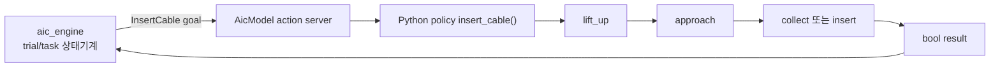
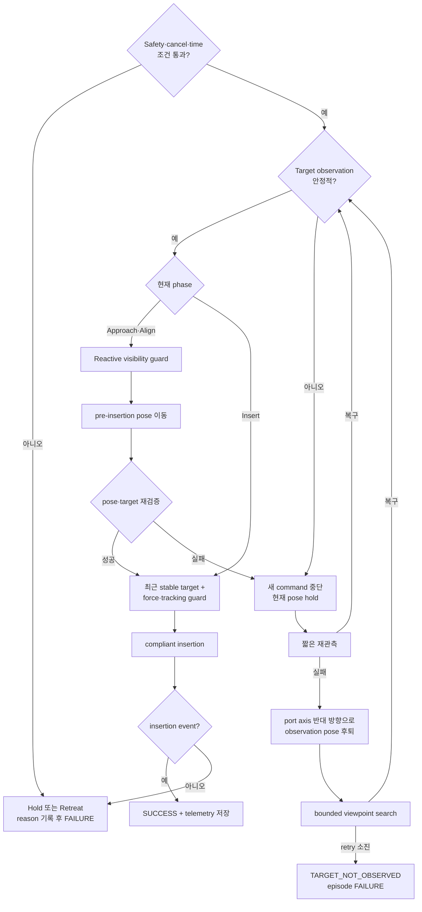
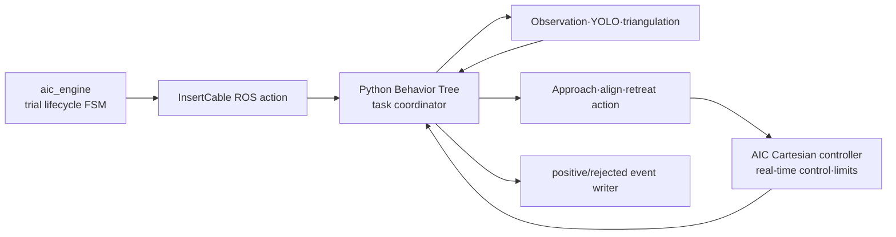
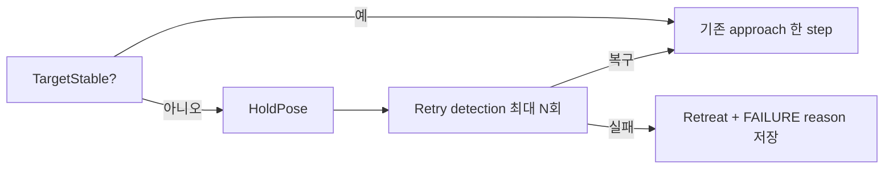

# PATCH_07 - Behavior Tree 기반 인지 실패 복구

- 작성일: 2026-08-06
- 검토 브랜치: `feature/data-collection-node`
- 검토 커밋: `e7e9342f73be19c71fa69abf53af9d98923eac94` + working tree
- 대상: AIC Engine, AIC Model, `PortOffsetCollect`, `LeRobot`, camera observation과 Cartesian controller의 task-level orchestration
- 구현 상태: 코드 감사와 적용 설계 완료, Behavior Tree runtime은 아직 미적용
- 결론: **Behavior Tree는 port 소실·가림·관측 지연·tracking failure를 실행 중 다시 검사하고, 실패한 구간만 정지·재관측·후퇴·재시도할 수 있어 현재 고정 stage보다 복구성·관측성·시험성이 높다. 다만 현재 perception은 지속적인 target visibility를 제공하지 않고 ROS action 취소도 policy thread까지 전달되지 않으므로, 이 두 신호를 먼저 보완해야 한다.**

### Why?

현재 project의 정상 경로는 명확하지만 실행 중 조건 변화에 대한 분기가 약하다.

- `aic_engine`은 trial 준비와 task 성공·실패를 관리하는 상태기계를 가진다. 그러나 `InsertCable` 내부에서 port가 잠시 사라졌는지, camera가 가려졌는지, 재관측 자세로 이동해야 하는지는 알지 못한다.
- `PortOffsetCollect`는 `lift_up → approach → collect`를 고정 순서로 실행한다. 수집 중 관측이나 가시성 검사가 실패하면 해당 sample만 건너뛰고 다음 offset으로 진행한다.
- `LeRobot`은 center camera에서 YOLO가 한 번 성공하면 recording을 시작하지만, 이후 port가 사라져도 다시 `recording_started=False`로 바꾸거나 robot motion을 정지시키지 않는다.
- 현재 가시성 판정은 두 종류가 섞여 있다. `PortOffsetCollect`의 가시성은 GT port 좌표가 image margin 안에 투영되는지를 뜻하고, `LeRobot`의 YOLO 결과만 실제 image detection이다. GT 투영 성공은 가림이 없다는 증거가 아니다.

따라서 “정상 sequence에 실패하면 task 전체 종료”와 “조건을 무시하고 계속 진행” 사이에 다음과 같은 task-level 판단 계층이 필요하다.

1. 지금 사용하는 관측이 신선하고 동기화됐는가.
2. task가 지정한 port가 충분한 camera에서 안정적으로 검출되는가.
3. port가 사라졌다면 잠깐 기다릴지, 정지할지, 안전 자세로 후퇴할지 결정한다.
4. 제한된 횟수만 재탐색하고, 계속 실패하면 원인을 남기고 종료한다.
5. 삽입 직전 gripper에 의한 예상 가림과 외부 물체에 의한 비정상 가림을 구분한다.

Behavior Tree는 이 조건과 복구 action을 계층적으로 조합하고 각 node의 `SUCCESS`, `FAILURE`, `RUNNING`을 통해 다음 행동을 선택하는 데 적합하다.

### 개념

| 개념 | 쉬운 설명 | 현재 project에서의 의미 |
|---|---|---|
| Behavior Tree | root에서 시작한 `tick`이 조건과 action node를 따라 전달되는 계층형 실행 규칙 | port 관측 상태를 매 tick 다시 확인하고 접근·재탐색·후퇴·실패 종료 중 하나를 선택한다. |
| `SUCCESS` | 조건이 만족됐거나 action이 정상 완료됨 | target pose가 안정적으로 생성됐거나 observation pose 도달이 완료된 상태다. |
| `FAILURE` | 조건이 만족되지 않았거나 action이 복구 불가능하게 실패함 | port detection timeout, TF 조회 실패, tracking failure 또는 재시도 소진 상태다. |
| `RUNNING` | action이 아직 진행 중이며 다음 tick에서 다시 확인해야 함 | robot 이동, 관측 누적, 재탐색 또는 삽입이 진행 중인 상태다. |
| Sequence | 앞 node가 성공해야 다음 node를 실행하며 하나라도 실패하면 전체 실패 | `관측 확인 → port pose 계산 → 접근 → 정렬 → 삽입`의 정상 경로다. |
| Fallback | 앞 전략이 실패하면 다음 대안을 실행하고 하나가 성공하면 종료 | `현재 시야에서 재검출 → observation pose로 후퇴 → 다른 viewpoint 탐색` 순서의 복구 경로다. |
| ReactiveSequence | 실행 중에도 앞쪽 condition을 다시 검사하고 condition이 실패하면 진행 action을 중단 | 접근 중 port가 사라지거나 force가 위험해질 때 blind motion을 즉시 중단한다. |
| Decorator | child에 timeout·retry 횟수 같은 실행 규칙을 덧붙임 | 무한 재탐색을 막기 위해 최대 횟수와 전체 시간 한계를 적용한다. |
| Blackboard | node가 공유하는 task 상태 저장소 | target name, detection timestamp, 3D pose, confidence, retry count와 failure reason을 공유한다. |

[BehaviorTree.CPP 기본 문서](https://www.behaviortree.dev/docs/learn-the-basics/BT_basics/)는 각 node가 `SUCCESS`, `FAILURE`, `RUNNING`을 반환하고 Sequence와 Fallback이 이를 조합한다고 설명한다. [ReactiveSequence 문서](https://www.behaviortree.dev/docs/nodes-library/SequenceNode/)는 앞쪽 condition이 바뀌면 실행 중 action을 다시 평가하거나 중단하는 구조를 제공한다. 이는 접근 중 target visibility를 계속 검사해야 하는 현재 문제와 직접 대응한다.

Behavior Tree는 다음 구성 요소를 대체하지 않는다.

- YOLO·triangulation 같은 perception algorithm
- MoveIt 같은 path planner
- Cartesian impedance controller의 500 Hz 제어와 torque/force saturation
- hard real-time emergency stop과 joint limit
- `aic_engine`의 trial 생성·simulator 준비·time limit 상태기계

### What I Made

코드는 변경하지 않았다. 다음 적용안을 작성했다.

- 현재 고정 stage·task 상태기계·YOLO trigger·GT 가시성 판정의 실제 역할 구분
- target visibility를 단일 frame이 아닌 시간 누적 조건으로 판정하는 제안식
- port 소실, 한 camera 장애, 전체 가림, 예상 self-occlusion, tracking failure별 복구 정책
- 기존 `aic_engine`과 controller를 유지하고 Python policy 안에 Behavior Tree를 두는 최소 통합 구조
- 재시도에서 탈락한 데이터까지 보존하는 failure telemetry와 episode 결과 schema
- 구현 전 반드시 해결해야 할 ROS action cancellation과 성공 의미 문제

#### Behavior Tree 사용 시 얻는 이득

가장 큰 이득은 정상 경로를 새로 만드는 것이 아니라 **정상 경로 도중 조건이 변했을 때 실패 범위를 작게 제한하는 것**이다. 현재 고정 stage는 port가 사라져도 실행 중인 motion을 반응형으로 중단하지 못하고, capture 실패는 sample skip 또는 stage 종료로 처리한다. Behavior Tree는 condition을 반복 평가해 해당 subtree만 멈추고 복구 경로로 전환할 수 있다.

| 현재 방식 | Behavior Tree 적용 후 | 구체적 이득 | 필요한 전제 |
|---|---|---|---|
| `lift_up → approach → collect/insert` 고정 순서 | 각 motion 앞과 실행 중에 `TargetStable`, `TrackingHealthy`, `ForceSafe` 재평가 | port가 사라진 뒤 오래된 target을 향해 계속 움직이는 blind motion 감소 | action node가 짧게 `RUNNING`을 반환하고 halt 가능해야 함 |
| capture 실패 시 해당 sample을 건너뜀 | `hold → 짧은 재관측 → 후퇴 → viewpoint search`를 순서대로 시도 | 일시적인 camera 가림 때문에 전체 task를 버리지 않고 실패한 perception 구간만 복구 | camera별 detection과 target age 필요 |
| task 결과가 대부분 `bool` | node마다 `SUCCESS`, `FAILURE`, `RUNNING`과 failure reason 유지 | 실패가 perception, TF, sync, tracking, force, timeout 중 어디서 발생했는지 확인 가능 | 구조화된 result와 event log 필요 |
| center YOLO가 한 번 성공하면 이후 소실을 확인하지 않음 | temporal hysteresis로 loss와 recovery를 연속 frame 기준 판정 | 한 frame의 detection flicker에는 버티고 지속 소실에는 정지 | camera FPS에 맞춘 $N_L$, $N_R$, $T_L$ 검증 필요 |
| 정상 실행과 복구 코드가 같은 loop 안에서 늘어날 가능성 | Sequence, Fallback, Decorator로 정상·대체·retry 정책 분리 | 새로운 recovery를 추가해도 기존 approach 계산을 다시 작성할 필요가 적음 | leaf action의 입출력과 성공 조건이 명확해야 함 |
| 재시도 범위와 종료 이유가 단계마다 다름 | Retry·Timeout decorator로 횟수와 전체 시간을 한곳에서 제한 | 무한 재탐색과 trial time limit 소진 방지 | ROS time과 cancel 상태를 모든 wait에서 확인 |
| 통과 sample만 남고 실패 관측은 삭제되거나 log에만 존재 | rejected-observation branch가 image·timestamp·reason 저장 | 가림·제어 오차가 언제 얼마나 발생했는지 dataset 밖에서 평가 가능 | positive dataset과 diagnostic data 분리 |
| 전체 E2E 실행으로만 분기 확인 | condition/action node에 기록된 status를 주입해 subtree 단위 시험 | Gazebo 없이도 `한 camera 소실`, `retry 소진`, `cancel` 같은 결정 로직 재현 가능 | motion action은 mock 가능한 경계로 분리 |
| port 종류별 절차가 하나의 큰 함수로 확장될 가능성 | 공통 `AcquireTarget`, `Approach`, `Retreat` subtree를 재사용하고 port별 threshold·insert action만 교체 | SC·SFP에서 공통 복구 정책의 중복 감소 | 실제로 두 port가 공유하는 동작만 subtree로 추출 |

특히 갑작스러운 가림에는 ReactiveSequence의 이점이 직접적이다. 일반 Sequence는 앞 condition이 한 번 성공한 뒤 long-running action이 끝날 때까지 다시 확인하지 않을 수 있다. ReactiveSequence는 action이 `RUNNING`인 동안 앞쪽 `TargetStable` condition을 다시 검사하고, 실패로 바뀌면 approach action을 halt해 recovery branch로 보낼 수 있다. [BehaviorTree.CPP ReactiveSequence 문서](https://www.behaviortree.dev/docs/nodes-library/SequenceNode/)의 대표 사용 목적도 장시간 action 실행 중 condition 재평가다.

Nav2 역시 정상 path planning/following이 실패하면 해당 contextual recovery를 먼저 시도하고, 해결되지 않을 때만 system-level recovery로 올린다. [Nav2 Behavior Tree walkthrough](https://docs.nav2.org/behavior_trees/overview/detailed_behavior_tree_walkthrough.html)의 이 구조를 현재 project에 대응시키면 다음과 같다.

- Contextual recovery: image 재대기, 다른 camera pair 사용, target 재검출.
- Motion recovery: 현재 pose hold, port axis 반대 방향 후퇴, observation pose 복귀.
- System failure: retry 소진, controller tracking failure, force limit, action timeout으로 task 종료.

이 계층화 덕분에 center camera 한 장의 일시 실패를 곧바로 전체 trial 실패로 올리지 않으면서, 지속적인 전체 가림을 무한히 재시도하지 않을 수 있다.

#### 이득을 검증할 지표

Behavior Tree를 사용했다는 사실만으로 개선을 주장하면 안 된다. 동일한 가림 시나리오를 기존 방식과 비교해 다음 지표가 좋아지는지 확인해야 한다.

| 지표 | 측정 방법 | 기대하는 변화 |
|---|---|---|
| `blind_motion_duration_s` | 마지막 valid target 시각부터 새 motion command가 멈춘 시각까지의 ROS time | target 소실 후 한 BT tick과 cancellation latency 범위로 감소 |
| `recovery_success_rate` | 일시 가림 episode 중 전체 task restart 없이 target을 다시 얻은 비율 | bounded reacquisition으로 증가 |
| `unnecessary_full_restart_count` | perception만 잠시 실패했는데 trial 전체를 다시 시작한 횟수 | contextual recovery 적용 후 감소 |
| `unclassified_failure_ratio` | reason code 없이 `False` 또는 timeout으로만 끝난 episode 비율 | node별 failure reason 기록으로 감소 |
| `rejected_observation_coverage` | capture 실패 중 image·timestamp·controller state가 모두 남은 비율 | diagnostic writer 적용 후 증가 |
| `false_recovery_count` | 실제 target이 안정적인데 detector flicker 때문에 hold/retreat한 횟수 | temporal hysteresis 조정 후 감소 |
| `recovery_time_s` | loss 확정부터 target recovered 또는 retry exhausted까지의 ROS time | timeout·retry 한계 안에서 유계가 됨 |

Behavior Tree 자체는 YOLO 정확도, triangulation 정밀도, controller tracking 성능을 높이지 않는다. 잘못된 condition을 넣으면 잘못된 결정을 더 체계적으로 반복할 뿐이다. 성능 이득은 **정확한 상태 신호, 취소 가능한 action, 제한된 retry, failure telemetry**가 함께 구현됐을 때만 발생한다.

#### 현재 실행 흐름

현재 `aic_engine`은 task 바깥 lifecycle을 관리하고 Python policy는 task 내부 motion을 관리한다. Behavior Tree의 적절한 경계는 Python policy 내부다. `aic_engine`이나 controller 전체를 Behavior Tree로 다시 작성할 필요는 없다.

#### 현재 코드 근거

| 파일 위치 | 함수 | 역할 |
|---|---|---|
| `ws_aic/src/aic/aic_engine/src/aic_engine.cpp` | [Engine::tasks_started()](../ws_aic/src/aic/aic_engine/src/aic_engine.cpp#L1339) | 입력: trial의 task 목록과 각 task의 time limit 처리: `InsertCable` goal을 보내고 result 또는 timeout까지 대기 결과: task 전체를 `TaskCompleted`, `TaskFailed`, `TimeLimitExceeded` 중 하나로 확정 |
| `ws_aic/src/aic/aic_model/aic_model/aic_model.py` | [AicModel.insert_cable_execute_callback()](../ws_aic/src/aic/aic_model/aic_model/aic_model.py#L249) | 입력: `InsertCable` goal과 cancel/lifecycle 상태 처리: policy를 별도 thread에서 실행하고 1초마다 완료 여부 확인 결과: action result의 `success`를 policy 반환값으로 설정 |
| `ws_aic/src/phy/phy_policy/data_generator/data_generator/port_offset_stage_episode.py` | [insert_cable()](../ws_aic/src/phy/phy_policy/data_generator/data_generator/port_offset_stage_episode.py#L41) | 입력: task, Observation callback, motion callback 처리: `lift_up`, `approach`, `collect`를 고정 순서로 한 번씩 호출 결과: stage 실패 status 또는 `ok` episode summary 생성 |
| `ws_aic/src/phy/phy_policy/data_generator/data_generator/port_offset_stage_motion.py` | [_stage_collect()](../ws_aic/src/phy/phy_policy/data_generator/data_generator/port_offset_stage_motion.py#L169) | 입력: offset sample, GT TF, camera/controller Observation 처리: 동기 Observation과 capture 시각 TF를 검사하고 저장 시도 결과: 실패 sample은 건너뛰지만 loop 종료 후 항상 `True` 반환 |
| `ws_aic/src/phy/phy_policy/data_generator/data_generator/port_offset_dataset.py` | [_port_projection_for_camera()](../ws_aic/src/phy/phy_policy/data_generator/data_generator/port_offset_dataset.py#L38) | 입력: GT port transform, camera intrinsic과 TCP 기반 extrinsic 처리: port origin을 image UV로 투영하고 margin 안인지 판정 결과: geometric FOV 여부를 반환하며 실제 occlusion·YOLO 성공은 판정하지 않음 |
| `ws_aic/src/phy/phy_policy/data_generator/data_generator/port_offset_dataset.py` | [_observation_sync_metadata()](../ws_aic/src/phy/phy_policy/data_generator/data_generator/port_offset_dataset.py#L105) | 입력: left/center/right image와 `ControllerState` timestamp 처리: camera span과 center-controller skew를 30 ms 기본 한계와 비교 결과: 동기화된 Observation만 후속 TF·저장 단계로 전달 |
| `ws_aic/src/phy/phy_policy/data_generator/data_generator/port_offset_dataset.py` | [_save_xyz_rpy_sample()](../ws_aic/src/phy/phy_policy/data_generator/data_generator/port_offset_dataset.py#L273) | 입력: 동기 Observation, GT port/plug TF, command와 label 처리: 최소 2개 camera의 geometric visibility와 파일 저장 성공 검사 결과: 통과한 image·metadata만 저장하고 실패 이유는 호출자 log로 반환 |
| `ws_aic/src/phy/phy_policy/data_generator/data_generator/LeRobot.py` | [LeRobot._init_yolo()](../ws_aic/src/phy/phy_policy/data_generator/data_generator/LeRobot.py#L141) | 입력: 고정된 YOLO weight 경로 처리: model을 background thread에서 생성하며 예외는 출력 없이 무시 결과: model이 없거나 초기화 실패하면 `_yolo_model=None` 유지 |
| `ws_aic/src/phy/phy_policy/data_generator/data_generator/LeRobot.py` | [LeRobot.insert_cable()](../ws_aic/src/phy/phy_policy/data_generator/data_generator/LeRobot.py#L347) | 입력: center image, GT port/plug TF, insertion event 처리: YOLO가 한 번 성공하면 recording을 시작하고 이후 GT 기반 approach·insert 계속 실행 결과: 실제 insertion 성공을 summary에 기록하지만 최종 반환값은 항상 `True` |
| `ws_aic/src/phy/phy_policy/data_generator/data_generator/lib/cheatcode.py` | [CheatCodePlanner.build_pose()](../ws_aic/src/phy/phy_policy/data_generator/data_generator/lib/cheatcode.py#L36) | 입력: GT port·plug·gripper transform과 approach offset 처리: port orientation·approach axis·plug-to-gripper offset으로 target TCP 계산 결과: perception 실패와 무관하게 GT 기반 pose와 error metadata 반환 |

### What was problem

#### 1. 현재 project에는 task 내부 복구 계층이 없다

`aic_engine`의 `TrialState`와 `TaskState`는 상태기계다. simulator 준비 실패 재시도와 task timeout은 처리하지만, `InsertCable` 내부의 perception 상태는 받지 않는다. 따라서 “port가 보이지 않는다”는 사건을 `hold`, `reacquire`, `retreat`, `abort` 중 하나로 분류할 위치가 없다.

`PortOffsetCollect`의 [`insert_cable()`](../ws_aic/src/phy/phy_policy/data_generator/data_generator/port_offset_stage_episode.py#L41)은 stage tuple을 순회한다. stage 자체가 `False`를 반환하면 종료하지만 [`_stage_collect()`](../ws_aic/src/phy/phy_policy/data_generator/data_generator/port_offset_stage_motion.py#L169)은 개별 capture가 계속 실패해도 마지막에 `True`를 반환한다. 따라서 목표 sample 수를 하나도 채우지 못해도 episode status가 `ok`가 될 수 있다.

#### 2. geometric visibility와 실제 detection이 다르다

[`_port_projection_for_camera()`](../ws_aic/src/phy/phy_policy/data_generator/data_generator/port_offset_dataset.py#L38)이 확인하는 것은 다음뿐이다.

- GT port origin이 camera 앞쪽에 있는가.
- 투영 UV가 image boundary와 설정 margin 안에 있는가.

이 조건은 camera와 port 사이에 cable, gripper 또는 다른 물체가 있는지 확인하지 않는다. 따라서 `visible=True`의 정확한 의미는 **해당 port point가 geometric FOV 안에 있음**이다. “영상에서 실제 port가 보임” 또는 “YOLO가 검출 가능함”으로 해석하면 안 된다.

반대로 [`LeRobot.insert_cable()`](../ws_aic/src/phy/phy_policy/data_generator/data_generator/LeRobot.py#L347)의 내부 `check_and_start()`는 실제 center image YOLO detection을 사용한다. 그러나 한 번 검출되면 `recording_started=True`가 episode 끝까지 유지된다. 이후 detection continuity, target identity, multi-camera agreement와 target age는 검사하지 않는다.

#### 3. 단일 frame 실패만으로 가림을 판정할 수 없다

YOLO 미검출 원인은 여러 가지다.

| 관측 | 가능한 원인 | 즉시 취할 수 없는 결론 |
|---|---|---|
| 한 camera만 미검출 | 순간 blur, exposure, camera별 가림, confidence 변동 | port 전체가 사라졌다고 단정 불가 |
| 세 camera 모두 미검출 | 외부 가림, robot self-occlusion, FOV 이탈, model 오류, stale image | 물체가 실제로 port를 가렸다고 단정 불가 |
| GT projection은 image 안, YOLO는 미검출 | occlusion 또는 detector failure 가능성 | simulation 진단에는 유용하지만 runtime GT 의존 불가 |
| YOLO는 검출, 3D pose 불안정 | 잘못된 association, timestamp 차이, 작은 baseline, calibration 오차 | 접근을 계속해도 안전하다고 단정 불가 |

가림 여부를 더 강하게 확인하려면 depth/segmentation, 예상 port ROI의 foreground, 또는 viewpoint 변경 후 재검출 결과가 필요하다. RGB YOLO miss만으로 `OCCLUDED`를 확정하면 detector 오류와 진짜 가림을 혼동한다. 첫 failure code는 `TARGET_NOT_OBSERVED`가 적절하고, 복구 후에도 geometric FOV 안에서 반복 미검출되거나 depth obstacle이 확인될 때 `OCCLUSION_SUSPECTED`로 올리는 편이 안전하다.

#### 4. ROS action 취소가 실제 policy motion을 멈추지 않는다

[`AicModel.insert_cable_execute_callback()`](../ws_aic/src/aic/aic_model/aic_model/aic_model.py#L249)은 cancel request를 받으면 action result를 반환한다. 그러나 worker thread에 cancellation predicate나 stop event를 전달하지 않고 thread를 join하지도 않는다. [`AicModel.action_thread_func()`](../ws_aic/src/aic/aic_model/aic_model/aic_model.py#L236)이 호출하는 policy API에도 cancel 인자가 없다.

따라서 reactive Behavior Tree가 ROS action을 halt하더라도 현재 구조에서는 Python policy thread가 motion command를 계속 publish할 수 있다. Behavior Tree 적용 전에 cooperative cancellation을 policy loop와 `sleep_for()` 대기 경로까지 전달해야 한다. BehaviorTree.CPP의 [ROS 2 integration 문서](https://www.behaviortree.dev/docs/ros2_integration/)도 reactive action에 ROS action을 권장하는 이유로 비동기 실행과 취소 가능성을 든다.

#### 5. 성공의 의미가 task마다 다르다

- [`_finish_data_collection_episode()`](../ws_aic/src/phy/phy_policy/data_generator/data_generator/port_offset_episode.py#L161)은 status가 실패여도 engine에는 data-collection task 종료를 알리기 위해 항상 `True`를 반환한다.
- [`LeRobot.insert_cable()`](../ws_aic/src/phy/phy_policy/data_generator/data_generator/LeRobot.py#L347)은 `insertion_success`를 summary에 따로 저장하지만 최종 반환은 항상 `True`다.
- [`InsertCable.action`](../ws_aic/src/aic/aic_interfaces/aic_task_interfaces/action/InsertCable.action#L1)의 result는 `bool success`와 자유 형식 `string message`만 가진다.

Behavior Tree는 child 결과의 성공·실패 의미에 의존한다. 따라서 최소한 다음을 분리해야 한다.

- `workflow_completed`: process가 정상 종료됐는가.
- `target_achieved`: insertion 또는 요구한 sample 수가 달성됐는가.
- `failure_reason`: `TARGET_NOT_OBSERVED`, `SYNC_TIMEOUT`, `TF_UNAVAILABLE`, `TRACKING_FAILED`, `FORCE_LIMIT`, `RETRY_EXHAUSTED` 중 무엇인가.

### How it changed

아직 코드 동작은 바뀌지 않았다. 권장 workflow는 다음과 같다.

#### 권장 Behavior Tree

#### Target visibility 판정

단일 detection 대신 multi-camera·timestamp·품질 조건을 묶어야 한다.

제안식 — `ws_aic/src/phy/phy_policy/data_generator/data_generator/LeRobot.py` | [`LeRobot.insert_cable()`](../ws_aic/src/phy/phy_policy/data_generator/data_generator/LeRobot.py#L347)의 내부 detection guard 대체:

$$
V_k=
\mathbf{1}\!\left[
N_{\mathrm{matched},k}\geq N_{\min}
\land
\Delta t_{\mathrm{camera},k}\leq \varepsilon_{\mathrm{sync}}
\land
c_{\min,k}\geq c_{\mathrm{threshold}}
\land
e_{\mathrm{reproj},k}\leq e_{\max}
\land
a_k\leq a_{\max}
\right]
$$

$V_k$는 observation $k$가 접근 제어에 사용 가능한지 나타내는 0 또는 1이다. $N_{\mathrm{matched},k}$는 task의 동일 `point_name`을 검출한 camera 수, $N_{\min}$은 기본 2대, $\Delta t_{\mathrm{camera},k}$는 camera timestamp 전체 span(s), $\varepsilon_{\mathrm{sync}}$는 현재 수집기의 기본 30 ms와 같은 동기 허용값, $c_{\min,k}$는 사용 detection 중 최저 confidence, $e_{\mathrm{reproj},k}$는 3D point의 최대 재투영 오차(px), $a_k=t_{\mathrm{now}}-t_{\mathrm{obs}}$는 관측 age(s)다.

이 식은 현재 `LeRobot`에 구현되지 않은 제안이다. confidence와 reprojection threshold는 validation data로 결정해야 하며 30 ms는 현재 수집 동기화 기본값일 뿐 runtime 최적값으로 검증된 값은 아니다. 값이 작거나 조건을 만족하는 camera가 많을수록 같은 시각의 안정적인 target일 가능성이 높다.

한 frame의 깜빡임으로 motion을 중단하지 않도록 loss와 recovery에 서로 다른 연속 조건을 둔다.

제안식 — 신규 `TargetVisibilityCondition.update()`의 temporal hysteresis:

$$
\mathrm{target\_lost}
=
\left(\sum_{i=k-N_L+1}^{k}(1-V_i)=N_L\right)
\lor
\left(t_k-t_{\mathrm{last\_valid}}>T_L\right)
$$

$$
\mathrm{target\_recovered}
=
\left(\sum_{i=k-N_R+1}^{k}V_i=N_R\right)
$$

$N_L$은 loss 판정에 필요한 연속 invalid observation 수, $N_R$은 recovery 판정에 필요한 연속 valid observation 수, $T_L$은 마지막 valid target을 허용하는 최대 시간(s)이다. 예를 들어 시작값으로 $N_L=3$, $N_R=3$을 사용할 수 있지만 camera FPS와 실제 blur 지속시간을 측정한 뒤 정해야 한다. $N_L$이나 $T_L$이 크면 불필요한 정지는 줄지만 blind motion 시간이 길어지고, 작으면 안전하게 빨리 멈추지만 detection flicker에 민감해진다.

#### Phase별 가시성 정책

| Phase | port가 사라졌을 때 | 이유 |
|---|---|---|
| Observation | hold 후 multi-camera 재관측, 실패하면 viewpoint search | 아직 움직일 근거가 없으므로 target pose를 새로 확정해야 한다. |
| Far approach | ReactiveSequence가 진행 action을 halt하고 현재 pose hold | 오래된 target으로 계속 접근하는 blind motion을 막는다. |
| Near alignment | 짧은 hold 후 재관측, 실패하면 port axis 반대 방향으로 제한 거리 후퇴 | lateral·orientation 오차가 작아야 하므로 target freshness 요구가 가장 높다. |
| Final insertion | 최근 stable 3D target의 age·불확실도가 통과하면 force/tracking guard로 전환 | gripper와 plug가 port를 가리는 self-occlusion이 정상적으로 발생할 수 있다. visibility만 요구하면 매번 삽입 직전에 중단된다. |
| Contact 또는 force 이상 | vision 상태와 관계없이 즉시 insertion 중단·후퇴 | Behavior Tree보다 controller force/torque 한계가 우선이며 안전 branch가 최고 우선순위다. |

Final insertion에서 사용할 last-known target은 무기한 유지하면 안 된다. target age, robot이 마지막 target pose 이후 움직인 거리, pose covariance 또는 reprojection error가 모두 제한 안에 있을 때만 짧은 open-loop/compliant motion을 허용해야 한다.

#### 상황별 복구 결과

| 상황 | 판정 | Behavior Tree 동작 | 반드시 저장할 결과 |
|---|---|---|---|
| left camera만 순간 미검출 | center/right가 동기화·동일 target을 유지하면 degraded valid | 접근 계속, missing camera 기록 | camera별 confidence·stamp·reason |
| 모든 camera가 짧게 미검출 | `N_L` 또는 `T_L` 전이면 transient loss | 새 pose command 중단, 현재 pose hold | loss 시작·종료 timestamp |
| 모든 camera가 계속 미검출 | temporal loss 확정 | observation pose 후퇴 후 bounded viewpoint search | retry index, viewpoint, 각 시도의 detection 결과 |
| GT projection은 안쪽, YOLO 미검출 | simulation에서 occlusion/detector failure 의심 | viewpoint 변경 후 재검출; depth가 있으면 ROI obstacle 확인 | GT projection은 debug-only 필드로 분리 |
| 접근하면서 gripper가 port를 가림 | near-insertion의 예상 self-occlusion 가능 | 최근 stable target이 유효하면 force/tracking guard로 전환 | 마지막 visual target age·품질, phase 전환시각 |
| tracking error 증가·수렴 실패 | controller failure | motion halt, 안전 후퇴, `TRACKING_FAILED` 종료 | `ControllerState.tcp_error`, velocity, command id |
| wrench 또는 torque limit 초과 | safety failure | perception recovery보다 먼저 중단 | raw/filtered wrench, saturation flag, threshold |
| 최대 재시도 소진 | unrecoverable perception failure | task `FAILURE`, 다음 trial 또는 사용자 개입 | `RETRY_EXHAUSTED`, 전체 소요시간, 실패 image |

#### 데이터 수집에서의 처리

복구 성공 sample만 저장하면 “port가 가려졌던 시점”과 “controller가 target을 놓친 시점”이 dataset에서 사라진다. 데이터 수집은 다음 두 출력을 분리해야 한다.

1. 학습용 positive sample: 동기화·target quality·가시성 조건을 통과한 image와 label.
2. 진단용 rejected observation: image, timestamp, command, controller state, failure reason과 BT node 상태. 학습에 자동 포함하지 않지만 episode 분석에는 남긴다.

현재 [`_save_xyz_rpy_sample()`](../ws_aic/src/phy/phy_policy/data_generator/data_generator/port_offset_dataset.py#L273)은 실패 시 파일을 쓰지 않거나 이미 쓴 파일을 삭제한다. Behavior Tree 적용 시 별도 `rejections.jsonl` 또는 episode event log가 필요하다. 이 기록은 filtering 기준 아래의 실패 데이터를 보존하므로 제어 오차와 occlusion 빈도를 평가할 수 있게 한다.

#### 권장 software 경계

현재 policy가 Python이므로 첫 구현은 `py_trees`가 변경 범위가 가장 작다. ROS 2 Jazzy에는 [`py_trees_ros` binary package와 tutorial](https://docs.ros.org/en/jazzy/p/py_trees_ros/)이 제공된다. 다만 현재 AIC Pixi 환경은 `robostack-kilted`이며 `py_trees` dependency가 없으므로 Kilted/Conda package resolution은 구현 시 별도 검증해야 한다.

BehaviorTree.CPP는 C++ 중앙 coordinator, ROS action wrapper와 Groot2 시각화가 필요할 때 적합하다. 현재 Python policy 전체를 C++ node로 옮겨야 바로 사용할 수 있는 구조는 아니다. 먼저 Python에서 조건·failure reason·recovery 정책을 검증하고, 여러 독립 ROS action server를 조정할 필요가 생길 때 BehaviorTree.CPP migration을 검토하는 편이 작다.

#### 권장 구현 순서

1. **Perception 상태 정의**
   - camera별 target name, confidence, UV, timestamp를 한 record로 만든다.
   - triangulation 성공, reprojection error와 target age를 함께 노출한다.
   - GT projection은 simulation debug field로만 유지한다.

2. **Cancellation 보장**
   - `AicModel`에서 `threading.Event` 또는 cancellation callback을 policy에 전달한다.
   - 모든 long loop와 wait가 cancel을 확인하고 motion command publish를 중단하게 한다.
   - 취소 후 worker thread 종료를 확인해야 다음 goal을 허용한다.

3. **Condition node 먼저 구현**
   - `ObservationFresh`, `TargetStable`, `TrackingHealthy`, `ForceSafe`, `TimeRemaining`을 만든다.
   - recorded Observation으로 threshold와 hysteresis를 단위검증한다.

4. **정상 sequence 이식**
   - 기존 `_stage_lift_up()`, `_stage_approach()`와 insert motion을 action node로 감싼다.
   - 한 tick을 오래 block하지 않고 `RUNNING`을 반환하도록 motion을 작은 단계로 나눈다.

5. **복구 action 추가**
   - `HoldPose`, `RetreatAlongPortAxis`, `MoveObservationPose`, `SearchViewpoint`, `AbortWithReason` 순서로 추가한다.
   - retry count와 total recovery timeout을 반드시 제한한다.

6. **실패 데이터 보존**
   - 매 transition에 ROS timestamp, node path, status, reason, target 품질, controller state를 저장한다.
   - positive dataset과 rejected diagnostic data를 분리한다.

7. **시나리오 검증**
   - 정상 port 관측
   - 한 camera만 가림
   - 세 camera 모두 일시 가림
   - 지속 가림 후 viewpoint 변경 성공
   - 지속 가림 후 retry 소진
   - near-insertion self-occlusion
   - tracking failure와 force limit

#### 권장 변경 대상

| 파일 위치 | 함수 또는 설정 | 변경 요약 |
|---|---|---|
| `ws_aic/src/aic/aic_model/aic_model/aic_model.py` | [AicModel.action_thread_func()](../ws_aic/src/aic/aic_model/aic_model/aic_model.py#L236) | 이전: policy에 task·observation·motion·feedback만 전달 변경: cooperative cancellation token 전달과 worker 종료 확인 효과: BT halt와 ROS action cancel이 실제 motion publish를 중단 |
| `ws_aic/src/aic/aic_model/aic_model/aic_model.py` | [AicModel.insert_cable_execute_callback()](../ws_aic/src/aic/aic_model/aic_model/aic_model.py#L249) | 이전: cancel 시 action result만 반환하고 thread는 유지될 수 있음 변경: stop event 설정 후 제한 시간 내 thread 종료 확인 효과: 이전 goal과 다음 goal의 policy motion 중첩 방지 |
| `ws_aic/src/phy/phy_policy/data_generator/data_generator/LeRobot.py` | [LeRobot.insert_cable()](../ws_aic/src/phy/phy_policy/data_generator/data_generator/LeRobot.py#L347) | 이전: 단일 center detection으로 recording을 영구 활성화하고 GT motion 계속 실행 변경: multi-camera temporal visibility condition과 phase별 recovery tree 적용 효과: port 소실 시 blind approach 대신 hold·reacquire·retreat·bounded failure 선택 |
| `ws_aic/src/phy/phy_policy/data_generator/data_generator/port_offset_stage_motion.py` | [_stage_collect()](../ws_aic/src/phy/phy_policy/data_generator/data_generator/port_offset_stage_motion.py#L169) | 이전: 실패 sample을 건너뛰고 loop 끝에서 항상 성공 반환 변경: 목표/저장/거부 count와 failure threshold를 episode 결과에 반영 효과: sample 부족을 `ok`로 숨기지 않고 실패 원인과 비율 측정 |
| `ws_aic/src/phy/phy_policy/data_generator/data_generator/port_offset_dataset.py` | [_save_xyz_rpy_sample()](../ws_aic/src/phy/phy_policy/data_generator/data_generator/port_offset_dataset.py#L273) | 이전: 통과 sample만 저장하고 실패 파일은 제거 변경: positive writer와 rejected-observation event writer 분리 효과: 필터 아래의 가림·sync·tracking 실패를 사후 분석 가능 |
| `ws_aic/src/aic/aic_interfaces/aic_task_interfaces/action/InsertCable.action` | [result와 feedback](../ws_aic/src/aic/aic_interfaces/aic_task_interfaces/action/InsertCable.action#L6) | 이전: bool과 자유 형식 문자열만 제공 변경: workflow 완료, target 달성, failure reason과 현재 BT phase 구분 효과: engine·report가 perception 실패와 제어 실패를 구조적으로 식별 |

### 최소 도입안

한 번에 모든 stage를 BT로 바꾸지 않는다. 첫 적용 범위는 다음 하나면 충분하다.

이 작은 tree로 다음 세 항목을 먼저 증명해야 한다.

- 접근 중 detection을 가리면 새 motion command가 중단된다.
- 가림을 제거하면 정해진 연속 frame 뒤 접근이 재개된다.
- 가림이 지속되면 정해진 retry/time limit 뒤 실패 reason과 image가 남는다.

이 세 항목이 검증되기 전에는 viewpoint search, Parallel node, planner 교체를 추가하지 않는 편이 적절하다.

### 검증 기준

| 시험 | 통과 기준 |
|---|---|
| 정상 시야 | 기존 정상 경로와 동일하게 pre-insertion까지 도달하고 불필요한 recovery가 0회다. |
| 단일 camera 가림 | 나머지 두 camera가 품질 조건을 만족하면 진행하며 degraded 상태가 기록된다. |
| 전체 일시 가림 | loss threshold 안에 새 접근 command가 중단되고 가림 제거 후 recovery threshold 뒤 재개한다. |
| 전체 지속 가림 | 설정된 retry와 timeout을 넘지 않고 안전 pose에서 `TARGET_NOT_OBSERVED`로 종료한다. |
| 취소 | cancel request 뒤 제한 시간 안에 policy thread와 motion publish가 모두 멈춘다. |
| self-occlusion | insertion phase 전환 조건을 만족하면 camera miss만으로 중단하지 않고 force/tracking guard가 동작한다. |
| 실패 데이터 | 각 실패에 image, source timestamp, BT node, reason, retry index와 controller state가 남는다. |

이 보고서는 설계와 정적 코드 감사 결과다. Behavior Tree dependency 설치, simulator E2E 실행과 threshold 측정은 수행하지 않았다.

### 참고 자료

- [BehaviorTree.CPP — Introduction to BTs](https://www.behaviortree.dev/docs/learn-the-basics/BT_basics/): tick, node status, Sequence, Fallback과 leaf node의 기본 의미
- [BehaviorTree.CPP — Sequences](https://www.behaviortree.dev/docs/nodes-library/SequenceNode/): Sequence와 ReactiveSequence의 재평가·중단 차이
- [BehaviorTree.CPP — Fallbacks](https://www.behaviortree.dev/docs/nodes-library/FallbackNode/): 우선순위가 있는 대체 전략 선택
- [BehaviorTree.CPP — Integration with ROS 2](https://www.behaviortree.dev/docs/ros2_integration/): 중앙 task coordinator와 취소 가능한 비동기 ROS action 연동
- [ROS 2 — Actions](https://docs.ros.org/en/rolling/Concepts/Basic/About-Actions.html): 장시간 작업의 goal, feedback, result와 cancel/preemption 의미
- [Nav2 — Detailed Behavior Tree Walkthrough](https://docs.nav2.org/behavior_trees/overview/detailed_behavior_tree_walkthrough.html): 정상 navigation 실패 뒤 contextual·system recovery를 bounded retry로 실행하는 실제 ROS 2 사례
- [py_trees_ros Jazzy documentation](https://docs.ros.org/en/jazzy/p/py_trees_ros/): Python ROS 2 Behavior Tree package와 tutorial 설치 경로
