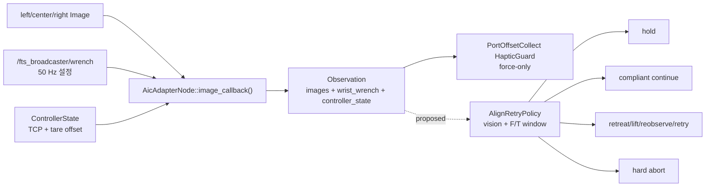
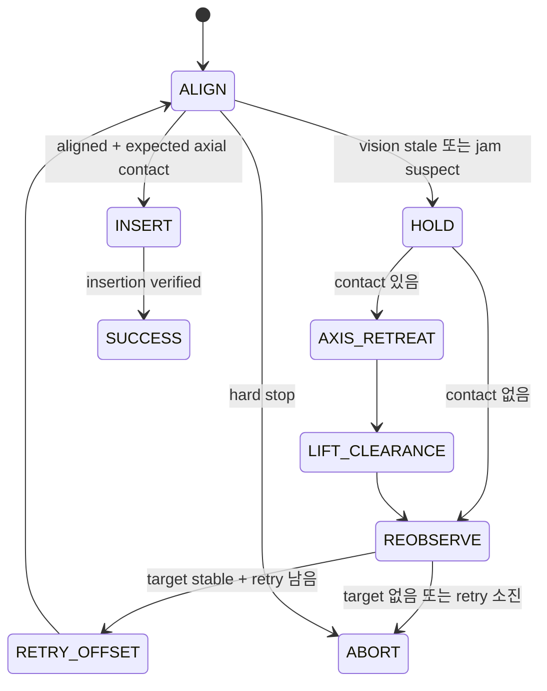

# PATCH_08 - Vision/F-T 융합 Align Retry 정책

- 최종 수정일: 2026-08-12
- 브랜치: `main`
- 코드 기준: `c261e6ab0f71` + working tree
- 구현 상태: 현재 camera/F-T 데이터 경로와 haptic guard 정적 감사 완료, align retry와 AI model은 설계 단계
- 결론: **현재 F/T-only guard를 그대로 AI로 대체하지 말고, 동기화·tare·frame 검증 뒤 규칙 기반 `hold → 접촉축 후퇴 → lift → 재관측 → bounded retry`를 먼저 적용하며, AI는 충분한 실패 episode가 쌓인 뒤 hard safety 아래의 이산 결정기로 추가한다.**

### Why?

Align 단계의 같은 camera view라도 실제 접촉 상태는 다를 수 있다. 포트 중심이 맞아 보이지만 plug가 모서리에 걸릴 수 있고, 반대로 정상 삽입 접촉인데 force만 보고 실패로 오판할 수 있다. Image는 **어디가 어긋났는지**, F/T sensor는 **접촉이 실제로 얼마나 발생했는지**를 보완한다.

현재 project는 이미 세 camera image와 `wrist_wrench`를 하나의 `Observation`으로 전달한다. 데이터 수집기는 baseline 대비 force 증가가 지속되면 motion을 hold하고 시작 pose로 후퇴한다. 그러나 이 guard는 image의 정렬 상태를 사용하지 않고, FinalPolicy의 align retry도 아니다. 먼저 이미 있는 신호를 정확히 동기화하고 해석해야 한다.

목표는 “특정 view와 force이면 무조건 위로 이동”이 아니다. 접촉 중 바로 `base_link +Z`로 들면 plug가 port 벽을 긁을 수 있다. 안전한 기본 복구는 **현재 command hold → 삽입축 반대 방향으로 짧게 이탈 → 충돌 여유가 확보된 뒤 lift → 새 image로 재정렬**이다.

이 문서는 [PATCH_07 - Behavior Tree 기반 인지 실패 복구](PATCH_07_behavior_tree_perception_recovery.md)의 `ForceSafe`, `Retreat`, `Reobserve`, bounded retry branch를 구체적인 Vision/F-T 판단기로 채운다.

### What I Made

- 현재 AIC의 camera, F/T, tare, haptic retreat 데이터 흐름 감사
- image와 wrench가 같은 판단에 들어가기 위한 timestamp·frame 조건
- AI 없이 먼저 시험할 수 있는 규칙 기반 contact-state table
- 향후 image encoder와 wrench time-series encoder를 결합하는 최소 late-fusion model
- hard safety와 learned policy의 권한 분리
- episode label, 평가 지표, 무료 실습 repository·전공 교재·연습문제 목록

#### 현재 데이터 흐름



#### 현재 코드 근거

| 파일 위치 | 함수 | 현재 역할 |
|---|---|---|
| [`ws_aic/src/aic/aic_adapter/src/aic_adapter.cpp`](../ws_aic/src/aic/aic_adapter/src/aic_adapter.cpp#L127) | `AicAdapterNode::image_callback()` | 입력: camera, joint, controller, wrench buffer<br>처리: 세 camera를 1 ms 이내로 맞추고 image보다 미래가 아닌 최신 state와 wrench를 선택<br>결과: 하나의 `Observation` publish |
| [`ws_aic/src/phy/phy_data_collection/phy_data_collection/policy/dataset.py`](../ws_aic/src/phy/phy_data_collection/phy_data_collection/policy/dataset.py#L437) | `observation_sync()` | 입력: `Observation`과 `sync_tolerance_ns`<br>처리: camera stamp 일치와 center image-controller 차이를 검사<br>결과: capture 가능 여부와 timestamp metadata 반환; wrench skew는 검사하지 않음 |
| [`ws_aic/src/phy/phy_data_collection/phy_data_collection/policy/motion.py`](../ws_aic/src/phy/phy_data_collection/phy_data_collection/policy/motion.py#L437) | `_wrist_force_in_base()` | 입력: raw wrist force, controller tare force, TCP orientation<br>처리: tare를 빼고 force를 `base_link` 방향으로 회전<br>결과: 3D force와 wrench timestamp 반환; torque는 사용하지 않음 |
| [`ws_aic/src/phy/phy_data_collection/phy_data_collection/policy/motion.py`](../ws_aic/src/phy/phy_data_collection/phy_data_collection/policy/motion.py#L465) | `HapticGuard.observe()` | 입력: 새 force frame과 이동 전 baseline<br>처리: force vector 차이의 norm이 threshold를 지속 초과하는지 검사<br>결과: `haptic_contact` boolean과 peak force metric 반환 |
| [`ws_aic/src/phy/phy_data_collection/phy_data_collection/policy/motion.py`](../ws_aic/src/phy/phy_data_collection/phy_data_collection/policy/motion.py#L511) | `prepare_haptic_guard()` | 입력: 이동 전 여러 `Observation`<br>처리: 고유 force frame들의 component-wise median을 baseline으로 계산<br>결과: baseline이 준비된 `HapticGuard`; frame 부족 시 실패 |
| [`ws_aic/src/phy/phy_data_collection/phy_data_collection/policy/motion.py`](../ws_aic/src/phy/phy_data_collection/phy_data_collection/policy/motion.py#L658) | `_follow()` | 입력: Cartesian waypoint와 optional `HapticGuard`<br>처리: S-curve waypoint publish 중 contact를 매 step 확인<br>결과: contact 시 현재 pose hold 후 `False` 반환 |
| [`ws_aic/src/phy/phy_data_collection/phy_data_collection/policy/motion.py`](../ws_aic/src/phy/phy_data_collection/phy_data_collection/policy/motion.py#L710) | `retreat_to_pose()` | 입력: 현재 pose와 직전 출발 pose<br>처리: 출발 pose까지 역방향 S-curve 생성<br>결과: 접촉 지점에서 후퇴; port insertion axis를 별도로 사용하지는 않음 |
| [`ws_aic/src/phy/phy_data_collection/phy_data_collection/policy/motion.py`](../ws_aic/src/phy/phy_data_collection/phy_data_collection/policy/motion.py#L784) | `approach()` | 입력: GT port/plug TF와 current TCP<br>처리: approach pose 이동 중 haptic contact 감시<br>결과: contact 시 출발 pose로 후퇴하고 approach 실패 반환 |
| [`ws_aic/src/aic/aic_controller/src/aic_controller.cpp`](../ws_aic/src/aic/aic_controller/src/aic_controller.cpp#L1070) | `Controller::read_state_from_hardware()` | 입력: joint와 F/T hardware interface<br>처리: current TCP kinematics와 raw sensed wrench를 읽고 tare offset을 FTS frame으로 갱신<br>결과: controller 내부 state 생성 |
| [`ws_aic/src/aic/aic_controller/src/aic_controller.cpp`](../ws_aic/src/aic/aic_controller/src/aic_controller.cpp#L1257) | `Controller::populate_controller_state()` | 입력: controller current/reference state와 tare offset<br>처리: TCP pose·velocity·error와 `ati/tool_link` tare를 message로 변환<br>결과: Adapter가 image와 결합할 `ControllerState` publish |

`Observation`에 실제 필드가 존재하는 근거는 [`aic_model_interfaces/msg/Observation.msg`](../ws_aic/src/aic/aic_interfaces/aic_model_interfaces/msg/Observation.msg#L1)다. `wrist_wrench`는 [`geometry_msgs/WrenchStamped`](https://docs.ros.org/en/kilted/p/geometry_msgs/msg/WrenchStamped.html)이므로 자체 source timestamp와 `frame_id`를 가진다.

### What was problem

#### 1. 현재 guard는 FinalPolicy align의 Vision/F-T fusion이 아니다

현재 `HapticGuard`는 `phy_data_collection`의 approach와 수집 motion을 보호한다. 판단 입력은 baseline 대비 3D force norm 하나다. YOLO target, UV/pose error, reprojection error, occlusion, align phase를 함께 보지 않는다.

따라서 현재 가능한 판단은 “평소보다 큰 force가 일정 시간 지속되었다”까지다. 다음을 구분하지 못한다.

- 정렬이 틀어진 상태에서 port 벽에 걸림
- 정렬이 맞고 정상적으로 접촉이 시작됨
- cable 장력 또는 다른 구조물 접촉
- sensor bias·진동·robot acceleration에 의한 transient
- target이 image에서 사라진 채 force가 증가함

#### 2. camera-F/T timestamp 상한이 없다

`AicAdapterNode::image_callback()`은 세 camera를 1 ms 이내로 제한한다. ControllerState와 wrench는 left image보다 미래가 아닌 최신 buffer 값을 선택한다. 그러나 wrench 선택 후 image와의 최대 차이를 검사하지 않는다.

현재 의미는 다음과 같다.

$$
t_{F/T} \leq t_{image}
$$

보장되지 않는 조건은 다음이다.

$$
0 \leq t_{image}-t_{F/T} \leq \tau_{F/T}
$$

$t_{image}$는 fusion 기준 image timestamp(s), $t_{F/T}$는 선택된 wrench source timestamp(s), $\tau_{F/T}$는 허용 가능한 최대 causal skew(s)다. F/T broadcaster 설정은 50 Hz이므로 명목 주기는 20 ms지만, scheduling·bridge 지연 때문에 실제 최대 skew가 20 ms라고 보장되지는 않는다.

또한 `observation_sync()`은 camera와 ControllerState만 검사한다. align fusion 전에 `wrist_wrench.header.stamp`, `header.frame_id`, finite 값, tare offset timestamp까지 별도 검증해야 한다.

#### 3. force norm만으로 접촉 방향을 잃는다

현재 helper는 force만 `base_link`로 회전한다. 최종 insertion에는 port axis 방향 force와 lateral force를 분리해야 한다.

제안식 — 신규 `ws_aic/src/phy/phy_policy/phy_policy/ros/align_retry.py | normalize_contact_features()`:

$$
\mathbf F_B
=
\mathbf R_{B\leftarrow S}
(\mathbf F_{raw,S}-\mathbf F_{tare,S})
$$

$$
F_{axial}=\mathbf a_B^T\mathbf F_B,
\qquad
F_{lateral}=\left\|\mathbf F_B-\mathbf a_B F_{axial}\right\|_2
$$

$B$는 `base_link`, $S$는 `ati/tool_link`, $\mathbf R_{B\leftarrow S}$는 sensor-to-base rotation, $\mathbf a_B$는 base frame에서 표현한 단위 insertion axis다. $F_{axial}$과 $F_{lateral}$의 단위는 N이다. 부호는 port frame의 insertion axis 정의에 따라 고정하고 test로 확인해야 한다.

Torque까지 다른 원점으로 옮길 때는 force·torque를 각각 회전하는 것만으로 충분하지 않다. sensor와 TCP/port origin 사이 moment arm이 있으면 full wrench transform이 필요하다. ROS 2 Kilted `force_torque_sensor_broadcaster`는 [filter chain과 TF2 wrench transformer node](https://control.ros.org/kilted/doc/ros2_controllers/force_torque_sensor_broadcaster/doc/userdoc.html)를 제공한다.

#### 4. controller의 `maximum_wrench`는 sensor abort threshold가 아니다

[`aic_ros2_controllers.yaml`](../ws_aic/src/aic/aic_bringup/config/aic_ros2_controllers.yaml#L53)의 `maximum_wrench`는 [`cartesian_impedance_action.cpp`](../ws_aic/src/aic/aic_controller/src/actions/cartesian_impedance_action.cpp#L82)에서 impedance **control wrench output**을 component-wise clamp한다. 측정된 `/fts_broadcaster/wrench`가 값을 넘으면 align을 중단하는 safety condition이 아니다.

따라서 retry threshold, hard stop threshold, controller output clamp를 같은 값으로 취급하면 안 된다.

#### 5. 성공 sample만으로는 retry AI를 학습할 수 없다

Retry classifier에는 실패 직전과 복구 이후가 필요하다. 성공적으로 저장된 정지 frame만 모으면 `jam`, `occluded`, `normal_contact`, `sensor_stale`, `tracking_failure`의 음성·실패 사례가 사라진다.

Frame 단위 random split도 금지해야 한다. 같은 trial의 연속 frame이 train과 validation에 나뉘면 거의 같은 image와 force trace가 양쪽에 들어가 성능이 과대평가된다.

### How it changed

#### 1단계: 규칙 기반 fusion을 먼저 적용

입력은 raw image 전체보다 현재 perception이 이미 계산하는 target ID, camera별 UV/confidence, triangulated pose, reprojection error를 우선 사용한다. 작은 데이터에서 해석 가능하고 threshold failure를 재현하기 쉽다.

| Vision 상태 | F/T 상태 | 결정 | 이유 |
|---|---|---|---|
| target stale·missing | 정상 | `HOLD → REOBSERVE` | 오래된 pose로 blind align 금지 |
| target stale·missing | 증가 또는 hard limit | `HOLD → AXIS_RETREAT → LIFT` | 가림 상태 접촉은 원인을 알 수 없으므로 먼저 이탈 |
| 정렬 오차 큼 | lateral force·torque 지속 증가 | `AXIS_RETREAT → LIFT → RETRY_OFFSET` | port 벽·모서리 jam 가능성 |
| 정렬 오차 작음 | 허용된 axial contact | compliant align/insert 계속 | 정상 접촉 가능성; 즉시 lift하면 false retry 증가 |
| 어떤 view든 hard force·torque 초과 | 무관 | 즉시 hold·retreat·abort | AI와 일반 retry보다 safety 우선 |
| 모든 값 정상이나 수렴 안 함 | tracking error 증가 | hold·controller failure 기록 | perception retry로 controller failure를 숨기지 않음 |
| retry count 소진 | 무관 | abort | 무한 반복 방지 |

#### baseline과 지속 조건

현재 median baseline 방식을 재사용할 수 있다.

제안식 — `ws_aic/src/phy/phy_policy/phy_policy/ros/align_retry.py | ContactWindow.update()`:

$$
\mathbf b
=
\operatorname{median}
\left(\mathbf F_{B,1},\ldots,\mathbf F_{B,M}\right),
\qquad
\Delta\mathbf F_{B,k}=\mathbf F_{B,k}-\mathbf b
$$

$M$은 접촉 전 정지 상태에서 수집한 고유 F/T frame 수, $\mathbf b$와 $\Delta\mathbf F$의 단위는 N이다. Median은 짧은 spike에 강하지만 drift를 자동 해결하지 않는다. baseline은 motion 중 계속 갱신하지 말고, 명확한 free-space hold에서만 다시 잡아야 실제 접촉을 baseline으로 흡수하지 않는다.

단일 spike가 아닌 persistence와 별도 hard gate를 둔다.

$$
\mathrm{retry}_k
=
\bigwedge_{i=k-N+1}^{k}
\left[
(F_{lateral,i}>\theta_{lat}\ \lor\ \|\boldsymbol\tau_i\|_2>\theta_{\tau})
\land e_{vision,i}>\theta_{vision}
\right]
$$

$$
\mathrm{hard\_stop}_k
=
\left[\|\Delta\mathbf F_{B,k}\|_2>\theta_{F,hard}\right]
\lor
\left[\|\boldsymbol\tau_k\|_2>\theta_{\tau,hard}\right]
$$

$N$은 연속 synchronized F/T frame 수, $e_{vision}$은 UV·pose·reprojection error에서 정의한 정렬 오차, $\boldsymbol\tau$는 동일 기준점에서 표현한 torque(N·m)다. `hard_stop`은 1회 초과에도 동작하고 AI가 무시할 수 없어야 한다.

문헌의 다른 robot threshold를 그대로 복사하지 않는다. `retry` threshold는 정상 free-space와 정상 insertion 분포에서 측정하고, hard threshold는 robot·cable·port의 허용 하중과 controller 검증으로 정한다.

$$
\theta_{retry}
=
Q_{1-\alpha}(x_{benign})+m,
\qquad
\theta_{retry}<\theta_{hard}\leq\theta_{allowable}
$$

$Q_{1-\alpha}$는 benign trace의 상위 quantile, $m$은 noise·sim-to-real margin, $\theta_{allowable}$은 hardware와 task가 허용하는 상한이다. 통계값은 nuisance trigger를 줄이는 시작점일 뿐 safety rating을 대신하지 않는다.

#### Retry lifecycle



`AXIS_RETREAT`은 port insertion axis 반대 방향의 제한 거리다. `LIFT_CLEARANCE`는 접촉 해제와 cable/board clearance를 확인한 뒤 실행하는 vertical 또는 pre-defined observation motion이다. 이 순서가 “force가 크면 즉시 위로”보다 scraping 위험을 줄인다.

제안 pseudocode — 신규 `ws_aic/src/phy/phy_policy/phy_policy/ros/align_retry.py | AlignRetryPolicy.update()`:

```python
# proposed pseudocode; 현재 repository에 미구현
def update(observation, target, retry_count):
    sample = synchronized_features(observation, target)
    if sample.invalid_or_stale:
        return HOLD_AND_REOBSERVE
    if sample.hard_force_or_torque:
        return HOLD_RETREAT_ABORT
    if sample.target_missing and sample.contact:
        return HOLD_AXIS_RETREAT_LIFT
    if sample.jam_persisted:
        return HOLD_AXIS_RETREAT_LIFT_RETRY
    if sample.visually_aligned and sample.expected_axial_contact:
        return CONTINUE_COMPLIANT
    if retry_count >= MAX_RETRIES:
        return ABORT_RETRY_EXHAUSTED
    return CONTINUE_VISUAL_ALIGN
```

#### 제안 변경 대상

| 파일 위치 | 함수 | 변경할 역할 |
|---|---|---|
| `ws_aic/src/aic/aic_adapter/src/aic_adapter.cpp` | `AicAdapterNode::image_callback()` | 입력: image와 buffered wrench<br>처리: 현재 causal selection을 유지하되 선택 성공·source stamp를 명확히 검증<br>결과: policy가 `image-wrench skew`를 판정할 수 있는 완전한 `Observation` 제공 |
| `ws_aic/src/phy/phy_policy/phy_policy/ros/align_retry.py` | `synchronized_features()` 신규 | 입력: `Observation`, target perception, port axis<br>처리: stamp gate, tare, frame transform, axial/lateral/vision feature 계산<br>결과: reason code가 포함된 단일 fusion sample |
| `ws_aic/src/phy/phy_policy/phy_policy/ros/align_retry.py` | `ContactWindow.update()` 신규 | 입력: synchronized sample stream<br>처리: baseline, persistence, hard threshold, peak·impulse 집계<br>결과: normal/contact/jam/hard-stop 상태 |
| `ws_aic/src/phy/phy_policy/phy_policy/ros/align_retry.py` | `AlignRetryPolicy.update()` 신규 | 입력: fusion state, phase, retry count<br>처리: 위 decision table과 hard safety 우선순위 적용<br>결과: continue/hold/retreat/lift/reobserve/retry/abort 중 하나 |
| `ws_aic/src/phy/phy_policy/phy_policy/ros/FinalPolicy.py` | align 실행 함수 | 입력: target observation과 retry decision<br>처리: cancel 가능한 short motion으로 axis retreat와 observation pose 실행<br>결과: bounded retry 또는 명시적 failure reason |

현재 branch에는 실제 `FinalPolicy.py`가 없으므로 마지막 행은 migration 이후 적용 대상이다. 이 보고서는 존재하지 않는 구현을 완료됐다고 주장하지 않는다.

#### 2단계: 실패 데이터가 쌓인 뒤 AI late fusion

처음부터 image-to-Cartesian motion end-to-end model을 만들 필요는 없다. 권장 최소 모델은 다음이다.

1. Vision branch: target ROI 또는 기존 YOLO keypoint feature를 작은 CNN/MLP로 encoding.
2. F/T branch: 같은 시간 window의 6D tared wrench, derivative, axial/lateral component를 1D CNN 또는 GRU로 encoding.
3. Context: align phase, retry count, last command delta, target visibility quality.
4. Late fusion: feature concatenate 후 `continue`, `lift_reobserve`, `retry_offset`, `abort` 분류와 confidence 출력.
5. Safety wrapper: stale input, hard force, workspace limit, uncertainty threshold는 model 밖에서 강제.

Model이 low-level wrench 또는 pose를 직접 출력하기보다 bounded discrete action을 선택하게 하면 잘못된 예측의 최대 이동량을 제한할 수 있다. ForceSight와 MOMA-Force는 visual representation과 force objective를 결합할 수 있음을 보여 주지만, AIC retry classifier에 그대로 복사할 architecture는 아니다.

#### 반드시 남길 episode data

| 묶음 | 필드 |
|---|---|
| Identity | `episode_id`, `trial_id`, task port type·rail·port, retry index |
| Time | image 3개 stamp, wrench stamp, controller stamp, 각 skew, ROS clock |
| Vision | image/ROI 경로, target ID, camera별 UV·confidence, reprojection error, visibility reason |
| F/T | raw·tared 6D wrench, source frame, baseline, axial/lateral force, derivative, peak, duration |
| Motion | current/reference TCP, command pose, insertion axis, phase, tracking error |
| Decision | rule/model version, logits·confidence, selected action, hard-gate reason |
| Outcome | contact released, re-detection, retry success, insertion success, abort reason, max force·torque |

성공 sample뿐 아니라 rejected observation과 retry failure를 episode event log에 남긴다. Training/validation/test는 frame이 아니라 `episode_id`, board pose, card combination 단위로 분리한다.

#### 검증 지표

- `jam` recall과 false-negative count: 위험 접촉을 놓친 횟수
- unnecessary lift rate: 정상 insertion contact를 retry로 오판한 비율
- peak axial/lateral force와 peak torque
- force threshold 초과 impulse
- recovery success rate와 retry 횟수
- target re-acquisition time와 total insertion time
- stale/sync rejection rate와 image-wrench skew distribution
- hard gate가 model decision보다 항상 우선했는지

제안 평가식 — episode evaluator:

$$
J_{excess}
=
\int_{t_0}^{t_1}
\max\left(0,\|\Delta\mathbf F(t)\|_2-\theta_{retry}\right)dt
$$

$J_{excess}$는 retry threshold를 넘은 force impulse(N·s)다. 성공률이 같아도 값이 작으면 과도한 접촉의 크기와 지속시간이 줄었음을 뜻한다.

#### 구현 순서와 완료 조건

1. MCAP으로 image-wrench-controller stamp와 raw/tared F/T를 기록한다.
   - 완료: causal skew histogram과 missing/stale rate가 산출됨.
2. `observation_sync()` 또는 align-local validator에 F/T stamp·frame gate를 추가한다.
   - 완료: 오래된 wrench가 decision에 들어가지 않고 reason code로 남음.
3. 기존 `_wrist_force_in_base()`와 `HapticGuard` behavior를 작은 test로 고정한다.
   - 완료: tare, rotation, duplicate stamp, persistence, baseline test 통과.
4. axial/lateral/torque feature와 규칙 기반 decision table을 offline replay로 검증한다.
   - 완료: 정상 contact와 jam scenario의 confusion matrix 생성.
5. FinalPolicy align에 short cancellable hold·axis retreat·lift·reobserve를 연결한다.
   - 완료: hard contact 시 새 approach command가 멈추고 retry count가 제한됨.
6. 실패 episode가 충분할 때 late-fusion classifier를 offline shadow mode로 추가한다.
   - 완료: model은 command하지 않고 rule decision과 차이를 log함.
7. shadow evaluation 통과 후 bounded discrete action만 허용한다.
   - 완료: hard safety override test와 unseen episode split 성능 기준 통과.

Threshold 수치, retreat 거리, lift 높이, window 길이, retry 횟수는 현재 로그로 검증되지 않았다. 다른 논문의 force limit를 AIC 값으로 복사하지 않는다.

### 무료 실습·이론 학습 경로

#### 1. Modern Robotics — 권위 있는 전공 교재와 해답 포함 연습문제

- [공식 책 페이지](https://hades.mech.northwestern.edu/index.php/Modern_Robotics): Cambridge University Press 교재의 무료 preprint, video, software 제공
- [무료 preprint PDF](https://hades.mech.northwestern.edu/images/7/7e/MR-2up-v2.pdf)
- [무료 practice exercises + solutions PDF](https://hades.mech.northwestern.edu/images/e/ef/MR_practice_exercises.pdf)
- [공식 GitHub `NxRLab/ModernRobotics`](https://github.com/NxRLab/ModernRobotics)

권장 순서: Chapter 3 rigid-body frame → Chapter 5 velocity kinematics/statics → Chapter 11 robot control·force control → Chapter 12 manipulation. 특히 practice exercise Chapter 5, 11, 12를 풀어 Jacobian-transpose force 관계와 control response를 먼저 익힌다.

#### 2. MIT Robotic Manipulation — force/hybrid control과 peg-in-hole

- [공식 course notes](https://manipulation.mit.edu/)
- [Chapter 8 Manipulator Control](https://manipulation.mit.edu/force.html): direct force, hybrid position/force, impedance와 RCC peg-in-hole exercise
- [공식 GitHub `RussTedrake/manipulation`](https://github.com/RussTedrake/manipulation): notes의 실행 code와 notebook

연습: point-mass force/position 문제를 푼 뒤 RCC peg-and-hole simulation에서 stiffness와 contact force trace를 바꿔 본다. AIC의 `control_stiffness`, `control_damping`, `feedforward_wrench_at_tip`을 해석하는 데 직접 연결된다.

#### 3. robosuite — 무료 RGB + F/T contact-rich simulator

- [공식 GitHub `ARISE-Initiative/robosuite`](https://github.com/ARISE-Initiative/robosuite)
- [공식 sensor 문서](https://robosuite.ai/docs/modules/sensors.html): gripper wrist force-torque와 image observation
- [Robot API](https://robosuite.ai/docs/simulation/robot.html): `ee_force`, `ee_torque`, `ee_ft_integral`
- [TwoArmPegInHole 문서](https://robosuite.ai/docs/source/robosuite.environments.manipulation.html#robosuite.environments.manipulation.two_arm_peg_in_hole.TwoArmPegInHole)

연습: `use_camera_obs=True`로 `TwoArmPegInHole`을 실행하고 image, `ee_force`, `ee_torque`를 episode별 저장한다. 먼저 threshold rule로 `continue/retreat`를 분류하고, hole offset을 바꿔 jam case를 만든다. AIC와 robot·physics는 다르므로 threshold를 이식하지 말고 fusion pipeline 연습에만 쓴다.

#### 4. ForceSight와 MOMA-Force — visual-force 연구 사례

- [ForceSight ICRA 2024 project](https://force-sight.github.io/)
- [ForceSight 공식 GitHub](https://github.com/force-sight/forcesight): RGBD·text에서 visual-force goal을 예측하고 dataset/model quick start 제공
- [ForceSight paper](https://arxiv.org/abs/2309.12312)
- [MOMA-Force IROS 2023 paper](https://arxiv.org/abs/2308.03624)
- [MOMA-Force project](https://visual-force-imitation.github.io/)

ForceSight는 **sensed F/T와 image를 입력으로 retry를 분류하는 model이 아니라**, image에서 force goal을 예측하고 low-level controller가 goal error를 사용한다. MOMA-Force는 image, action, wrench가 같은 expert trajectory에 들어가며 visual action-wrench prediction과 admittance control을 결합한다. 두 자료에서는 image-force label 구성, model/controller 분리, hard termination을 참고하고 AIC에는 작은 discrete retry classifier로 축소한다.

#### 5. Dive into Deep Learning — 무료 AI 기초와 exercise

- [공식 interactive book](https://d2l.ai/)
- [무료 PDF](https://d2l.ai/d2l-en.pdf)
- [CNN chapter](https://d2l.ai/chapter_convolutional-neural-networks/index.html)
- [Sequence/RNN chapter](https://d2l.ai/chapter_recurrent-neural-networks/index.html)
- [Attention chapter](https://d2l.ai/chapter_attention-mechanisms-and-transformers/index.html)

각 section의 code와 exercises로 image encoder, wrench sequence encoder, late fusion classifier를 따로 학습한다. 처음 실습은 Transformer 대신 작은 CNN + GRU/1D CNN이면 충분하다.

### 참고 자료와 사용 근거

| 자료 | 이 문서에서 사용한 근거 |
|---|---|
| [ROS 2 Kilted Force Torque Sensor Broadcaster](https://control.ros.org/kilted/doc/ros2_controllers/force_torque_sensor_broadcaster/doc/userdoc.html) | `WrenchStamped`, sensor frame, filter chain, TF2 wrench transformer |
| [ROS 2 Jazzy ApproximateTime tutorial](https://docs.ros.org/en/ros2_packages/jazzy/api/message_filters/doc/Tutorials/Approximate-Synchronizer-Cpp.html) | header timestamp 기반 multi-topic matching과 QoS 일치 조건 |
| [Modern Robotics 공식 페이지](https://hades.mech.northwestern.edu/index.php/Modern_Robotics) | 무료 preprint가 출판판과 같은 chapter·exercise를 포함하고 별도 해답 포함 practice PDF 제공 |
| [MIT Robotic Manipulation Chapter 8](https://manipulation.mit.edu/force.html) | force control, hybrid position/force, impedance, contact Jacobian, RCC peg-in-hole exercise |
| [robosuite 공식 문서](https://robosuite.ai/docs/) | RGB camera, wrist F/T observable, operational-space controller와 peg-in-hole 실습 환경 |
| [ForceSight paper·code](https://github.com/force-sight/forcesight) | visual-force goal model, 공개 training/evaluation path와 image-force data 설계 사례 |
| [MOMA-Force paper](https://arxiv.org/abs/2308.03624) | image/action/wrench trajectory, visual-force imitation, admittance control, 별도 force termination 사례 |
| [Dive into Deep Learning](https://d2l.ai/) | CNN, sequence model, attention의 무료 code·수식·exercise |

이 문서는 static code audit와 공개 자료 조사 결과다. Gazebo contact injection, MCAP timing 측정, threshold calibration, FinalPolicy runtime, model training은 수행하지 않았다.
