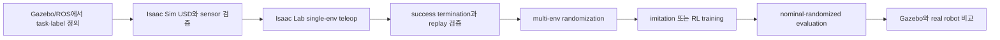

# PATCH_09 - Isaac Lab 적용 판단

- 작성일: 2026-08-06
- 검토 브랜치: `feature/data-collection-node`
- 검토 커밋: `e7e9342f73be19c71fa69abf53af9d98923eac94` + working tree
- 대상: `ws_aic/src/aic/aic_utils/aic_isaac`
- 결론: **Isaac Lab은 독립 simulator라기보다 Isaac Sim 위에서 대량 병렬 robot-learning 환경을 구성하는 framework다. AIC에서는 domain randomization, teleoperation dataset, imitation learning과 RL에 적합하지만 현재 구성만으로 cable insertion 성공이나 ROS 실행 동등성을 검증할 수는 없다.**

### Why?

“Isaac Lab을 언제 사용하는 simulator인가?”라는 질문에는 Isaac Sim과 Isaac Lab을 먼저 구분해야 한다. Isaac Sim이 USD scene, PhysX physics, RTX rendering과 sensor를 실행하는 simulator이고, Isaac Lab은 그 위에 action·observation·reward·termination·randomization·병렬 environment와 learning library 연결을 제공한다.

현재 AIC에는 Gazebo 기반 ROS workflow와 별도로 Isaac Lab용 `AIC-Task-v0`가 있다. 두 환경은 같은 UR5e와 Task Board 문제를 표현하지만 interface, asset format, controller와 검증 목적이 다르다. Isaac Lab을 Gazebo의 GUI 대체재로 선택하면 통합비용만 늘고, 반복 학습·randomization이 필요할 때 사용하면 GPU 병렬화의 이점을 얻는다.

### 개념

| 개념 | 쉬운 설명 | AIC에서 필요한 이유 |
|---|---|---|
| Isaac Sim | USD scene을 PhysX와 RTX로 실행하는 실제 simulator | UR5e, cable, board, camera와 contact physics를 실행한다. |
| Isaac Lab | Isaac Sim 위에서 robot-learning task를 정의하는 framework | observation, action, reward, reset, randomization과 RL training을 한 environment로 묶는다. |
| USD | scene, robot, material과 transform을 표현하는 Omniverse asset format | 현재 AIC Isaac scene과 robot·port·board asset이 USD로 준비되어 있다. |
| Vectorized environment | 같은 task를 여러 복사본으로 동시에 실행하는 구조 | RL에 필요한 많은 rollout을 GPU에서 병렬 수집한다. |
| Manager-based environment | task 요소를 action·observation·reward·event manager로 나누는 구성 방식 | AIC 설정을 항목별로 교체하고 실험조건을 비교하기 쉽다. |
| Domain randomization | reset마다 조명, pose, 물성이나 noise를 바꾸는 방법 | policy가 하나의 고정 simulation 조건에 과적합되는 것을 줄인다. |
| Imitation learning | 사람이 조작한 demonstration에서 policy를 학습하는 방식 | keyboard·SpaceMouse 조작을 episode로 저장해 초기 policy dataset을 만들 수 있다. |
| Reinforcement learning | reward가 커지도록 반복 trial을 통해 policy를 개선하는 방식 | 정렬오차, motion smoothness와 joint limit를 함께 최적화할 수 있다. |

### What I Made

코드는 변경하지 않았다. 다음 내용을 저장소와 공식 NVIDIA 문서 기준으로 정리했다.

- Isaac Sim과 Isaac Lab의 역할 차이
- Isaac Lab이 적합하거나 과한 상황
- Gazebo, MoveIt, Isaac Sim·Isaac Lab의 선택 기준
- 현재 AIC Isaac environment의 구현 범위와 미완성 부분
- physics/action 주기와 현재 reward의 실제 의미
- AIC에서 Isaac Lab을 사용할 때의 권장 단계와 검증 기준

#### 현재 코드의 역할

| 파일 위치 | 함수 | 역할 |
|---|---|---|
| `ws_aic/src/aic/aic_utils/aic_isaac/aic_isaaclab/source/aic_task/aic_task/tasks/manager_based/aic_task/aic_task_env_cfg.py` | [AICTaskSceneCfg.__post_init__()](../ws_aic/src/aic/aic_utils/aic_isaac/aic_isaaclab/source/aic_task/aic_task/tasks/manager_based/aic_task/aic_task_env_cfg.py#L215) | 입력: UR5e·scene USD와 camera 설정 처리: center/left/right 224×224 tiled RGB camera 구성 결과: vectorized environment별 vision sensor 생성 |
| `ws_aic/src/aic/aic_utils/aic_isaac/aic_isaaclab/source/aic_task/aic_task/tasks/manager_based/aic_task/aic_task_env_cfg.py` | [AICTaskEnvCfg.__post_init__()](../ws_aic/src/aic/aic_utils/aic_isaac/aic_isaaclab/source/aic_task/aic_task/tasks/manager_based/aic_task/aic_task_env_cfg.py#L562) | 입력: simulation·action·command 기본 설정 처리: 120 Hz physics와 SVD differential IK action 구성 결과: `wrist_3_link` pose를 상대 command로 제어하는 environment 생성 |
| `ws_aic/src/aic/aic_utils/aic_isaac/aic_isaaclab/source/aic_task/aic_task/tasks/manager_based/aic_task/mdp/events.py` | [randomize_board_and_parts()](../ws_aic/src/aic/aic_utils/aic_isaac/aic_isaaclab/source/aic_task/aic_task/tasks/manager_based/aic_task/mdp/events.py#L106) | 입력: env ID, board 범위와 part offset 처리: reset마다 board·port·NIC card 위치 sampling 결과: environment physics state와 선택적 USD transform 갱신 |
| `ws_aic/src/aic/aic_utils/aic_isaac/aic_isaaclab/source/aic_task/aic_task/tasks/manager_based/aic_task/mdp/rewards.py` | [position_command_error_exp()](../ws_aic/src/aic/aic_utils/aic_isaac/aic_isaaclab/source/aic_task/aic_task/tasks/manager_based/aic_task/mdp/rewards.py#L63) | 입력: desired·actual end-effector position과 `sigma` 처리: squared distance를 exponential kernel로 변환 결과: target 근처에서 커지는 environment별 reward 반환 |
| `ws_aic/src/aic/aic_utils/aic_isaac/aic_isaaclab/scripts/record_demos.py` | [main()](../ws_aic/src/aic/aic_utils/aic_isaac/aic_isaaclab/scripts/record_demos.py#L125) | 입력: teleop device, task와 dataset 경로 처리: action·state episode를 기록하고 success term 확인 결과: 성공으로 표시된 demonstration만 HDF5로 export |
| `ws_aic/src/aic/aic_utils/aic_isaac/aic_isaaclab/scripts/replay_demos.py` | [main()](../ws_aic/src/aic/aic_utils/aic_isaac/aic_isaaclab/scripts/replay_demos.py#L134) | 입력: HDF5 episode와 replay option 처리: initial state 복원 후 action sequence 재실행 결과: state 일치와 선택적 success rate 검증 |
| `ws_aic/src/aic/aic_utils/aic_isaac/aic_isaaclab/scripts/rsl_rl/train.py` | [main()](../ws_aic/src/aic/aic_utils/aic_isaac/aic_isaaclab/scripts/rsl_rl/train.py#L162) | 입력: task·PPO 설정·seed·`num_envs` 처리: vectorized environment를 RSL-RL wrapper에 연결해 rollout 학습 결과: log, checkpoint와 선택적 training video 저장 |

### What was problem

#### Isaac Lab이 적합한 상황

| 상황 | Isaac Lab을 쓰는 이유 | AIC 예시 |
|---|---|---|
| 대량 RL rollout | 동일 task를 여러 environment에서 병렬 실행 | board·port 위치를 바꾼 수많은 접근 trial 학습 |
| Domain randomization | pose·조명·noise·physics variation을 reset event로 관리 | camera 조명과 Task Board 위치 변화에 강한 policy 학습 |
| Teleoperation dataset | human input, action과 simulator state를 episode로 저장·재생 | port 접근 demonstration을 HDF5로 수집 |
| Imitation learning | 소수 human demonstration을 변형·확장해 policy 초기화 | insertion 전 정렬 motion 학습 |
| Vision-based policy | tiled camera로 여러 environment와 camera를 batched rendering | center/left/right image feature를 observation으로 사용 |
| Sim-to-real robustness 연구 | actuator·sensor·friction variation으로 과적합 완화 | simulation과 실제 UR5e 차이를 randomization 범위로 모델링 |
| 반복 policy benchmark | 같은 observation/action/reward/seed 설정으로 algorithm 비교 | PPO architecture나 reward weight별 성공률 비교 |

#### Isaac Lab이 과한 상황

- ROS topic, TF, action server와 lifecycle node 한 개를 디버깅한다.
- 한두 개 deterministic case를 GUI에서 재현하면 충분하다.
- collision-free path 하나를 계산하려는 목적이다. 이 경우 MoveIt이 planner 역할에 더 직접적이다.
- 현재 Gazebo model과 controller의 동작이 정확히 같은지 증명하려 한다.
- RTX GPU·VRAM이 부족하고 camera rendering이 필요한 task다.
- 실제 cable contact dynamics를 아직 보정하지 않은 상태에서 sim 결과만으로 real success를 주장하려 한다.

Isaac Lab은 반복 학습을 위한 infrastructure를 줄여 주지만 physics model, reward, termination과 sensor calibration의 정확성을 자동 보장하지 않는다. 넓은 randomization도 잘못된 nominal model을 대체하지 못한다.

#### Gazebo·MoveIt·Isaac Lab 비교

| 도구 | 핵심 역할 | 현재 AIC에서 우선 사용할 상황 |
|---|---|---|
| Gazebo | ROS와 연결된 robot physics simulation | `/tf`, topic, AIC engine/controller와 데이터 수집 workflow 검증 |
| MoveIt | collision-aware motion planning framework | free-space에서 pre-insertion pose까지 joint trajectory 계획 |
| Isaac Sim | USD·PhysX·RTX 기반 simulation과 sensor rendering | camera·contact·physics가 포함된 NVIDIA simulation scene 실행 |
| Isaac Lab | Isaac Sim task를 learning environment로 구성 | 병렬 RL, demonstration 수집, randomization과 policy benchmark |

MoveIt과 Isaac Lab은 대체 관계가 아니다. MoveIt 또는 cuRobo가 motion을 계획할 수 있고, Isaac Lab이 그 motion이나 learned policy를 여러 randomized environment에서 평가할 수 있다.

#### 현재 AIC Isaac 환경의 구현 상태

| 항목 | 현재 상태 | 판단 |
|---|---|---|
| Gym task | `AIC-Task-v0`를 `ManagerBasedRLEnv`로 등록 | environment entry point 있음 |
| Robot·scene | UR5e, AIC scene, Task Board, SC port, NIC card USD 구성 | asset pack이 별도로 필요함 |
| Action | 6개 UR joint를 사용하는 relative-pose differential IK | teleoperation과 Cartesian pose action 가능 |
| Observation | joint state, end-effector pose, wrench, command, last action, 3-camera ResNet18 feature | multimodal policy 입력 구성됨 |
| Target command | `CommandsCfg.ee_pose`가 robot 기준 uniform pose를 4초마다 sampling | 실제 SC port entrance와 연결되지 않은 generic reaching target |
| End-effector 기준 | action·reward body가 `wrist_3_link` | `gripper/tcp` 또는 cable plug tip 정렬을 직접 평가하지 않음 |
| Reward | position·orientation tracking, reaching bonus, action/joint smoothness와 joint limit penalty | reaching·alignment 중심이며 insertion success와 동일하지 않음 |
| Randomization | light, board X/Y, port X, NIC card Y와 initial joint offset | board rotation·물성·camera calibration randomization은 없음 |
| Parallelism | config default는 `num_envs=1`; train CLI로 override 가능 | 현재 기본 실행만으로 병렬화 이점 없음 |
| Cable | 별도 cable articulation config가 주석 처리됐고 실제 형상은 외부 USD asset에 의존 | local config만으로 cable deformation·장력 모델을 확인할 수 없음 |
| Contact | robot USD spawn에서 `activate_contact_sensors=False`; [`contact_net_forces()`](../ws_aic/src/aic/aic_utils/aic_isaac/aic_isaaclab/source/aic_task/aic_task/tasks/manager_based/aic_task/mdp/observations.py#L21)도 observation에 연결되지 않음 | 명시적 contact-sensor 기반 success·reward가 없음 |
| Success | termination은 timeout만 있고 `success` term 없음 | record/replay의 성공 episode 판정이 동작하지 않음 |
| ROS bridge | integration 내부에 `rclpy`·`rclcpp` publisher/subscriber 없음 | Gazebo ROS workflow의 drop-in replacement가 아님 |
| Version | local README는 Isaac Lab `2.3.2`에서 시험됐다고 명시 | 최신 main 문서 API와 바로 혼합하면 안 됨 |

특히 [`record_demos.py | main()`](../ws_aic/src/aic/aic_utils/aic_isaac/aic_isaaclab/scripts/record_demos.py#L125)은 successful episode만 export하도록 설정하지만, 현재 `TerminationsCfg`에는 timeout만 있다. 스크립트 자체도 success term이 없으면 demonstration을 성공으로 표시할 수 없다고 경고한다. 따라서 README의 recording command가 존재한다는 사실과 usable success dataset이 생성된다는 사실은 다르다.

또한 [`CommandsCfg`](../ws_aic/src/aic/aic_utils/aic_isaac/aic_isaaclab/source/aic_task/aic_task/tasks/manager_based/aic_task/aic_task_env_cfg.py#L270)는 port frame을 읽지 않고 uniform end-effector pose를 생성하며, [`AICTaskEnvCfg.__post_init__()`](../ws_aic/src/aic/aic_utils/aic_isaac/aic_isaaclab/source/aic_task/aic_task/tasks/manager_based/aic_task/aic_task_env_cfg.py#L562)은 제어·reward body를 `wrist_3_link`로 둔다. 따라서 현재 reward는 randomized port에 plug를 정렬하는 문제가 아니라 sampled pose에 wrist를 보내는 reaching 문제다. Observation에 actual pose와 target command가 함께 있으므로 policy가 camera feature와 port 위치를 사용하지 않고도 reward를 높일 수 있다.

### How it changed

#### 현재 simulation 주기

`ws_aic/src/aic/aic_utils/aic_isaac/aic_isaaclab/source/aic_task/aic_task/tasks/manager_based/aic_task/aic_task_env_cfg.py` | [AICTaskEnvCfg.__post_init__()](../ws_aic/src/aic/aic_utils/aic_isaac/aic_isaaclab/source/aic_task/aic_task/tasks/manager_based/aic_task/aic_task_env_cfg.py#L562)의 구현값:

$$
f_{\mathrm{action}}
=
\frac{1}{\Delta t_{\mathrm{physics}}\,d}
=
\frac{1}{(1/120)\times4}
=30\,\mathrm{Hz}
$$

$\Delta t_{\mathrm{physics}}=1/120\,\mathrm{s}$는 physics step, $d=4$는 decimation이다. physics는 action 하나당 네 번 진행되고 policy/action update는 약 $33.3\,\mathrm{ms}$마다 한 번이다. 이는 simulation reference 주기이며 GPU 부하로 인한 실제 wall-clock 처리율이나 real robot controller 주기를 보장하지 않는다.

#### 현재 fine-position reward

`ws_aic/src/aic/aic_utils/aic_isaac/aic_isaaclab/source/aic_task/aic_task/tasks/manager_based/aic_task/mdp/rewards.py` | [position_command_error_exp()](../ws_aic/src/aic/aic_utils/aic_isaac/aic_isaaclab/source/aic_task/aic_task/tasks/manager_based/aic_task/mdp/rewards.py#L63)의 구현식:

$$
r_{\mathrm{pos}}
=
\exp\left(
-\frac{\left\|\mathbf p-\mathbf p_d\right\|_2^2}{\sigma^2}
\right)
$$

$\mathbf p$와 $\mathbf p_d$는 world frame의 actual·desired end-effector position(m), $\sigma=0.05\,\mathrm{m}$다. 오차가 0이면 reward는 1, 5 cm이면 $e^{-1}\approx0.368$, 10 cm이면 $e^{-4}\approx0.018$이다. `RewardsCfg`의 weight가 0.3이므로 total reward에 더해지는 값은 각각 약 0.3, 0.110, 0.005다.

이 reward는 target 근처로 갈수록 큰 신호를 주지만 port entrance 내부 삽입, cable 상태, contact force threshold나 지속시간을 판정하지 않는다. 따라서 reaching reward가 높다는 사실만으로 insertion success를 정의하면 안 된다.

#### 권장 적용 workflow

1. 먼저 Gazebo와 실제 task 기준으로 success, failure, timestamp와 label을 정의한다.
2. Isaac Sim single environment에서 robot scale, joint direction, camera intrinsics/extrinsics, contact와 cable physics를 검증한다.
3. Port entrance와 plug pose·접촉·삽입 깊이를 이용한 success termination을 추가한다.
4. Teleoperation episode를 record하고 같은 initial state에서 replay가 재현되는지 확인한다.
5. 그 뒤에만 `num_envs`를 늘리고 headless rollout throughput과 VRAM을 측정한다.
6. Board pose, camera, lighting, actuator, friction과 observation noise를 실제 가능한 범위로 randomize한다.
7. Nominal seed와 unseen randomization에서 별도 성공률을 계산한다.
8. 마지막으로 Gazebo와 실제 UR5e에서 tracking error, contact force와 success rate를 비교한다.

#### AIC에서 우선순위

현재 상태에서는 Isaac Lab RL을 바로 장시간 실행하는 것보다 다음 세 가지가 먼저다.

1. Target command와 reward 기준을 실제 port entrance·plug tip frame으로 교체
2. `success` termination 구현
3. cable articulation·contact sensor 활성화 및 물리 검증
4. single-environment demonstration record/replay 검증

이 네 조건 없이 병렬 PPO를 실행하면 policy가 “실제 삽입”이 아니라 현재 reaching reward만 최적화할 가능성이 크다.

### 검증 기준

1. 동일 initial state와 action을 replay했을 때 joint·rigid-object state error가 허용범위 안에 있다.
2. Success가 port entrance 정렬, insertion depth, contact 또는 task completion state로 판정된다.
3. Cable과 plug motion이 Gazebo 또는 실제 측정범위와 비교된다.
4. Camera intrinsics·extrinsics, frame convention과 image timestamp가 AIC perception 입력과 일치한다.
5. `num_envs=1`과 multi-env에서 observation·reward·termination 의미가 동일하다.
6. 학습 throughput, GPU utilization과 peak VRAM을 실제 측정한다.
7. Training randomization과 분리된 nominal·unseen evaluation set을 유지한다.
8. Isaac Lab version, Isaac Sim version, GPU, driver, seed와 asset hash를 결과에 저장한다.

현재 검토는 static code·configuration 감사다. Isaac Lab container 실행, USD asset loading, record/replay, PPO training과 E2E insertion은 수행하지 않았다.

### 참조 코드 및 자료 출처

#### 내부 코드

| 저장소 코드 | 참조 내용 |
|---|---|
| [`aic_isaac/README.md`](../ws_aic/src/aic/aic_utils/aic_isaac/README.md#L1) | integration 목적, tested version, asset·container·teleop·training command |
| [`AIC-Task-v0` registration](../ws_aic/src/aic/aic_utils/aic_isaac/aic_isaaclab/source/aic_task/aic_task/tasks/manager_based/aic_task/__init__.py#L15) | Manager-based Gym environment와 PPO config 연결 |
| [`aic_task_env_cfg.py`](../ws_aic/src/aic/aic_utils/aic_isaac/aic_isaaclab/source/aic_task/aic_task/tasks/manager_based/aic_task/aic_task_env_cfg.py#L50) | scene, camera, action, observation, reward, event와 simulation 설정 |
| [`events.py`](../ws_aic/src/aic/aic_utils/aic_isaac/aic_isaaclab/source/aic_task/aic_task/tasks/manager_based/aic_task/mdp/events.py#L24) | light·board·part reset randomization |
| [`rewards.py`](../ws_aic/src/aic/aic_utils/aic_isaac/aic_isaaclab/source/aic_task/aic_task/tasks/manager_based/aic_task/mdp/rewards.py#L34) | position·orientation·smoothness·joint limit reward term |
| [`rsl_rl_ppo_cfg.py`](../ws_aic/src/aic/aic_utils/aic_isaac/aic_isaaclab/source/aic_task/aic_task/tasks/manager_based/aic_task/agents/rsl_rl_ppo_cfg.py#L15) | PPO network와 optimization 설정 |

#### 외부 자료

| 출처 | 사용 범위 |
|---|---|
| [Isaac Lab 공식 개요](https://isaac-sim.github.io/IsaacLab/main/index.html) | robot-learning framework, PhysX, tiled rendering과 domain randomization |
| [Isaac Lab Ecosystem](https://isaac-sim.github.io/IsaacLab/develop/source/setup/ecosystem.html) | Isaac Lab과 simulator 구분, manager-based environment와 learning package |
| [Isaac Lab Quickstart](https://isaac-sim.github.io/IsaacLab/main/source/setup/quickstart.html) | vectorized environment와 `num_envs` 목적 |
| [Isaac Lab Imitation Learning](https://isaac-sim.github.io/IsaacLab/main/source/overview/imitation-learning/index.html) | teleoperation·demonstration 기반 학습 workflow |
| [Domain randomization과 policy transfer](https://isaac-sim.github.io/IsaacLab/develop/source/how-to/transfer_policies_between_physx_and_newton.html) | plausible physics·sensor variation과 nominal evaluation 필요성 |
| [Isaac Sim Camera Sensors](https://docs.isaacsim.omniverse.nvidia.com/latest/sensors/isaacsim_sensors_camera.html) | RTX camera, tiled sensor와 batched data capture |
| [Isaac Sim Synthetic Data Generation](https://docs.isaacsim.omniverse.nvidia.com/latest/synthetic_data_generation/index.html) | Replicator와 perception·action·teleoperation data workflow |
| [Isaac Sim Requirements](https://docs.isaacsim.omniverse.nvidia.com/5.0.0/installation/requirements.html) | RTX GPU, RAM·VRAM과 camera-heavy workload 제약 |

공식 최신 문서는 향후 기능 판단에 사용했고, 현재 AIC 구현 상태는 local integration이 명시한 Isaac Lab `2.3.2` 코드만을 기준으로 판정했다.
