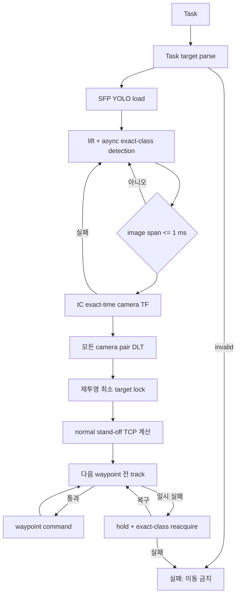

# FinalPolicy multiple-card triangulation 이식

- 작성일: 2026-08-14
- 상태: 최신 `phy_data_collection` 통합·unit test 완료, simulator smoke test 대기
- 원본: `AIC_Sejong` `feat/data_gen`
- 대상: `aic-physic` `feature/approach`
- 구현 범위: SFP lift, Task target 식별, YOLOv8-pose 검출, DLT, tracking, approach

### Why?

단일 카드에서는 `port_type + port_index`만으로도 목표가 하나였다. 여러 카드가
동시에 보이면 각 카드에 `sfp_port_0`, `sfp_port_1`이 반복된다. 기존 FinalPolicy의
후보에는 rail identity가 남지 않아 `nic_card_mount_0/sfp_port_1`과
`nic_card_mount_3/sfp_port_1`을 확실히 구분할 수 없었다.

또한 기존 approach는 lift 단계에서 한 번 계산한 XYZ를 끝까지 사용했다. 새 image가
다른 카드로 바뀌거나 target이 가려져도 이를 판정할 decision point가 없었다.

이번 이식은 다음을 보장한다.

- SFP Task의 `rail + port`를 immutable target class로 변환한다.
- `SFP_41`처럼 rail과 port가 포함된 YOLO class만 선택한다.
- center image timestamp에서 조회한 camera TF로 `base_link` XYZ를 계산한다.
- approach waypoint마다 exact class, optical flow, 재투영, 3D jump를 검사한다.
- target 확인 실패 시 다음 robot command를 보내지 않는다.

### What I Made

#### 1. Task에서 절대 target class 생성

[`phy_data_collection/policy/final_policy_vision.py | target_from_task()`](../ws_aic/src/phy/phy_data_collection/phy_data_collection/policy/final_policy_vision.py#L77)은
[`aic_task_interfaces/msg/Task.msg`](../ws_aic/src/aic/aic_interfaces/aic_task_interfaces/msg/Task.msg#L1)의
문자열을 다음처럼 변환한다.

| Task | YOLO target |
|---|---|
| `sfp`, `nic_card_mount_4`, `sfp_port_1` | `SFP_41` |

[`phy_data_collection/policy/final_policy_vision.py | parse_model_class()`](../ws_aic/src/phy/phy_data_collection/phy_data_collection/policy/final_policy_vision.py#L61)은
SFP rail `0..4`, port `0..1` 범위를 검사한다. 형식이나 범위가 틀리거나 SC 등 아직
학습 데이터를 준비하지 않은 connector이면 robot command 전에 Task를 거부한다.

#### 2. 기존 lift profile 재사용

[`phy_data_collection/policy/FinalPolicy.py | _stage_lift_up_detect()`](../ws_aic/src/phy/phy_data_collection/phy_data_collection/policy/FinalPolicy.py#L106)은
최신 [`phy_data_collection/policy/motion.py | _follow()`](../ws_aic/src/phy/phy_data_collection/phy_data_collection/policy/motion.py#L660)을
재사용한다.

- `+50 mm`
- `40` waypoints
- waypoint 간 `0.05 s`
- 현재 wrist orientation
- 기존 stiffness/damping
- quintic S-curve

YOLO는 한 worker thread에서 lift와 겹쳐 실행한다. exact target이 확정되면 다음
waypoint를 보내지 않고, 미검출이면 lift 완료 pose에서 retry한다.

코드 소유: `phy_data_collection/policy/motion.py | _follow()`

$$
s(t)=10t^3-15t^4+6t^5,\qquad 0\le t\le1
$$

$$
\mathbf p(t)=(1-s(t))\mathbf p_0+s(t)\mathbf p_1
$$

`s(t)`는 시작과 끝의 속도·가속도를 0으로 만드는 보간 비율이다.

#### 3. 동일 timestamp camera projection

[`phy_data_collection/policy/final_policy_vision.py | PortVision._projection_data()`](../ws_aic/src/phy/phy_data_collection/phy_data_collection/policy/final_policy_vision.py#L231)은
세 image span이 기본 `1 ms` 이하인지 먼저 확인한다. 이후 center image stamp `tC`에서
각 camera optical frame의 `base_link` transform을 TF2로 직접 조회한다.

```python
# phy_data_collection/policy/final_policy_vision.py | PortVision._projection_data()
reference_stamp = observation.center_image.header.stamp
T_optical_from_base = lookup_transform_at(
    camera_optical_frame,
    "base_link",
    reference_stamp,
)
P = K @ T_optical_from_base[:3, :]
```

조회 실패 시 최신 TF나 과거 ControllerState로 대체하지 않고 Observation을 폐기한다.

코드 소유: `phy_data_collection/policy/final_policy_vision.py | PortVision._projection_data()`

$$
\lambda_i
\begin{bmatrix}u_i\\v_i\\1\end{bmatrix}
=
\mathbf K_i
\begin{bmatrix}\mathbf R_i&\mathbf t_i\end{bmatrix}
\begin{bmatrix}X_{base}\\Y_{base}\\Z_{base}\\1\end{bmatrix}
=
\mathbf P_i\tilde{\mathbf X}_{base}
$$

#### 4. exact-class YOLO와 DLT

[`phy_data_collection/policy/final_policy_vision.py | PortVision._detect()`](../ws_aic/src/phy/phy_data_collection/phy_data_collection/policy/final_policy_vision.py#L288)은
세 camera image를 batch 추론한다. confidence가 더 높아도 Task target과 다른 class는
즉시 제거한다. detection 하나는 physical port 하나와 네 corner keypoint를 뜻한다.

[`phy_data_collection/policy/final_policy_vision.py | triangulate_point()`](../ws_aic/src/phy/phy_data_collection/phy_data_collection/policy/final_policy_vision.py#L93)은
OpenCV DLT로 각 corner의 `base_link` XYZ를 계산한다.

[`phy_data_collection/policy/final_policy_vision.py | PortVision._estimate_candidates()`](../ws_aic/src/phy/phy_data_collection/phy_data_collection/policy/final_policy_vision.py#L342)은
모든 camera pair를 평가한 뒤 다음 gate를 통과한 최소 재투영 RMS 후보를 선택한다.

1. 두 camera 이상의 exact target class
2. finite XYZ와 `base_link` workspace
3. 모든 사용 camera에서 positive depth
4. 다른 camera의 동일 class detection과 재투영 threshold

코드 소유: `phy_data_collection/policy/final_policy_vision.py | PortVision._estimate_candidates()`

$$
e_{reproj}
=
\sqrt{
\frac{1}{N}
\sum_{i=1}^{N}
\left\|
\mathbf u_i-\pi(\mathbf P_i\tilde{\mathbf X}_{base})
\right\|_2^2
}
$$

#### 5. port normal과 stand-off

[`phy_data_collection/policy/final_policy_vision.py | plane_normal()`](../ws_aic/src/phy/phy_data_collection/phy_data_collection/policy/final_policy_vision.py#L119)은
triangulation한 네 corner에 SVD plane fit을 적용한다. 법선 부호는 평균 camera 위치를
향하도록 고른다. 따라서 stand-off는 port entrance에서 camera/robot 쪽으로 물러난
거리다.

[`phy_data_collection/policy/FinalPolicy.py | _stage_approach()`](../ws_aic/src/phy/phy_data_collection/phy_data_collection/policy/FinalPolicy.py#L217)은
다음 목표 TCP를 만든다.

코드 소유: `phy_data_collection/policy/FinalPolicy.py | _stage_approach()`

$$
\mathbf p^{target}_{tcp}
=
\mathbf p^{triangulated}_{port}
+
d_{stand\text{-}off}\,\hat{\mathbf n}_{port\rightarrow camera}
+
\mathbf d_{tcp\ calibration}
$$

기본 stand-off는 `30 mm`, TCP calibration은 기존 `(0, 15, 45) mm`다. 현재 wrist
orientation은 유지한다. 최대 접근거리 기본 `0.5 m`를 넘으면 이동하지 않는다.

#### 6. approach target tracking

[`phy_data_collection/policy/final_policy_vision.py | track_keypoints()`](../ws_aic/src/phy/phy_data_collection/phy_data_collection/policy/final_policy_vision.py#L135)은
camera별 pyramidal KLT와 forward-backward 검사로 이전 keypoint의 현재 위치를 찾는다.

[`phy_data_collection/policy/final_policy_vision.py | PortVision.track()`](../ws_aic/src/phy/phy_data_collection/phy_data_collection/policy/final_policy_vision.py#L430)은
다음 조건을 모두 확인한다.

$$
\begin{aligned}
c_t &= c_{target}, \\
\left\|\mathbf u_t^{yolo}-\mathbf u_t^{flow}\right\|_2 &\le \tau_{flow}, \\
\left\|\mathbf u_t^{yolo}-\pi(\mathbf P_t\tilde{\mathbf X}_{t-1})\right\|_2
&\le \tau_{proj}, \\
\left\|\mathbf X_t-\mathbf X_{t-1}\right\|_2 &\le \tau_{3d}
\end{aligned}
$$

두 camera 이상이 통과해야 fresh triangulation으로 track을 갱신한다. 한 camera가
가려져도 나머지 두 camera가 유효하면 계속한다.

[`phy_data_collection/policy/FinalPolicy.py | _track_guard()`](../ws_aic/src/phy/phy_data_collection/phy_data_collection/policy/FinalPolicy.py#L175)은
일시 실패 시 exact class 재검출을 시도한다. 연속 기본 2회 확인하면 resume하고,
기본 3회 miss 동안 복구되지 않으면 다음 waypoint를 보내지 않고 abort한다.

#### 7. ROS lifecycle와 prediction topic

[`phy_data_collection/policy/FinalPolicy.py | insert_cable()`](../ws_aic/src/phy/phy_data_collection/phy_data_collection/policy/FinalPolicy.py#L275)은
전체 stage를 다음 순서로 실행한다.



initial lock, track, reacquire XYZ는
`/final_policy/triangulated_port_xyz`에 `PointStamped`로 발행한다.
`header.frame_id="base_link"`, `header.stamp=center image stamp`다.

실행 예:

```bash
cd /path/to/aic-physic/ws_aic/src

AIC_SFP_YOLO_MODEL_PATH=/absolute/path/to/sfp.pt \
AIC_YOLO_DEVICE=cpu \
PIXI_FROZEN=true pixi run ros2 run aic_model aic_model --ros-args \
  -p use_sim_time:=true \
  -p policy:=phy_data_collection.policy.FinalPolicy
```

현재는 수집·학습이 완료된 SFP task만 지원한다. 다른 connector task는 이동 전에 거부한다.

### What was problem

#### 기존 rail selector 부재

원본 triangulation 후보는 `port_index`만 보존했다. 여러 카드의 같은 port number를
Task의 `target_module_name`과 연결할 수 없었다.

#### moving camera 시각 불일치

기존 방식은 image보다 미래가 아닌 최신 과거 ControllerState TCP pose를 사용했다.
center image 시각의 TF 조회·보간이 아니므로 lift 중 camera pose 오차가 생길 수 있었다.

#### 고정 board-center heuristic

원본의 고정 board center 반경은 randomized Task Board pose와 충돌했다. 이번 구현은
고정 center score를 제거하고 exact class, workspace, positive depth, reprojection만 쓴다.

#### approach 중 target 재검증 부재

기존 approach는 cached XYZ를 모든 waypoint에서 사용했다. 가림이나 잘못된 재검출을
motion gate로 연결할 수 없었다.

#### 대상 환경의 YOLO dependency 부재

`ultralytics`가 Pixi 환경에 없었다. PyPI dependency `>=8.3,<9`를 추가하고 lock을
실제로 갱신했다. 현재 설치 확인 버전은 `8.4.120`이다.

### How it changed

| 파일 위치 | 함수 | 변경된 핵심 |
|---|---|---|
| [`phy_data_collection/policy/final_policy_vision.py`](../ws_aic/src/phy/phy_data_collection/phy_data_collection/policy/final_policy_vision.py#L61) | `parse_model_class()`·`target_from_task()` | 입력: Task/model class 문자열.<br>처리: SFP rail·port와 허용 범위 parse.<br>결과: `SFP_41` immutable target 또는 이동 전 실패. |
| [`phy_data_collection/policy/final_policy_vision.py`](../ws_aic/src/phy/phy_data_collection/phy_data_collection/policy/final_policy_vision.py#L231) | `PortVision._projection_data()` | 입력: 세 Image·CameraInfo.<br>처리: 1 ms span 검사와 `tC` TF2 exact-time lookup.<br>결과: timestamp가 같은 `base_link` projection matrices. |
| [`phy_data_collection/policy/final_policy_vision.py`](../ws_aic/src/phy/phy_data_collection/phy_data_collection/policy/final_policy_vision.py#L288) | `PortVision._detect()` | 입력: 세 camera image와 YOLO 결과.<br>처리: exact target class와 네 keypoint만 유지.<br>결과: 다른 rail·port 후보가 후속 계산에 들어오지 않음. |
| [`phy_data_collection/policy/final_policy_vision.py`](../ws_aic/src/phy/phy_data_collection/phy_data_collection/policy/final_policy_vision.py#L342) | `PortVision._estimate_candidates()` | 입력: camera별 target detection.<br>처리: 모든 pair DLT·workspace·depth·재투영 검증.<br>결과: 최소 reprojection RMS의 `base_link` port pose. |
| [`phy_data_collection/policy/final_policy_vision.py`](../ws_aic/src/phy/phy_data_collection/phy_data_collection/policy/final_policy_vision.py#L430) | `PortVision.track()` | 입력: 이전 estimate와 새 Observation.<br>처리: KLT·exact class·current TF 재투영·3D jump gate.<br>결과: 같은 target이 두 camera에서 확인될 때만 track 갱신. |
| [`phy_data_collection/policy/FinalPolicy.py`](../ws_aic/src/phy/phy_data_collection/phy_data_collection/policy/FinalPolicy.py#L106) | `_stage_lift_up_detect()` | 입력: 현재 TCP와 Observation stream.<br>처리: 기존 lift 중 target-only async YOLO.<br>결과: exact target lock 뒤에만 approach 허용. |
| [`phy_data_collection/policy/FinalPolicy.py`](../ws_aic/src/phy/phy_data_collection/phy_data_collection/policy/FinalPolicy.py#L175) | `_track_guard()` | 입력: approach 직전 새 Observation.<br>처리: track 실패 시 제한된 exact-class reacquire.<br>결과: loss 동안 hold, 복구 실패 시 abort. |
| [`phy_data_collection/policy/FinalPolicy.py`](../ws_aic/src/phy/phy_data_collection/phy_data_collection/policy/FinalPolicy.py#L217) | `_stage_approach()` | 입력: triangulated XYZ·plane normal·TCP offset.<br>처리: stand-off pose와 이동거리 계산, waypoint guard 실행.<br>결과: 추적이 유지되는 명령만 전송. |
| [`phy_data_collection/policy/motion.py`](../ws_aic/src/phy/phy_data_collection/phy_data_collection/policy/motion.py#L660) | `_follow()` | 이전: 모든 waypoint를 무조건 전송.<br>변경: optional `step_guard`가 false면 명령 전 중단.<br>효과: 기존 collector 호출은 유지하고 FinalPolicy만 perception gate 사용. |
| [`phy_data_collection/test/test_final_policy.py`](../ws_aic/src/phy/phy_data_collection/test/test_final_policy.py#L1) | 9개 회귀 test case | SFP Task parse, 범위·SC 거부, synthetic DLT, normal 방향, KLT, command guard, 다른 class 전환 금지를 검증. |

### 검증 결과

```text
PIXI_FROZEN=true pixi run python -m pytest -q \
  phy/phy_data_collection/test/test_final_policy.py
9 passed in 1.06s

PYTHONPATH=tools/bounding_box_tool PIXI_FROZEN=true pixi run python -m pytest -q \
  tools/bounding_box_tool/test
5 passed in 0.26s
```

추가 확인:

- `FinalPolicy`, `final_policy_vision` Python compile 성공
- installed Pixi 환경에서 `ultralytics 8.4.120` import 성공
- policy loader용 `phy_data_collection.policy.FinalPolicy.FinalPolicy` import 성공
- HF `team-physic/aic-approach@0814-001`의 `best.pt` load 성공
- weight schema `task=pose`, `kpt_shape=[4, 3]`, SFP class `SFP_00..SFP_41` 확인
- 실제 descent image의 `SFP_31` 추론에서 camera당 1개 detection과 4개 keypoint 확인
- `git diff --check` 성공

아직 검증하지 못한 항목:

- Gazebo camera TF와 실측 reprojection threshold
- tracking loss/가림 simulator smoke test
- TCP offset과 stand-off의 실제 collision clearance

### 의도적으로 이식하지 않은 항목

- vision-offset align
- cable insert
- wrist orientation predictor
- debug video 저장 전체
- Hugging Face background downloader
- SC inference (SC 수집·학습 이후 별도 활성화)
- GT entrance TF를 policy 입력으로 사용하는 cheat path

현재 `insert_cable()` 성공은 **approach 완료**를 뜻한다. 실제 삽입 성공을 뜻하지 않는다.
새 YOLO가 detection당 네 port corner를 동일 순서로 출력한다는 계약이 깨지면 DLT plane
normal도 유효하지 않으므로 model smoke test가 필수다.
